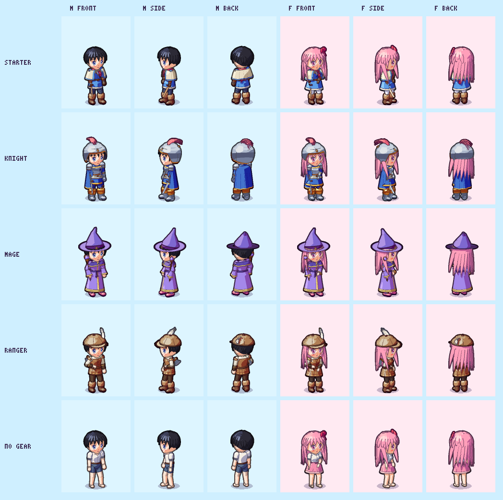
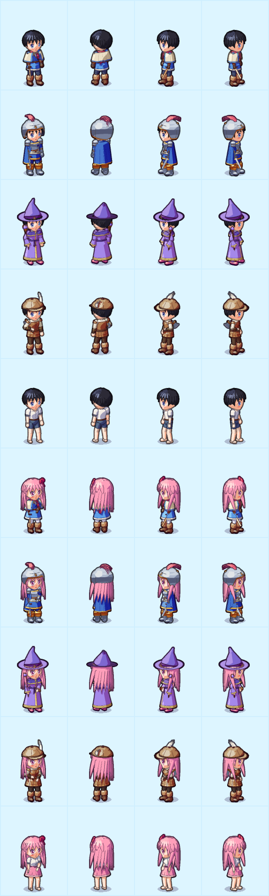

# 01. 캐릭터 디자인 변경 및 장비 외형 적용

## 작업 내용

**목표**: 테일즈위버 SD 스프라이트 느낌의 캐릭터. 외부 그림 없이 코드로 그리되 최대한 본뜬다.

- **3D 도형 인형 + 셀 셰이딩 툰 렌더러** (`ToonRenderer`, `ToonPrimitives`)
  - 머리·몸통·옷은 높이마다 타원 단면을 쌓은 `ToonLoft`, 팔다리는 `ToonRoundCone`, 머리카락은 베지어 곡선을 따라 쓸어 만든 끝이 뾰족한 가닥 `ToonClump`
  - 3/4 시점(앞 28°, 옆 70°)에서 찍어 부위 경계선·윤곽선·그림자가 있는 애니메이션풍 스프라이트 생성, 왼쪽은 오른쪽을 거울 반전
  - 2배 슈퍼샘플 후 축소, 3배 해상도 텍스처 + Bilinear
- **테일즈위버풍 SD 비율**: 약 3등신(키 ≈ 43px), 큼직한 손·뭉툭한 신발, 다리를 벌린 당당한 자세, 망토·빨간 목도리 같은 겹옷
- **남/여 선택** (캐릭터 만들기 창): 체형(남 어깨 넓음 / 여 허리·가슴), 기본 머리(남 단정한 검은 앞머리 / 여 긴 분홍 머리), 얼굴(남 갸름한 턱·넓은 눈 간격)
- **장비 4부위(머리/옷/신발/무기)** 착용 시 겉모습·능력치가 바뀜. 같은 차림은 캐시 재사용, 새 차림은 백그라운드 스레드에서 그림

## 스크린샷

| 캐릭터 샘플 (성별 × 장비) | 확대 |
|---|---|
|  |  |

## 문제와 해결

| 문제 | 원인 / 해결 |
|---|---|
| 방향을 "화가가 그린 PNG 로 전환"으로 잘못 잡아 그림 파이프라인을 먼저 만듦 | 원래 목표는 "코드 그래픽 유지 + 테일즈위버 본뜨기" → 파이프라인을 되돌리고 툰 렌더러 쪽을 개편 |
| 머리카락이 레고 블록 / 헬멧처럼 보임 | 풍성한 머리 껍질을 짧은 머리에도 써서 부풀었음 → 머리 모양을 따라가는 껍질(`HairKit.Surface`)로 바꾸고, 가닥을 좁고 끝이 뾰족하게, 길이를 들쭉날쭉하게 |
| 남자 머리가 옆으로 뻗치고 얼굴이 넓어 보이며 눈이 몰려 보임 (피드백) | 옆으로 뻗는 가닥 제거 + 이마를 덮는 앞머리, `MaleHeadProfile` 로 볼·턱을 좁히고 `EyeSpacing` 3.05 로 눈 간격을 넓힘 |
| 검은 머리가 뭉개져 덩어리로 보임 | `ToonColor.HairTone` 으로 검은 머리에 푸른 윤기를 넣어 가닥 명암을 살림 |
| 아틀라스 1장 그리는 데 시간이 오래 걸림 | 프레임을 `Parallel.For` 로 나눠 그림 (스레드 1개 0.7초 → 9개 0.16초), 렌더 코드는 static 상태를 바꾸지 않게 스레드 안전하게 |
| 캐릭터를 고칠 때마다 Unity 를 켜서 확인하면 느림 | Core + 렌더링 코드를 그대로 컴파일하는 dotnet 미리보기 도구(UnityEngine 흉내 shim)를 만들어 4초 만에 PNG 로 확인 |

## 작업 흐름 변화
- 이 작업은 기능 브랜치 + PR 로 합쳤고, 이후부터는 main 브랜치에서 바로 작업하기로 정함
