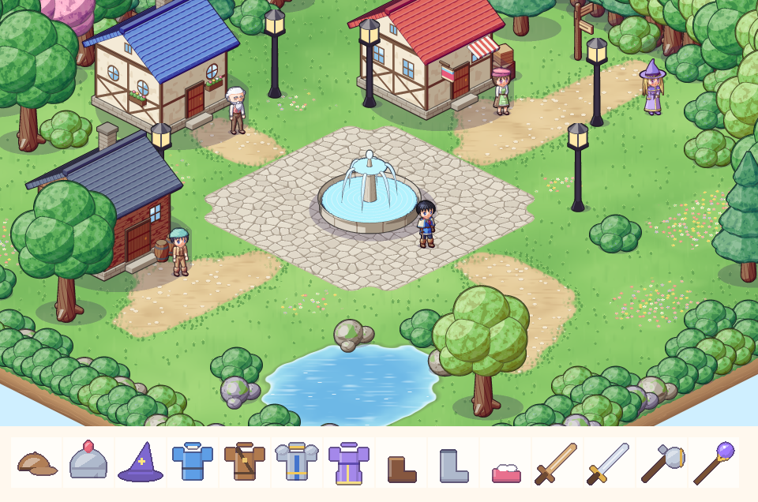
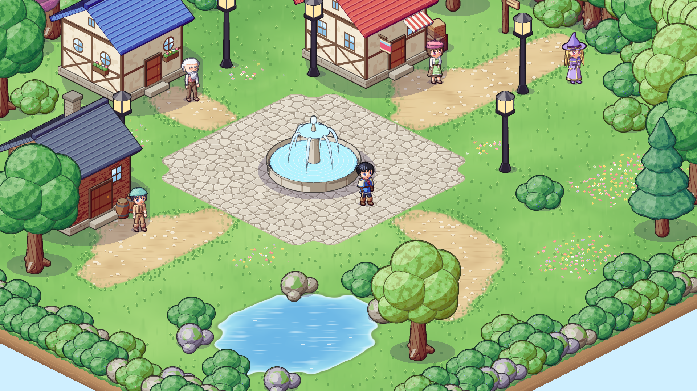
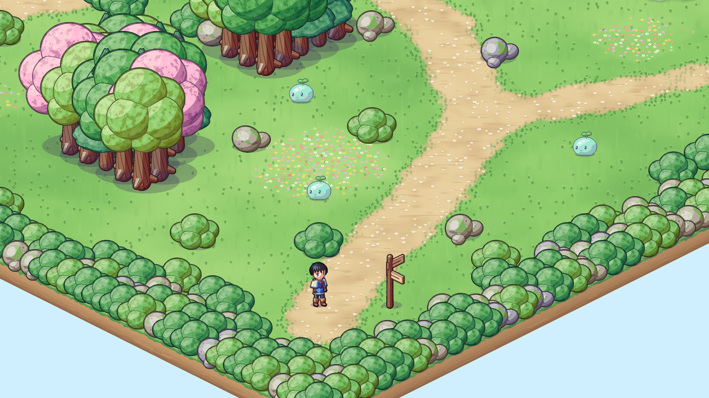

# 02. 월드 맵 확장 · 이동 속도 증가 · 월드 그래픽 (#2)

## 작업 내용

- **맵 확장**: 마을 36×36, 들판 52×52 (도형을 칠하는 작은 스크립트로 호수·굽은 길·숲을 설계하고 연결성 검사)
- **이동 속도** 초당 3.4칸 → 5칸
- **A\* 길찾기** (`Pathfinder`, Core): 8방향, 대각선은 양옆 칸이 열려 있을 때만(모서리 끼기 방지), 시야 판정으로 경로를 곧게 다듬음. 못 가는 곳을 누르면 가장 가까운 칸까지
- **월드 그래픽 개편**: 도트 타일을 칸마다 찍던 방식을 버리고
  - 바닥 = 맵 한 장을 그림처럼 칠함 (지형을 가우스로 번지게 + 노이즈 → 둥근 물가·매끈한 흙길, 풀·자갈·조약돌·물결 질감, 섬 앞쪽 흙 절벽)
  - 나무·집·분수·가로등 = 캐릭터와 같은 툰 렌더러로 아이소 시점(45°/30°)에서 렌더
  - 여러 칸짜리 장식물(집·분수)은 세로 띠로 잘라 띠마다 정렬 → 캐릭터가 앞·옆·뒤 어디에 서도 가려짐이 맞음
  - 플레이어가 나무·집 뒤로 가면 반투명(`OccluderFade`), 카메라는 맵 범위 밖을 비추지 않음
- 시작 마을 이름 **포슬 마을 → 프론트 마을**

## 스크린샷

| 월드 미리보기 | 마을 | 들판 |
|---|---|---|
|  |  |  |

## 문제와 해결

| 문제 | 원인 / 해결 |
|---|---|
| 캐릭터가 나무보다 커 보임 | 크기 기준을 정함: 캐릭터 키 ≈ 43px, 나무 ≈ 110px(2.5배), 집 4×4칸 |
| 앞쪽 가장자리의 큰 나무가 마을·연못을 가림 | 맵 앞쪽 두 가장자리에는 덤불(`B`)·바위(`R`)만, 큰 나무 숲은 뒤쪽 가장자리에만 두는 규칙을 만듦 |
| NPC(창고지기) 앞 나무가 NPC를 가리고, 가로등이 광장 시야를 막음 | 해당 장식물 제거, "NPC 바로 앞 2~3칸에는 나무 금지" 규칙 추가 |
| 흙길이 계단처럼 각지고 잎 질감에 줄무늬가 생김 | 지형 값을 가우스로 번지게 한 뒤 경계값으로 자르고 노이즈를 섞어 모서리를 둥글게, 잎 질감 샘플링 수정 |
| 들판 바닥 그림 생성 ≈ 0.7초라 맵 이동 때 멈칫 | 포탈로 이어진 맵의 바닥을 백그라운드에서 미리 칠해 둠(`PrewarmGround`), 장식물은 여러 스레드로 한꺼번에 굽기 |
| 세이브 왕복 테스트 실패 | 맵을 새로 그리며 테스트 좌표가 물 위가 됨 → 스폰 기준 좌표로 변경 |
| 미리보기 도구 shim 에 없는 API (`Vector3.Min/Max`, `Mathf.Tan`) | shim 에 추가하거나 Core `IsoMath` 로 대체 |
