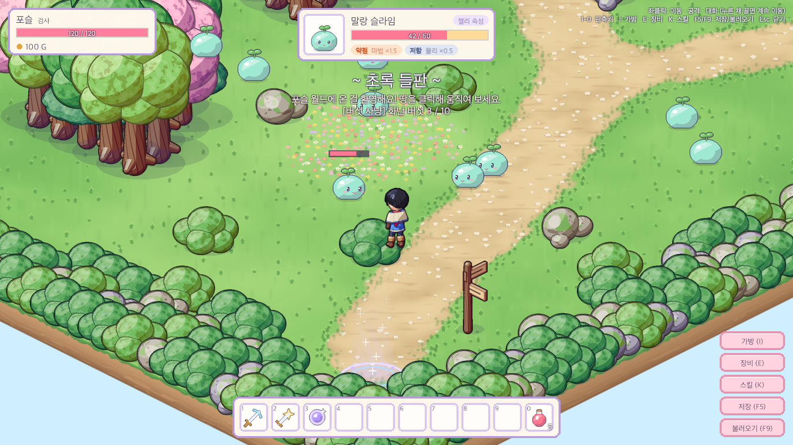
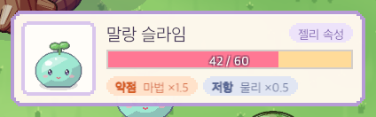
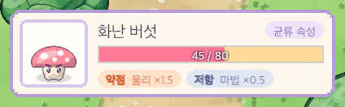
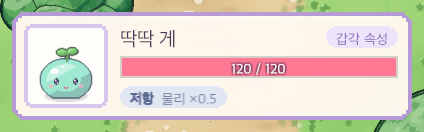

# 03. 몬스터 전투 시 몬스터 정보 박스

## 작업 내용

- 몬스터를 클릭(공격 대상 지정)하면 **화면 위쪽 가운데**에 정보 박스 표시 (`MonsterInfoBox`)
  - 초상화(앞모습 프레임에서 몸 부분만 잘라낸 스프라이트) · 이름 · 속성 칩(예: `젤리 속성`)
  - HP 바 + 수치, 깎인 만큼 노란 흔적이 잠깐 남았다 줄어드는 연출
  - 약점/저항 칩 (예: `약점 마법 ×1.5` `저항 물리 ×0.5`) — Core `AffinityTable.TypesWith` 로 상성표에서 계산
- 대상의 `Health` 이벤트를 구독해 **실시간 갱신**
- 대상이 죽으면 빈 HP 바를 0.6초 보여 준 뒤 숨김, 대상 지정이 풀리면(땅·NPC 클릭, Esc, 맵 이동, 기절) 바로 숨김
- `PlayerController` 의 공격 대상 변경을 `SetTarget` 한 곳으로 모으고 `TargetChanged` 이벤트 추가
- 박스는 `CanvasGroup.blocksRaycasts = false` 로 **뒤의 월드 클릭을 막지 않음**

## 스크린샷

| 슬라임 (젤리) | 버섯 (균류) | 저항만 있는 경우 (테스트용 가상 몬스터) |
|---|---|---|
|  |  |  |

## 문제와 해결

| 문제 | 원인 / 해결 |
|---|---|
| 맵 이름 배너가 박스와 겹침 | 배너·알림 문구를 박스 아래로 내림 |
| 표시한 약점/저항이 실제 데미지와 어긋날 위험 | 모든 속성 × 데미지 종류에 대해 "약점으로 표시된 공격 = 실제 1.5배, 저항 = 0.5배" 를 확인하는 테스트 추가 |
| 파괴된 몬스터 참조가 Unity 의 "가짜 null" 이라 대상 해제 이벤트가 안 나갈 수 있음 | `SetTarget` 에서 `ReferenceEquals` 로 비교해 확실히 풀리게 |
| Unity 창을 띄우지 않고 UI 를 확인할 방법이 없음 | batchmode 에서 GameSession 을 조립하고 캔버스를 카메라 모드로 바꿔 RenderTexture 로 찍는 임시 캡처 스크립트를 만듦 (확인 후 되돌림) |
| 캡처 첫 장의 월드가 뒤섞여 찍힘 | batchmode 첫 렌더링 문제 → 버리는 렌더를 한 번 먼저 찍음 |
| 캡처 과정에서 `ProjectSettings/TimeManager.asset` 이 재직렬화됨 | 캐릭터 만들기 창이 `Time.timeScale` 을 건드린 흔적 → 매번 git 으로 되돌리고 세이브 파일 해시를 전후 비교해 사용자 세이브를 건드리지 않았음을 확인 |
