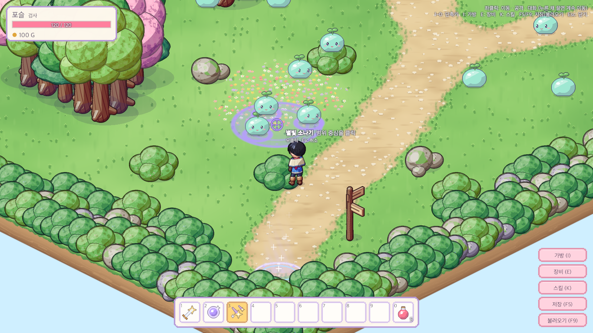
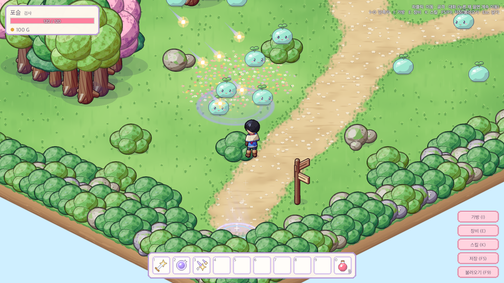
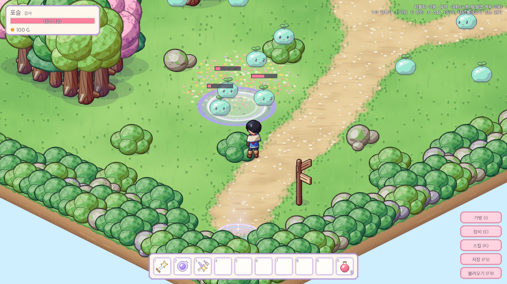
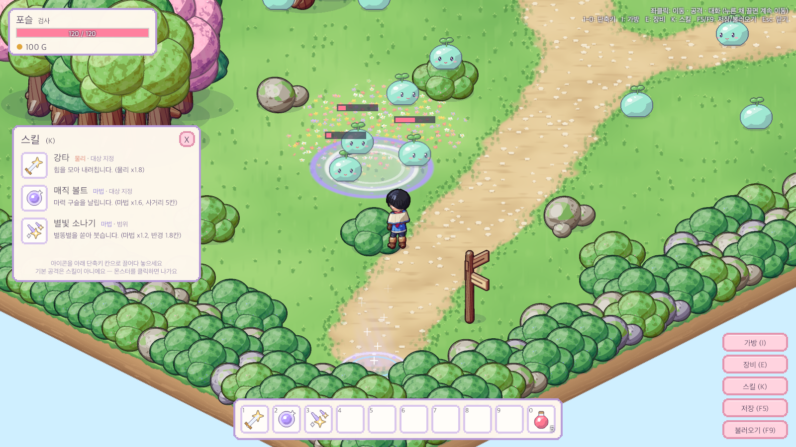
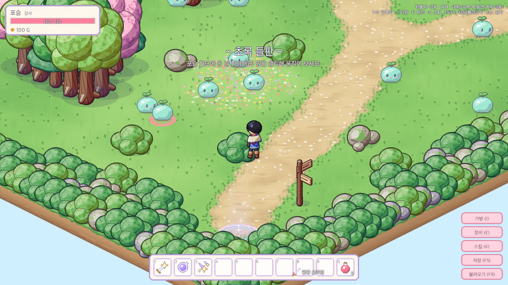
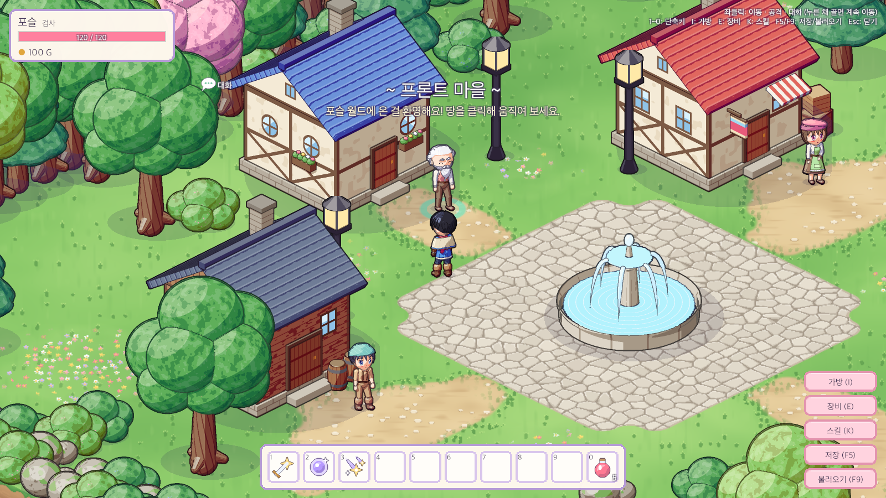

# 04. 스킬 사용 방식 개편 — 기본공격 분리, 대상 지정/범위 스킬 (#4)

## 작업 내용

- **기본 공격 분리**: `skill.slash` 였던 기본 공격을 스킬 목록에서 빼서 `GameDatabase.BasicAttack`(`attack.basic`)으로. 스킬창·핫바에 없고 몬스터 클릭으로만 나감
- **스킬 선택 모드**: 스킬 단축키를 누르면 바로 쓰지 않고 선택 모드(`PendingSkill`) → 조준 커서 + 안내 문구, 핫바·스킬창 칸 노란 강조
  - **대상 지정** (강타, 매직 볼트): 커서 아래 몬스터 발밑 노란 고리 → 클릭하면 (사거리 밖이면 다가가서) 발동, 그 뒤 기본 공격으로 자동 사냥
  - **범위** (새 스킬 「별빛 소나기」: 마법 ×1.2, 반경 1.8칸, 사거리 6칸): 커서를 따라다니는 범위 타원 + 범위 안 몬스터 고리 → 땅 클릭, 별똥별이 떨어지는 순간 범위 안 몬스터 모두에게 데미지
  - 우클릭 / Esc / 같은 단축키로 취소, 맵 이동·기절 때 자동 취소
- `SkillDefinition` 에 `TargetType`(대상 지정/범위)·`Radius` 추가, 범위·사거리 판정은 Core `SkillRules` → **미리보기와 실제 판정이 같은 함수**
- 세이브 v3: 핫바의 옛 기본 공격을 지우고 그 자리에 별빛 소나기
- **후속 수정**
  - 커서를 올리면 몬스터(분홍 고리 + 칼·이름) / NPC(민트 고리 + 말풍선) 표시 (`PointerTargetView`)
  - 몬스터·NPC 클릭 판정 개선

## 스크린샷

| 범위 스킬 조준 | 대상 지정 조준 |
|---|---|
|  |  |

| 별빛 소나기 (떨어지는 중) | 착지 (3마리 명중) | 스킬창 |
|---|---|---|
|  |  |  |

| 몬스터 위 커서 | NPC 위 커서 |
|---|---|
|  |  |

> 커서 옆 칼·말풍선 표시가 엉뚱한 곳에 찍힌 것은 캡처용 카메라 모드 때문이고, 실제 게임(오버레이 캔버스)에서는 커서 오른쪽 아래에 붙는 것을 좌표로 확인했습니다.

## 문제와 해결

| 문제 | 원인 / 해결 |
|---|---|
| 단일 스킬을 휘두르는 중에 범위 스킬을 예약하면 이미 쓴 스킬이 다시 나갈 수 있음 | "쓴 스킬은 기본 공격으로 되돌리기"를 범위 시전 분기보다 먼저 하도록 순서 수정 |
| 범위 타원·별이 옅어 잘 안 보임 | 미리보기 도구로 장면을 합성해 보며 테두리를 굵게, 가장자리 쪽을 밝게, 별을 1.4배로 |
| 범위 스킬 연출 중 맵을 옮기면 다른 맵 몬스터가 맞을 위험 | 연출 오브젝트를 맵 루트 밑에 만들어 맵과 함께 사라지게 |
| (Play 확인 중 발견) 몬스터를 눌러도 땅 클릭이 되는 느낌 | NPC 클릭 영역이 몸보다 좁았고, 몬스터 영역은 몸과 딱 맞아 움직이면 빗나감 → 영역 확대 + 0.2 유닛 안에서 가장 가까운 대상을 잡는 여유 판정, 커서 표시와 클릭이 같은 `WorldClickable.Pick` 을 쓰게 |
| (Play 확인 중 발견) 멀리서 NPC 를 클릭하면 다가가기만 하고 대화창이 안 뜸 | NPC 칸은 막힌 칸이라 경로가 옆 칸에서 끝나는데, 추적이 그 옆 칸에서 또 대화 거리만큼 앞에 멈춰 "닿을 수 없음"으로 포기 → 경로가 대상까지 닿지 않으면 옆 칸까지 끝까지 가도록 수정 |
| (Play 확인 중 발견) 스킬 뒤 기본 공격으로 이어지지 않는 경우 | 에디터 시뮬레이션으로 대상 지정 스킬은 정상임을 확인. 몬스터 위를 클릭해 범위 스킬을 쓰면 대상이 잡히지 않아 멈췄음 → 그 몬스터를 공격 대상으로 지정 |
| 에디터 모드에서는 Update·OnEnable 이 돌지 않아 캡처·시뮬레이션이 실제와 다름 | 리플렉션으로 필요한 메서드를 직접 호출하고, 재사용 대기 시간은 사전 값을 줄여 "시간이 흐른 것처럼" 만들어 검증 |
