# 06. 직업별 스킬 트리 · 스킬마스터 NPC

## 작업 내용

- **직업과 전직**
  - 직업 2종: **전사**(검사 스킬) / **법사**. 전직 단계 0(전직 전) · 1(1차 전직, 레벨 50부터) · 2(2차 전직, 레벨 120부터)
  - 캐릭터 만들기 창에서 성별과 함께 직업을 고른다. 직업을 고르면 그 직업의 첫 스킬(전사 `강타` / 법사 `에너지 볼`)을 배워 단축키 1번에 올린다
  - 직업이 없던 예전 세이브는 다음 시작 때 한 번 직업을 고른다. 이때 다른 직업의 스킬, 아직 레벨이 모자란 스킬은 잊고 올렸던 스킬포인트는 돌려준다
  - 전직 절차(전직 NPC·퀘스트)는 다음 작업. 조건 확인과 단계 올리기(`JobRules.TryAdvance`)까지만 만들었다
- **스킬 트리 28종** (직업마다 14종, 스킬마다 직업 · 필요 레벨 · 필요 전직 단계)

  | 단계 | 전사 | 법사 |
  |---|---|---|
  | 전직 전 | 강타(1) · 더블 슬래쉬(20) · 리프트 파워(25, 패시브) · 아머 브레이커(30) · 아드레날린(45, 패시브) | 에너지 볼(1) · 매직 애로우(10) · 회복(15) · 별빛 소나기(20) · 리프트 매직(40, 패시브) |
  | 1차 전직 | 트리플 슬래쉬(60) · 헤이스트(70, 패시브) · 검기 베기(85) · 코마 어택(100) · 대지 가르기(120) | 펜타 매직 애로우(50) · 화염 폭풍(60) · 텔레포트(70) · 헬 파이어(90) · 아이스 필러(100) |
  | 2차 전직 | 예리한 감(130, 패시브) · 파도 가르기(140) · 뇌전 가르기(180) · 검기 발산(210) | 윈드 블레이드(130) · 루미너스(140) · 메테오(180) · 라이트닝 스피어(210) |

- **스킬 종류**: 쓰는 방식은 다섯 가지이고, 범위 모양은 네 가지다
  - 대상 지정: 몬스터 클릭. 연속 타격(2·3·5회)과 투사체(구슬·화살·불 구슬)가 있다
  - 범위
    - 원형: 지점을 클릭, 사거리 밖이면 다가가서 쓴다
    - 부채꼴·직선: 캐릭터에서 클릭한 방향으로, 선 자리에서 바로 쓴다
    - 캐릭터 둘레: 단축키를 누르면 바로 쓴다
  - 자기 대상: 회복. 최대 HP 의 일정 비율, 단축키를 누르면 바로 쓴다
  - 자기 이동: 텔레포트. 최대 6칸, 물·나무 너머로 갈 수 있고 막힌 곳을 누르면 그 앞에 선다
  - 패시브: 배우면 항상 적용되고 핫바에 올릴 수 없다
    - 공격력 % · 마법 공격력 %
    - 공격 속도: 기본 공격 간격과 공격 동작이 빨라진다
    - 이동 속도: 걷기 동작도 함께 빨라진다
    - 치명타 확률
- **상태 효과** (Core `StatusEffects`): 방어력 감소(-30%, 8초) · 기절 · 빙결(3초, 움직이지도 공격하지도 못함) · 화상(1초마다 데미지의 15%, 5초) · 넉백
  - 몬스터 머리 위 표시: 금 간 방패 · 도는 별 · 얼음 · 일렁이는 불꽃. 빙결은 푸른빛, 화상은 붉은빛으로 몸색도 바뀐다
- **스킬마스터 코코**
  - 마을 광장 서쪽에 섰다. 창고 앞 길을 건넌 자리다
  - 말을 걸면 대화가 열린다: *스킬 배우기* / *전직이 뭔가요?*
  - 스킬 배우기 창
    - 내 직업의 스킬 트리를 전직 단계 탭으로 보여 준다
    - 스킬마다 상태를 적는다: `배움 Lv.N` / `배우기` 버튼 / `Lv.20 필요` / `1차 전직 필요`
    - 배우면 핫바 앞쪽 빈 칸에 저절로 올라가고, 결과는 창 아래에 잠깐 뜬다
  - 지금 배울 수 있는 스킬이 있으면 머리 위에 민트색 `!` 가 뜬다
  - 레벨업으로 새 스킬이 풀리면 "스킬마스터를 찾아가 보세요" 알림을 띄운다
- **스킬창(K) 개편**
  - 전직 단계 탭으로 나눴다
  - 배운 스킬: 레벨·효과, `+` 버튼으로 스킬 레벨 올리기
  - 안 배운 스킬: 흐린 아이콘과 배우는 조건
- **연출** (`SkillEffectView`)
  - 원형: 별 · 불덩이 · 운석 · 균열 · 번개
  - 부채꼴: 바닥이 번쩍이고 검기가 퍼져 나간다
  - 직선: 빛줄기 · 줄지어 떨어지는 번개
  - 캐릭터 둘레: 충격파 · 돌아가는 바람 칼날
  - 기타: 베기 자국 · 얼음 기둥 · 회복 빛 · 순간이동 반짝이
- **스킬 아이콘 28종**: 모두 코드로 그렸다. 전사는 은빛 칼날 + 주황·노랑, 법사는 보라 + 원소 색
- **세이브 v5**
  - 직업·전직 단계를 저장한다
  - 예전 스킬 id 를 새 스킬로 옮긴다: 강타 → 강타, 매직 볼트 → 에너지 볼, 별빛 소나기 → 별빛 소나기. 스킬 레벨은 그대로다
- **테스트**: 77 → 94개
  - 기획서의 레벨·전직 단계와 같은지
  - 배우는 조건, 직업 고르기(스킬 정리·포인트 환급), 전직 레벨
  - 패시브, 회복량, 상태 효과 시간
  - 부채꼴·직선·주변 범위 판정, 순간이동·넉백 도착점
  - v4 → v5 마이그레이션
- **테스트 도구**: Play 중 메뉴 *레벨 +10* · *스킬포인트 +10* · *전직 단계 올리기* · *캐릭터 만들기 (성별·직업 다시 고르기)*. 높은 레벨 스킬을 바로 확인할 수 있다

## 스크린샷

마을 광장 옆의 스킬마스터 코코. 배울 스킬이 있으면 머리 위에 민트색 `!`, 커서를 올리면 민트 고리와 `대화` 표시가 뜬다.

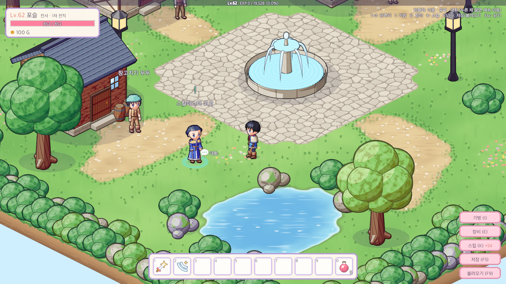

대화 → *스킬 배우기*

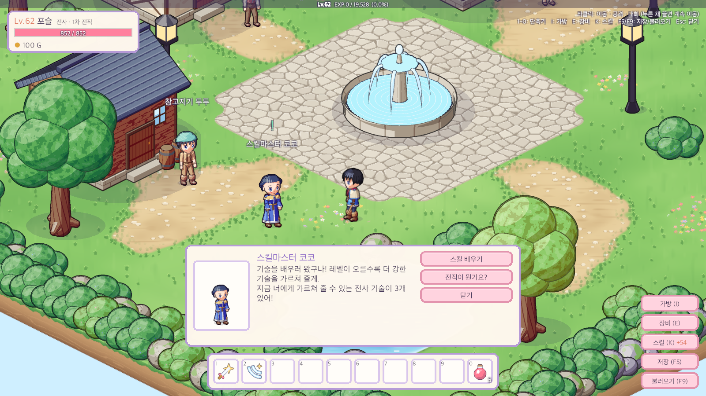

스킬 배우기 창 (1차 전직 탭). 레벨·전직이 된 스킬만 `배우기`, 나머지는 필요한 조건을 적는다.

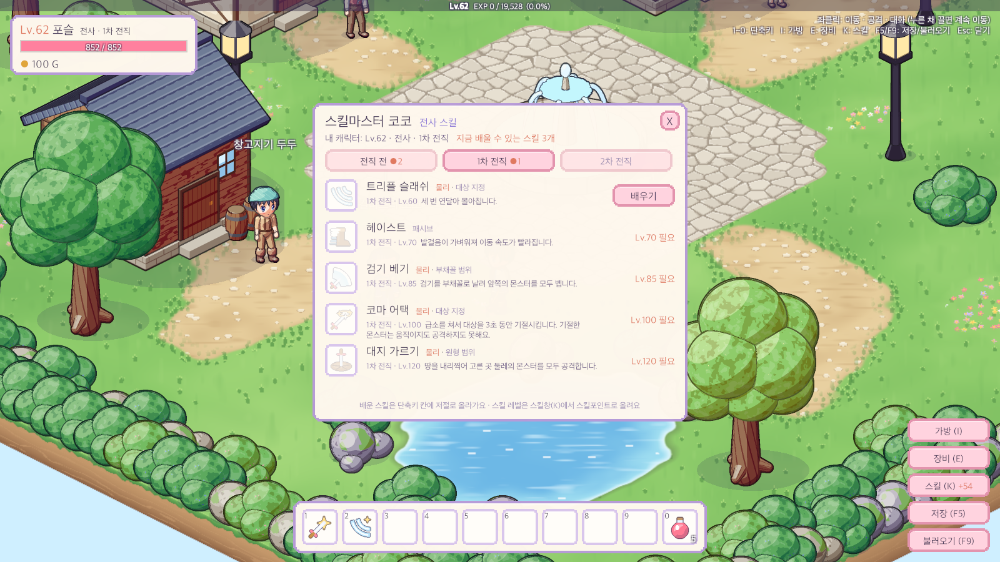

배우면 창 아래에 결과가 뜨고, 단축키 빈 칸(3번)에 저절로 올라간다.

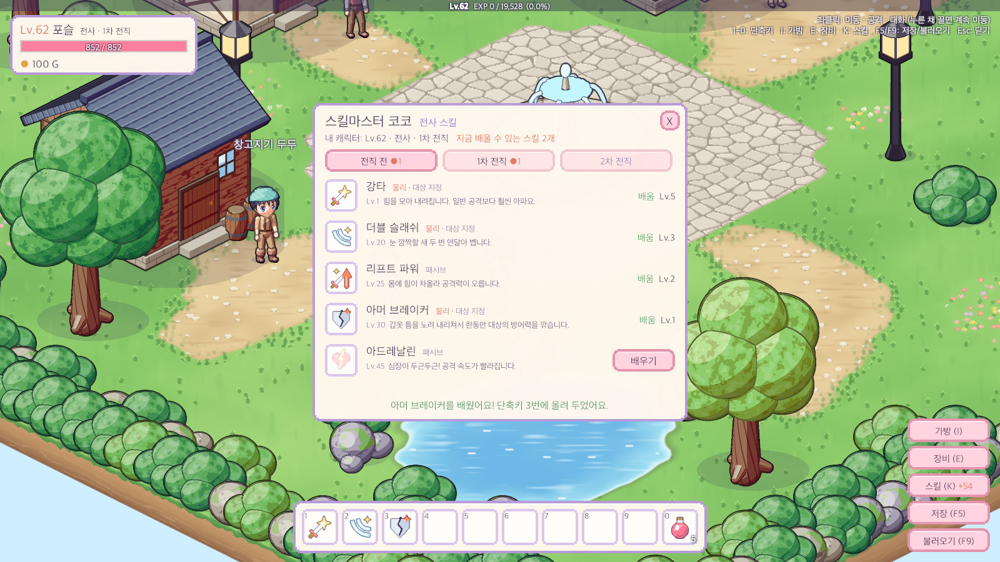

스킬창(K): 전직 단계 탭, 스킬 레벨·위력·패시브 수치, 안 배운 스킬은 배우는 조건

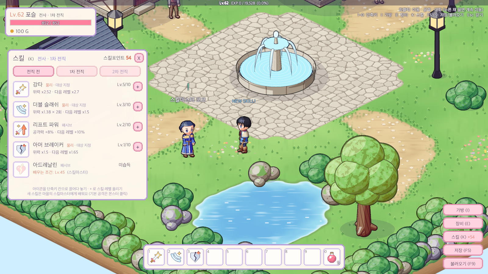

캐릭터 만들기: 성별 + 직업 (직업이 없던 예전 세이브에서 처음 뜬 모습)

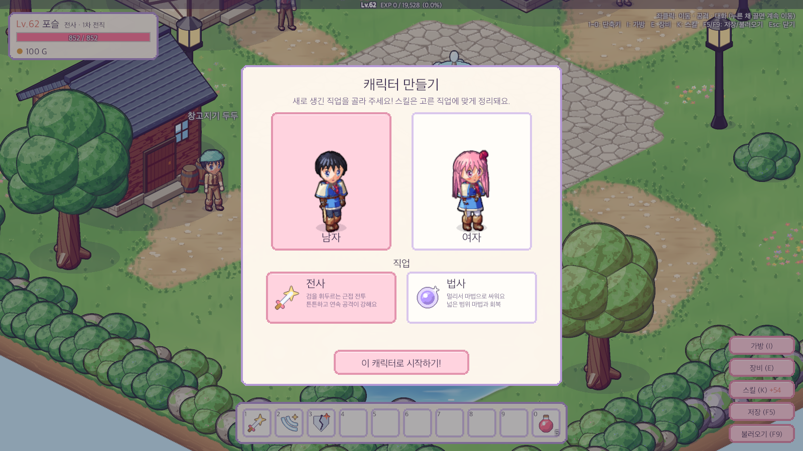

스킬 아이콘 28종 (위: 전사, 아래: 법사)

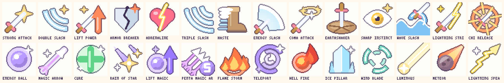

조준 미리보기: 검기 베기(부채꼴) · 파도 가르기(넓은 부채꼴) · 대지 가르기(원형, 사거리 밖) · 루미너스(직선) · 라이트닝 스피어(넓은 직사각형) · 텔레포트(최대 거리 원 + 도착 자리)

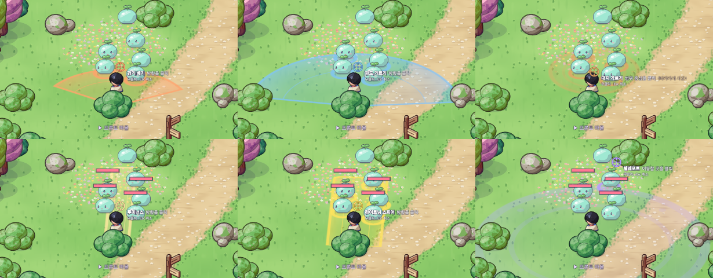

전사 연출: 검기 베기 · 파도 가르기 · 대지 가르기 · 뇌전 가르기 · 검기 발산 · 아머 브레이커/코마 어택 타격

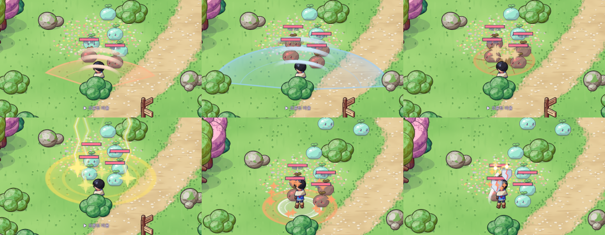

법사 연출: 메테오(낙하 · 충돌) · 화염 폭풍(낙하 · 불길) · 별빛 소나기 · 루미너스 · 라이트닝 스피어 · 윈드 블레이드 · 상태 효과 · 텔레포트

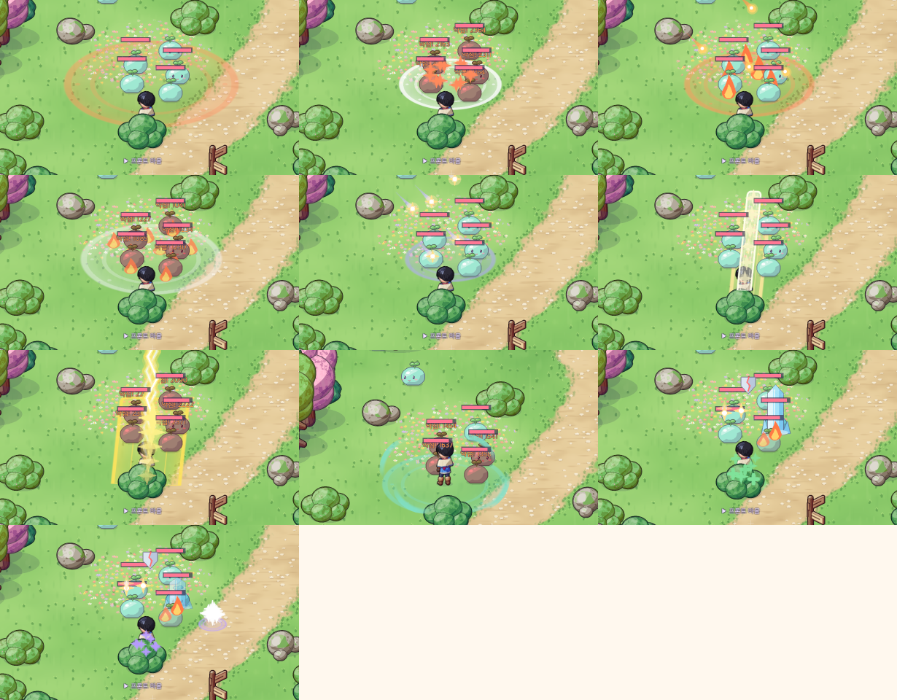

상태 효과: 방어력 감소(방패) · 기절(별) · 빙결(얼음 기둥) · 화상(불꽃) + 회복(초록 빛)

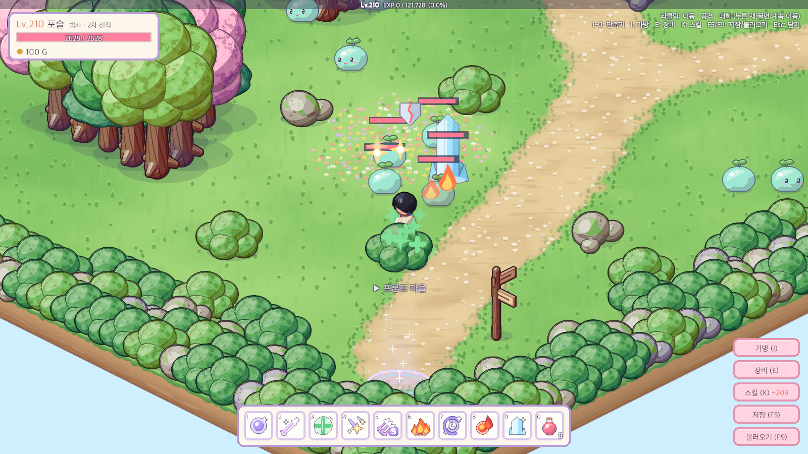

## 문제와 해결

| 문제 | 원인 / 해결 |
|---|---|
| 부채꼴·직선처럼 방향이 있는 범위를 아이소 바닥에 맞게 그리기 | 모양을 "바닥 칸 공간"에 그린 스프라이트를 (0.707, 0.354) 로 누른 부모 밑에서 45° + 방향각만큼 돌림 = 그리드 → 화면 투영과 같은 변환. 미리보기와 판정이 같은 Core 함수라 보이는 대로 맞는다 |
| 예전 세이브를 옮기는 단계가 "그때 있던 스킬 전부"를 배운 상태로 만들던 코드가 새 스킬 28종을 다 배우게 됨 | 옛 스킬 id 를 상수로 고정해 옛 단계는 옛 스킬 3개만 다루게 하고, 새 단계에서 새 id 로 옮김 |
| 직업이 없던 세이브에 직업을 정해 줘야 함 | 무기로 추측하지 않고 다음 시작 때 직접 고르게 함 (성별이 없던 세이브와 같은 방식). 고르는 순간 스킬을 직업 규칙에 맞게 정리 |
| 스킬마스터 창의 결과 알림이 창 위쪽 탭과 겹침 | 화면 가운데 창이라 알림 자리와 겹친다 → 결과 문구를 창 안 아래 안내 줄에 4초 동안 표시 |
| 얼음 기둥이 몬스터보다 훨씬 크고, 기절 별이 작아 잘 안 보임 | 캡처로 확인 → 얼음 기둥 0.78배, 몸을 덮는 얼음은 0.8 × 0.5, 기절 별 1.4배 |
| 텔레포트 조준 표시가 물리(주황) 색 | 데미지가 없는 스킬은 데미지 종류가 기본값(물리) → 스킬별 색 표에 마법 보라로 추가 |
| 체력이 가득한데 회복을 쓰면 재사용 대기만 걸림 | 물약처럼 "이미 체력이 가득해요!" 알림만 띄우고 쓰지 않음 |
| 연속 타격(더블·트리플 슬래쉬) 숫자가 한 자리에 겹침 | 한 타마다 숫자를 조금씩 위에 띄움 |
| 아이콘이 작은 칸에서 잘 안 읽힘 (헤이스트 장화가 그루터기처럼, 펜타 매직 애로우 화살 5개가 뭉침) | 미리보기 도구로 한 장에 모아 보며 다시 그림: 앞코가 둥근 장화 + 날개, 화살 3개 + "5" 배지 |
| Unity 에디터가 열려 있어 batchmode 테스트를 돌릴 수 없음 | 프로젝트를 APFS 복제(`cp -c`, 용량 추가 없음)해 복제본에서 테스트·캡처 (테스트 1회 약 1분) |
| 캡처(카메라 모드 캔버스)에서 NPC 이름표·조준 커서가 대상에서 어긋나고, 맵을 다시 불러오면 옛 이름표가 남음 | 게임은 오버레이 캔버스라 문제 없음 → 복제본에서만 화면 → 캔버스 좌표를 직접 계산하고, 맵을 바꾸기 전에 이름표를 치움 |
| 레벨 50·120 이상 스킬을 실제 플레이로 확인하기 어려움 | 에디터 테스트 메뉴(레벨 +10, 스킬포인트 +10, 전직 단계 올리기)와 캡처·시뮬레이션 스크립트(검기 베기·검기 발산·코마 어택·회복·텔레포트·윈드 블레이드 넉백·아이스 필러 빙결 흐름)로 확인 |

## 남은 일
- 전직 NPC·전직 퀘스트 (지금은 테스트 메뉴로만 전직)
- 캐릭터 선택창(슬롯)과 직업별 시작 장비·능력치
- 스킬 위력·재사용 대기·상태 효과 수치는 임시값 → 높은 레벨 사냥터와 몬스터가 생기면 밸런스 조정
