# 07. 퀘스트 시스템 (수락 · 목록 · 진행 확인)

## 작업 내용

- **퀘스트 목표 3종** (한 퀘스트에 목표를 여러 개 둘 수 있다)
  - 사냥: 받은 뒤에 잡은 몬스터 수를 센다
  - 수집해 전달: 가방에 가진 개수가 곧 진행도. 보고할 때 가져가고, 써 버리거나 팔아서 모자라게 되면 다시 "진행 중"으로 돌아간다
  - NPC 찾아가기: 그 NPC 에게 말을 걸면 달성. 찾아간 NPC 가 퀘스트에 맞는 대사를 한다
- **퀘스트를 주는 NPC · 보고받는 NPC**
  - 퀘스트마다 준 NPC 와 보고받는 NPC 를 따로 정할 수 있다 (예: 창고지기가 부탁하고 스킬마스터에게 전달)
  - 퀘스트 전용 NPC 가 아니어도(상인·창고지기·스킬마스터) 퀘스트를 줄 수 있다. 대화 메뉴 맨 앞에 퀘스트 선택지가 붙는다
  - 말을 걸면: ① 찾아가기 대사 → ② 이 NPC 에게 보고할 퀘스트가 있으면 보고부터 → ③ 원래 메뉴
  - 받는 조건: 필요 레벨 + 선행 퀘스트. 반복 퀘스트는 마친 뒤 다시 받는다
- **머리 위 표시**: 노란 `?` = 보고할 퀘스트 / 찾아가야 하는 NPC, 노란 `!` = 받을 수 있는 퀘스트, 회색 `…` = 그 NPC 가 준 퀘스트를 진행 중
- **퀘스트 창 (`Q`)**: 탭 셋
  - 진행 중: 목표마다 진행도, 다 채우면 누구에게 보고할지, `포기하기` (실수로 누르지 않게 두 번 눌러야 한다)
  - 받을 수 있음: 어느 NPC 에게 받는지, 레벨이 모자라면 `Lv.3 필요`
  - 완료: 마친 횟수, 반복 퀘스트면 다시 받을 수 있다는 안내
- **화면 진행 표시**: 오른쪽 위(조작 도움말 아래)에 진행 중인 퀘스트와 목표 진행도가 늘 보인다. 글자만 있어서 월드 클릭을 막지 않는다
- **진행 알림**: 사냥·수집·방문 모두 한 곳에서 `[마을 한 바퀴] 창고지기 두두 만나기 완료`, `목표 완료! 촌장 포포에게 보고하세요.` 를 띄운다. 보고하면 머리 위에 `QUEST CLEAR!`
- **퀘스트 4종**

  | 퀘스트 | 주는 NPC → 보고 | 조건 | 목표 | 보상 |
  |---|---|---|---|---|
  | 마을 한 바퀴 | 촌장 포포 → 촌장 포포 | 처음부터 | 상인·창고지기·안내원 만나기 | 50G · 경험치 40 · 포션 3 |
  | 젤리 푸딩 재료 | 상인 모모 → 상인 모모 | 마을 한 바퀴 | 말랑 젤리 5개 | 120G · 경험치 60 |
  | 화난 버섯 소탕 (반복) | 촌장 포포 → 촌장 포포 | 마을 한 바퀴, Lv.3 | 화난 버섯 5마리 | 150G · 경험치 80 · 포션 3 |
  | 버섯 갓 배달 | 창고지기 두두 → 스킬마스터 코코 | 마을 한 바퀴, Lv.3 | 버섯 갓 3개 | 100G · 경험치 100 · 포션 5 |

- **보상이 사라지지 않게**
  - 보상 아이템이 가방에 다 안 들어가면 보고를 미룬다. 가방 복사본에 "수집품을 내주고 보상을 넣어 보기"를 먼저 해 보고, 들어갈 때만 실제로 바꾼다
  - 창고의 *재료 모두 맡기기* 는 진행 중인 수집 퀘스트 재료를 가방에 남긴다
- **세이브 v6**: 퀘스트마다 목표별 진행도와 마친 횟수를 저장한다. 목표가 하나뿐이던 예전 진행도는 첫 목표로 옮기고, 지금은 없는 퀘스트 기록도 지우지 않고 남긴다
- **대화창**: 퀘스트 부탁(2~4줄) + 보상 한 줄이 들어가게 본문을 넓혔다
- **테스트**: 94 → 108개
  - 목표 종류별 진행(사냥은 받은 뒤부터 · 수집은 가방을 따라감 · 방문은 두 번 세지 않음)
  - 받는 조건(레벨·선행), 반복·포기, 보상이 안 들어갈 때 아무것도 바뀌지 않는지, 수집품이 빠진 자리에 보상이 들어가는지
  - NPC 별 상태·머리 위 표시, 창고에 맡길 때 퀘스트 재료 남기기
  - 세이브 왕복(불러올 때 진행 알림이 뜨지 않는지), v5 → v6 마이그레이션
  - 퀘스트 데이터 검사: NPC 가 맵에 있는지, 사냥 몬스터가 맵에 나오는지, 수집 아이템을 떨어뜨리는 몬스터가 있는지, 세 종류가 다 있는지
- **테스트 도구**: Play 중 메뉴 *진행 중인 퀘스트 목표 채우기* · *퀘스트 기록 지우기*

## 스크린샷

첫 퀘스트: 촌장 포포의 부탁. 부탁 대사 아래에 보상이 붙는다.

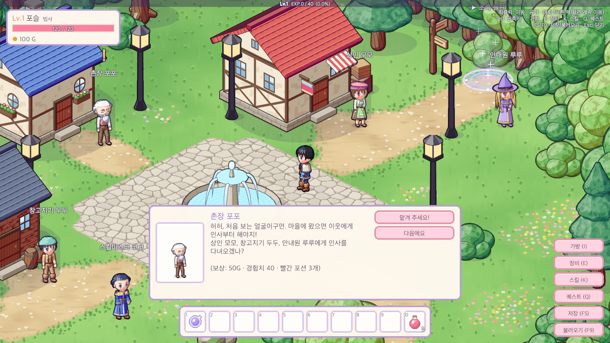

받은 뒤: 찾아가야 할 모모·두두·루루 머리 위에 `?`, 촌장 머리 위에 `…`. 오른쪽 위에 진행 표시가 생긴다.

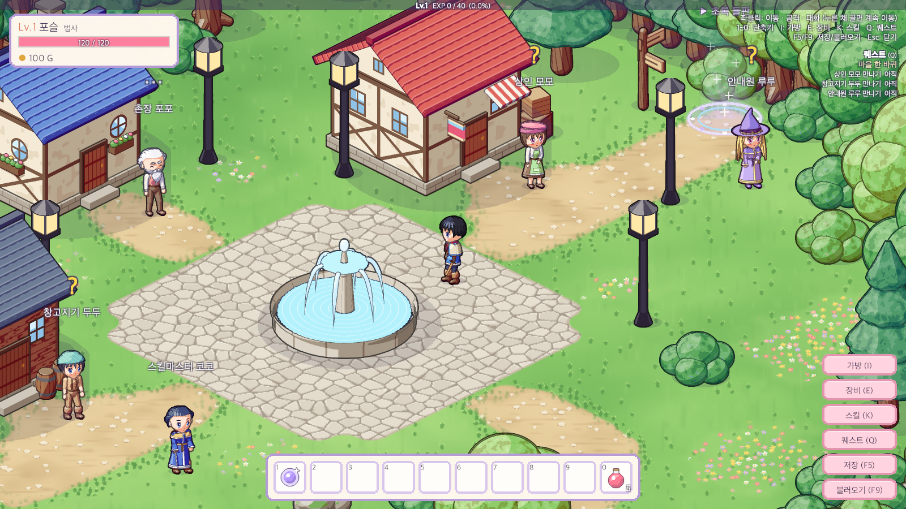

상인 모모에게 말을 걸면 퀘스트 대사가 먼저 나오고 (진행 알림 + 오른쪽 위 진행 표시가 `완료` 로), `계속` 을 누르면 원래 상점 메뉴로 간다.

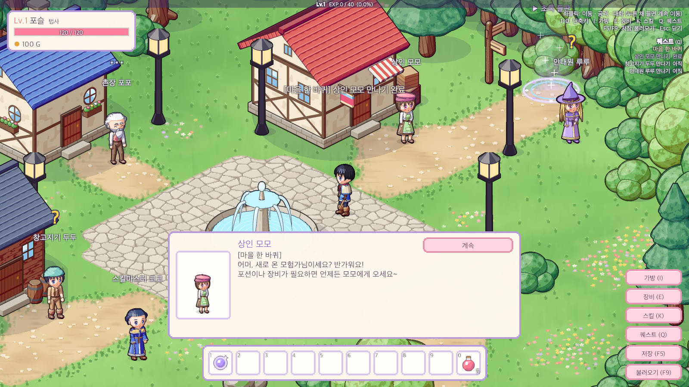

퀘스트 창(Q) — 진행 중: 목표별 진행도와 의뢰·보고 NPC

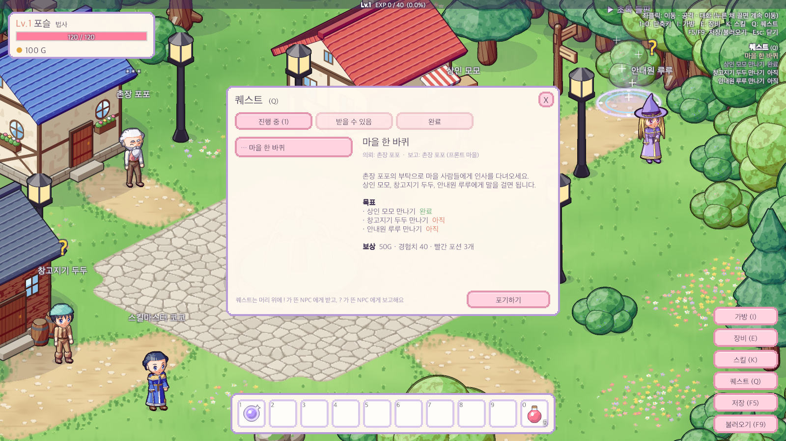

셋 다 만나면 촌장 머리 위가 `?` 로 바뀌고, 말을 걸면 보고부터 한다.

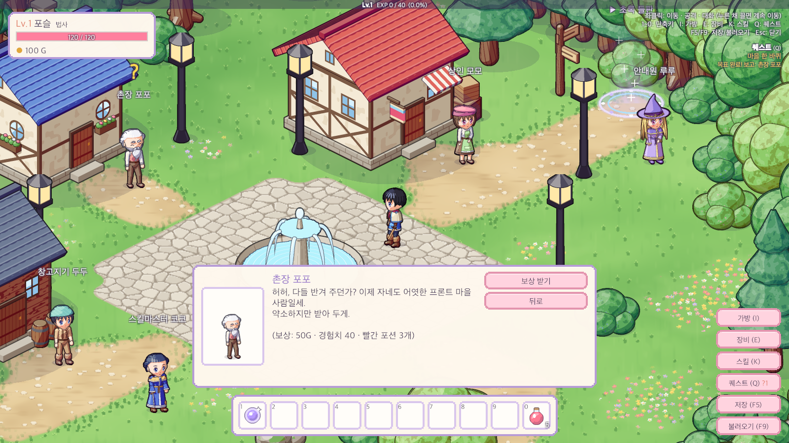

보상 받기: 레벨업 + `QUEST CLEAR!`

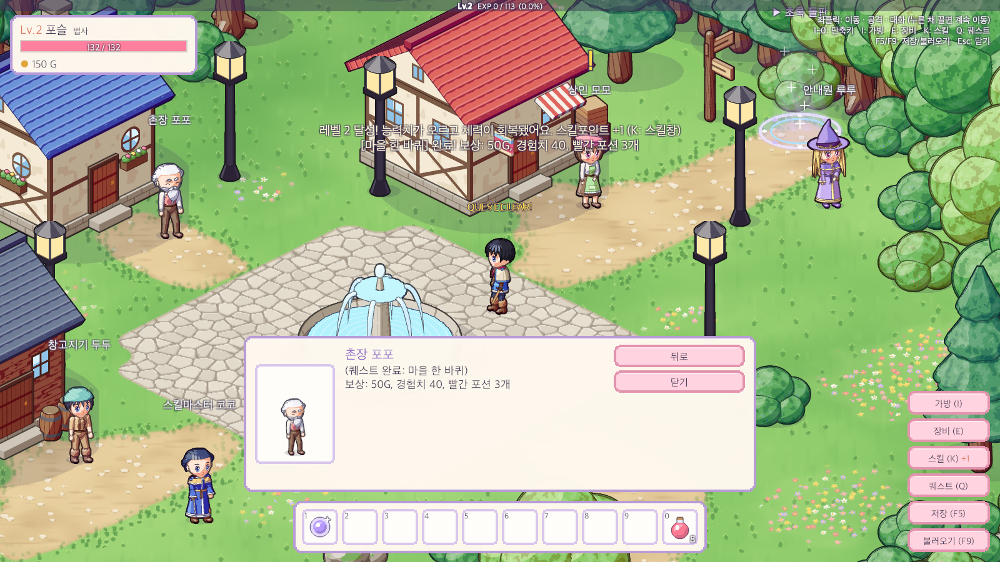

받을 수 있음 탭: 선행 퀘스트를 마치자 열린 모모의 부탁, 레벨이 모자란 퀘스트는 흐리게 `Lv.3`

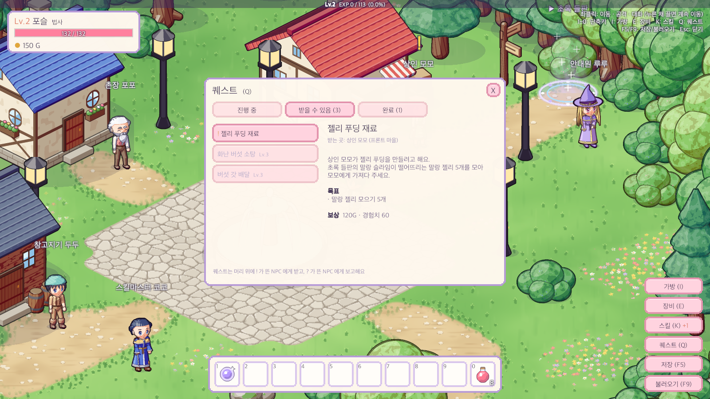

퀘스트 셋을 동시에 진행: 수집 2/5 · 사냥 3/5 · 배달 준비 완료. 보고받을 스킬마스터 코코 머리 위에 `?`

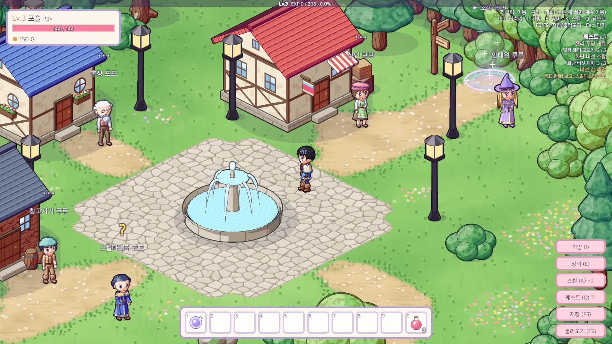

준 NPC 와 보고받는 NPC 가 다른 퀘스트. `포기하기` 는 한 번 더 눌러야 포기된다.

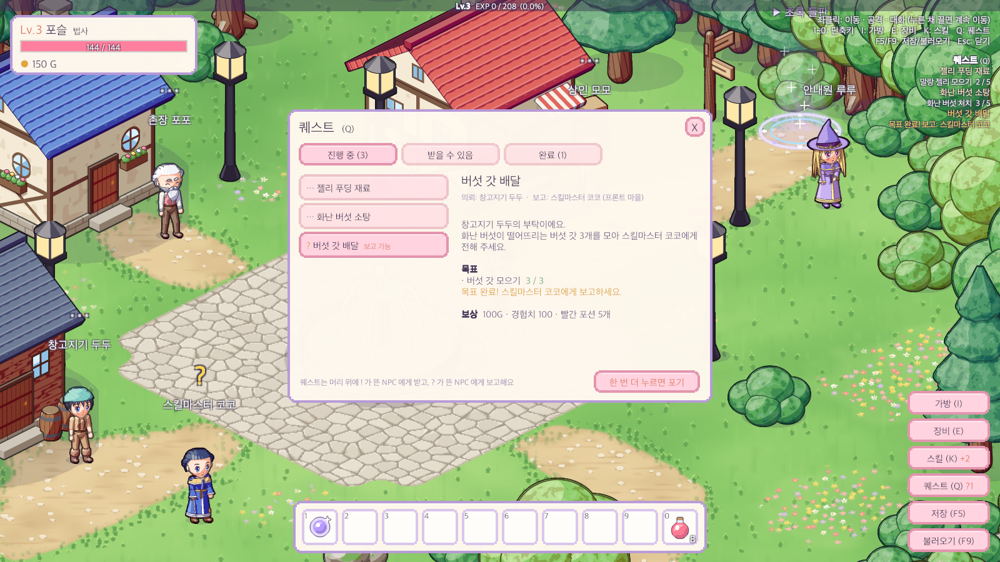

스킬마스터 코코에게 버섯 갓 전달

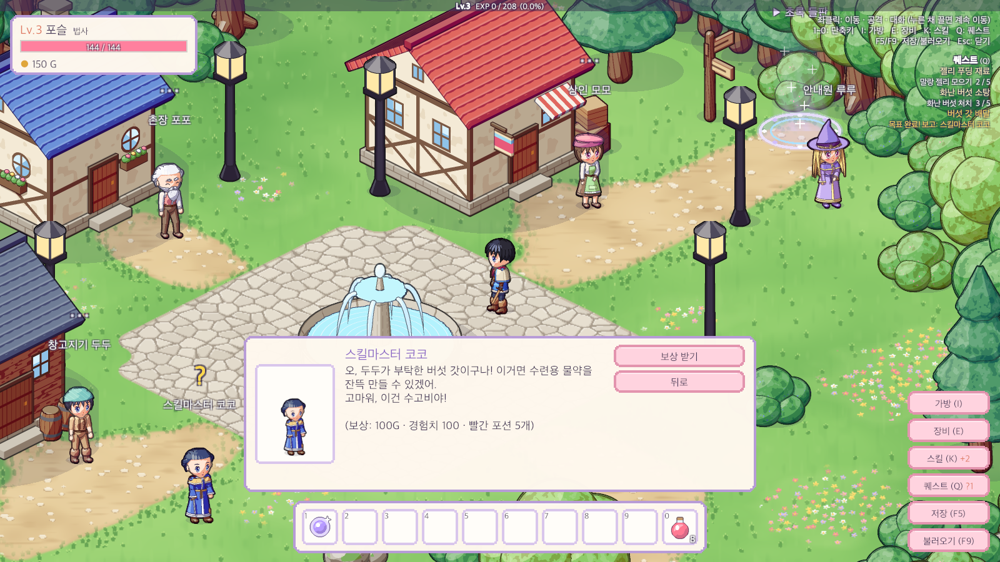

퀘스트를 준 창고지기 두두: 원래 메뉴 맨 앞에 진행 중인 퀘스트 선택지

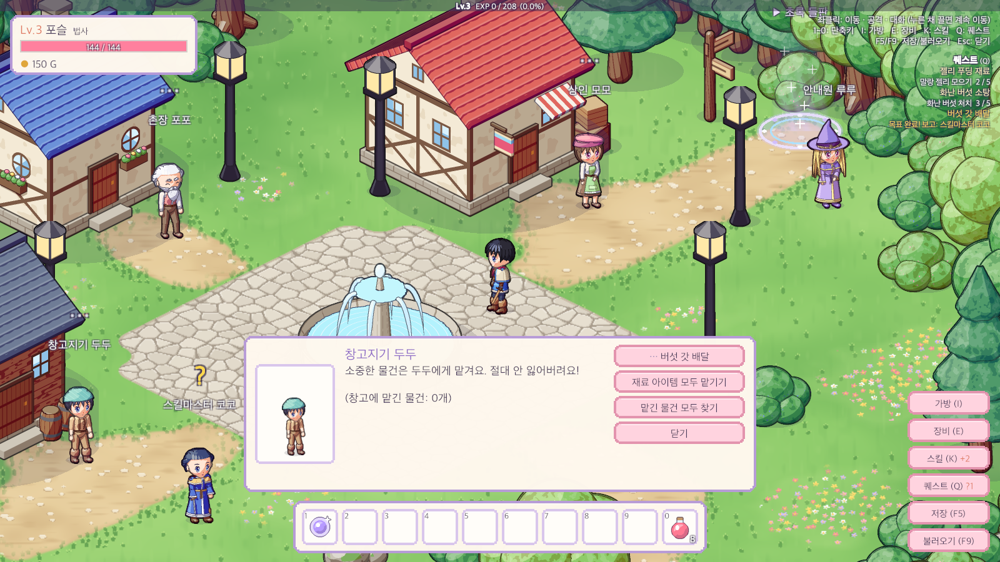

## 문제와 해결

| 문제 | 원인 / 해결 |
|---|---|
| 수집 퀘스트의 진행도를 어디에 둘지 | 따로 세면 가방과 어긋난다 → 가방에 가진 개수를 진행도로 쓰고, 가방이 바뀔 때마다 다시 센다. 모자라게 되면 "보고 가능"이 풀린다 |
| 보고할 때 수집품을 먼저 빼면 그 순간 진행도가 떨어져 "완료"로 바꿀 수 없음 | 조건 확인 → 완료로 기록 → 수집품 회수 → 보상 순서. 완료된 퀘스트는 가방을 더 세지 않는다 |
| 가방이 꽉 차면 보상 아이템이 사라질 수 있음 | 가방 복사본으로 "수집품을 내주고 보상을 넣어 보기"를 먼저 하고, 다 들어갈 때만 보고를 받음. 수집품이 빠진 자리는 보상 칸으로 셈 |
| 세이브를 불러오는 동안 "젤리 3/5" 같은 진행 알림이 쏟아짐 | 가방을 채우는 순간에는 옛 퀘스트 기록으로 다시 세고 있었다 → 불러오는 동안은 수집 목표를 세지 않고, 퀘스트 기록을 불러올 때 새 가방으로 조용히 한 번에 셈 |
| 창고에 "재료 모두 맡기기"를 하면 모아 둔 퀘스트 재료까지 맡겨짐 | 진행 중인 수집 퀘스트의 재료는 가방에 남기고 "퀘스트에 쓸 재료는 가방에 남겨 뒀어요" 안내 |
| 퀘스트가 하나뿐이던 예전 세이브(진행도 숫자 하나) | 세이브 v6 마이그레이션: 옛 진행도를 첫 목표로, 마친 퀘스트는 "한 번 마침"으로. 지금은 없는 퀘스트 기록도 지우지 않고 보존 |
| 퀘스트 대사가 대화창을 넘침 | 부탁(2~4줄) + 보상 한 줄 기준으로 대화창 본문을 넓힘. 목표 목록은 대화 대신 퀘스트 창에서 보여 줌 |
| 대화창 본문에 색 태그를 쓰면 한 글자씩 나올 때 태그가 그대로 보임 | 본문은 괄호 안내문으로, 색 기호(`?` `!` `…`)는 선택지 이름에만 씀 |
| 머리 위 `!` 가 가늘어 잘 안 보임 | 캡처로 확인 → 표시 글자를 키우고 테두리를 두껍게 |
| 퀘스트 설명의 줄바꿈이 창 폭과 안 맞아 어색하게 끊김 | 문장이 끝나는 곳에서만 줄을 바꾸고 나머지는 자동 줄바꿈에 맡김 |

## 남은 일
- 전직 퀘스트: 퀘스트 시스템에 "보상 = 전직"을 이어 붙인다
- 퀘스트가 많아지면 대화창 선택지(최대 5개)를 넘으니 목록 넘기기 필요
- 사냥 퀘스트용 몬스터 위치 안내(미니맵·지도 표시)
