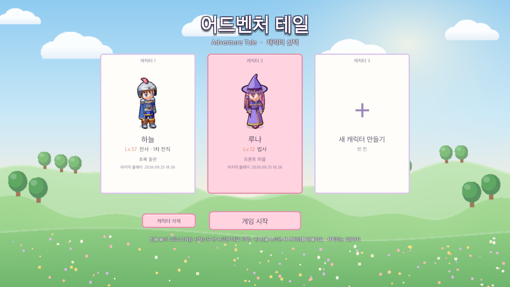
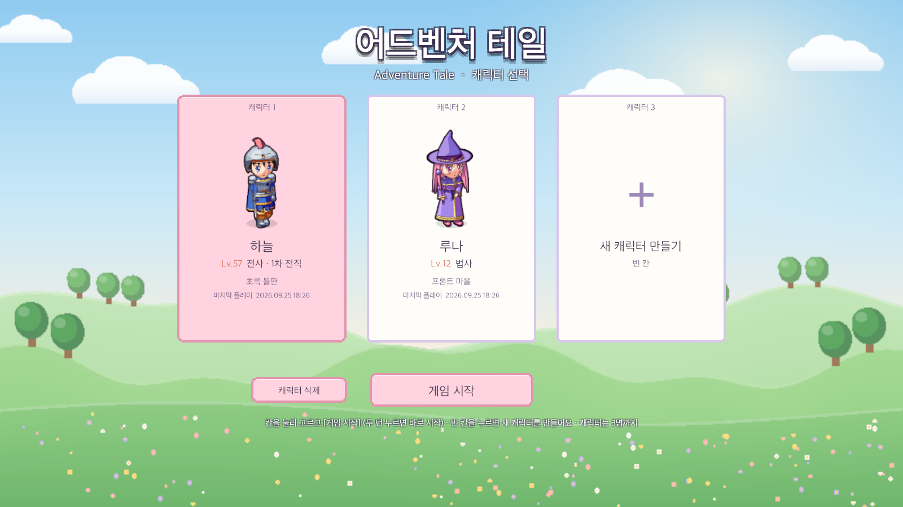
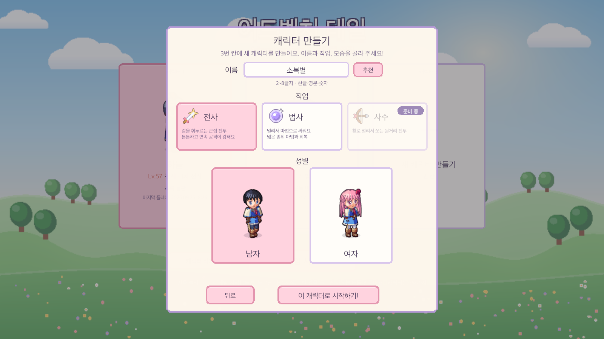
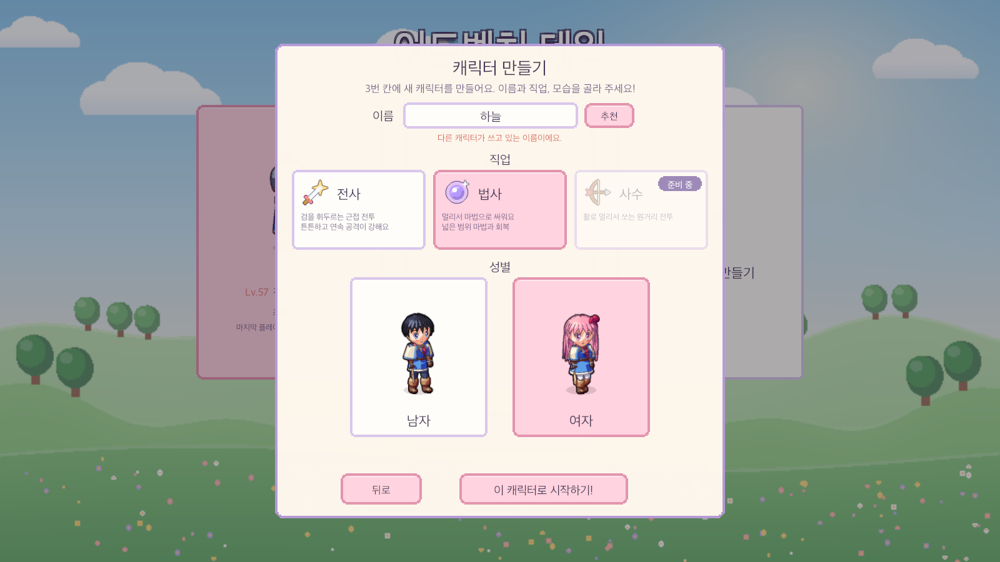
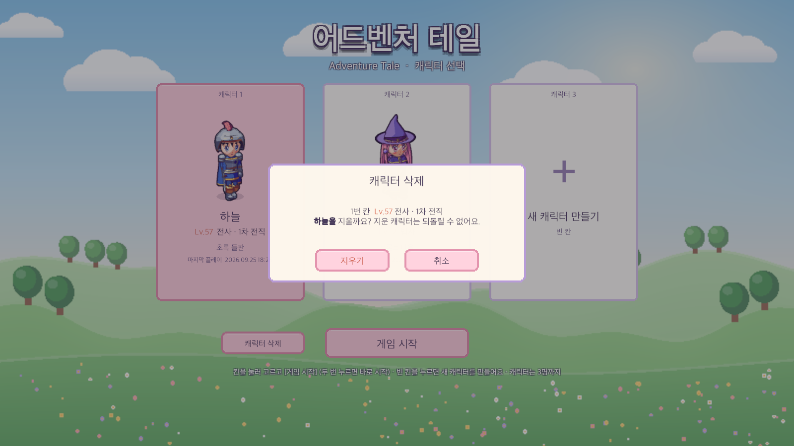
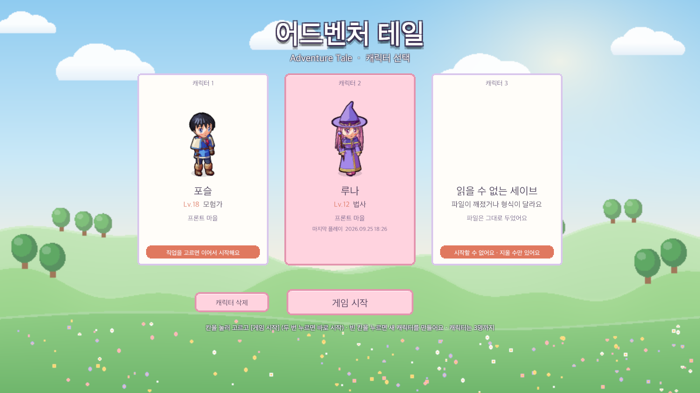
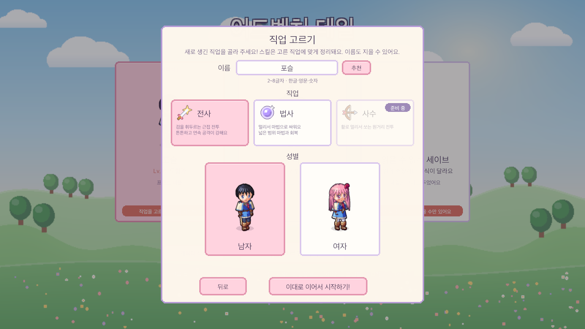
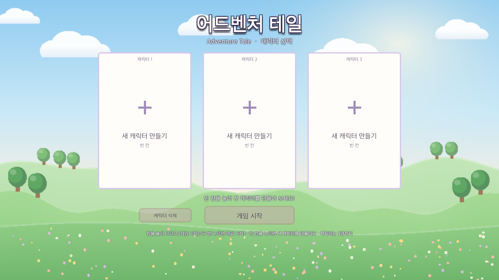

# 08. 캐릭터 선택창 · 캐릭터 생성 (이름 / 직업 / 성별)

## 작업 내용

- **캐릭터 선택창**: 게임을 켜면 월드보다 먼저 뜨는 화면
  - 캐릭터는 3명까지. 칸마다 세이브 파일이 하나씩(`slot1~3.json`) 있고, 예전 단일 세이브는 그대로 1번 칸 캐릭터가 된다
  - 칸마다 입은 장비 그대로의 캐릭터 모습 · 레벨 · 직업(전직 단계) · 있던 맵 · 마지막 플레이 시각
  - 가장 최근에 플레이한 칸을 골라 둔다. 고른 칸은 분홍 카드가 되고 캐릭터가 걸으며 빙글 돈다
  - 캐릭터 칸을 눌러 고르고 `게임 시작` (두 번 누르면 바로 시작) / 빈 칸을 누르면 캐릭터 만들기
  - `캐릭터 삭제` 는 "Lv.57 전사 · 1차 전직 하늘을 지울까요?" 확인 창을 한 번 더 거친다
  - 배경은 하늘 · 뭉게구름 · 겹겹의 언덕과 나무 · 꽃밭을 한 장으로 그린 그림 (코드로 생성)
- **캐릭터 만들기**: 이름을 짓고, 직업을 고르고, 그 직업의 캐릭터를 남 / 여로 미리 보며 고른다
  - 이름: 2~8글자, 완성된 한글 · 영문 · 숫자만 (띄어쓰기 · 기호 · "ㅋㅋ" 같은 낱자는 안 됨), 다른 칸 캐릭터와 같은 이름은 안 됨 (영문 대소문자는 같은 글자로 본다)
  - "몽글별 · 방울곰" 같은 추천 이름을 미리 채워 두고 `추천` 버튼으로 바꿀 수 있다. 타자를 치지 않고 바로 만들어도 된다
  - 안 되는 이름으로 만들기를 누르면 입력칸 아래에 까닭이 빨갛게 뜨고 창은 그대로 남는다
  - 직업: 전사 · 법사 (사수는 흐린 카드에 `준비 중`). 직업마다 첫 스킬(전사 `강타` / 법사 `에너지 볼`)을 배워 단축키 1번에 올리고, 스킬마스터가 가르치는 스킬도 직업마다 다르다
  - 만들자마자 그 캐릭터로 마을에서 시작한다. 캐릭터가 있는 칸에는 절대 덮어쓰지 않는다
- **게임 ↔ 선택창**
  - 게임 한 판 = 세션 하나. 선택창에서 고른 칸의 세이브로 월드 · 플레이어 · UI 를 만든다
  - 게임 화면 오른쪽 아래 `캐릭터 선택` → 저장 → 화면이 어두워진 뒤 월드 · 플레이어 · UI 를 모두 치우고 선택창으로 돌아온다
- **예전 세이브 · 깨진 세이브**
  - 성별 · 직업을 고른 적 없는 예전 세이브: 칸에 "직업을 고르면 이어서 시작해요" → 직업 고르기 창에서 고르고 시작 (이름도 이때 새로 지을 수 있다). 레벨 · 골드 · 퀘스트는 그대로, 스킬만 직업에 맞게 정리하고 올렸던 스킬포인트는 돌려준다
  - 읽을 수 없는 세이브: "읽을 수 없는 세이브" 카드로 보이고 시작할 수 없다. 파일은 저절로 지우지 않고, 지우기만 할 수 있다 (자세한 까닭은 칸을 누르면 아래 안내 줄에)
- **세이브 형식은 그대로**: 칸 번호가 곧 세이브 파일 이름이라 저장하는 내용은 바뀌지 않았다 (세이브 버전 v6 유지)
- **테스트**: 108 → 123개
  - 칸 이름(예전 세이브 = 1번 칸), 빈 칸 셋, 새 캐릭터는 자기 칸에만 저장
  - 캐릭터가 있는 칸 · 읽을 수 없는 세이브가 있는 칸은 덮어쓰지 않음, 고를 수 없는 직업 · 없는 칸 거부
  - 칸끼리 서로 영향 없음, 예전 세이브 직업 고르기 후 진행 유지, 지우면 빈 칸, 최근 칸 고르기
  - 이름 규칙(글자 수 · 쓸 수 있는 글자 · 겹치는 이름), 추천 이름이 늘 규칙에 맞고 겹치지 않는지, 예전 세이브 이름 새로 짓기
- **테스트 도구**: 에디터 메뉴 *세이브 모두 삭제 (캐릭터 3칸)*, Play 중 *성별·직업 다시 고르기 (지금 캐릭터)*

## 스크린샷

캐릭터 선택창: 캐릭터 둘 + 빈 칸. 가장 최근에 플레이한 법사가 골라져 있다.

다른 칸을 누르면 그 캐릭터가 골라진다.

빈 칸 → 캐릭터 만들기: 이름(추천 이름이 채워져 있다) · 직업(전사 · 법사 · 사수 준비 중) · 성별

법사 · 여자를 고른 모습

이름이 다른 칸 캐릭터와 겹치거나 쓸 수 없는 글자가 있으면 까닭을 보여 주고 창은 그대로

캐릭터 삭제 확인

예전 세이브(직업을 고르기 전)와 읽을 수 없는 세이브

예전 세이브 → 직업 고르기

처음 켰을 때 (캐릭터 없음)

게임 화면 오른쪽 아래 `캐릭터 선택` 버튼

## 문제와 해결

| 문제 | 원인 / 해결 |
|---|---|
| 세이브가 하나뿐인데 캐릭터는 여럿 | 칸 번호 = 세이브 파일 이름(`slot1~3`). 예전 단일 세이브 이름이 `slot1` 이라 옮기는 작업 없이 1번 칸 캐릭터가 되고, 저장 내용은 바뀌지 않아 세이브 버전도 그대로 |
| 선택창은 게임 세션보다 먼저라 HUD 가 없다 | 선택창이 자기 캔버스를 만들고, 캐릭터 만들기 창은 세션 없이 여는 조건(처음 고른 값 · 미리보기 장비 · 문구 · 뒤로)을 받게 바꿔 선택창과 게임 안에서 함께 쓴다 |
| 선택창으로 돌아갔다가 다른 캐릭터로 시작하면 이전 세션이 남을 수 있음 | 세션이 만든 것(월드 · 플레이어 · UI · 세션)을 나갈 때 모두 치우고 멈춘 시간 · 툴팁 · 드래그도 되돌림. 실제 Play 모드로 두 캐릭터를 오가며 루트 오브젝트 · 플레이어 수 · HUD 수를 확인 |
| 새 캐릭터를 만들다 기존 캐릭터를 덮어쓸 위험 | 만들기는 파일이 없는 칸에서만 된다. 읽을 수 없는 세이브가 있는 칸도 덮어쓰지 않고, 지우는 것은 확인 창을 거친 사용자만 |
| batchmode 에서 Play 모드를 돌리면 첫 프레임 뒤 아무것도 진행되지 않음 | Play 에 들어갈 때 에디터가 스크립트 도메인을 다시 불러와 시험 스크립트의 등록이 사라졌다 → 단계 번호를 에디터 세션 상태에 저장하고 다시 불러온 뒤 스스로 다시 등록, 가져오기가 끝나 가라앉은 뒤에 Play |
| 흐름 시험 · 캡처가 실제 세이브를 만들거나 지울 위험 | 프로젝트 복제본에서만 세이브 폴더를 임시 폴더로 바꿔서 시험하고, 시험 전후로 실제 세이브 파일의 해시를 비교 |
| 빈 칸 카드의 미리보기 자리에 흰 네모 | 그림 없는 UI Image 는 흰 사각형으로 그려진다 → 캐릭터 그림이 오기 전까지 숨김 |
| 깨진 세이브 카드의 긴 오류 문구가 아래 줄과 겹침 | 카드에는 "파일이 깨졌거나 형식이 달라요"만, 기술적인 까닭은 칸을 눌렀을 때 아래 안내 줄에 |
| 예전 세이브를 직업 고르기 창으로 열었는데 제목이 "캐릭터 만들기" | 창 제목도 여는 쪽에서 정하게 해 "직업 고르기" / "성별·직업 다시 고르기" 로 |
| 캐릭터가 여럿인데 모두 같은 기본 이름 | 캐릭터 만들기에 이름 짓기를 넣음. 규칙은 게임 규칙 쪽(순수 코드)에 두어 창의 즉시 확인과 저장할 때의 확인이 같은 함수를 쓴다 |
| 한글 입력(조합 중인 글자)을 batchmode 에서 시험할 수 없음 | 추천 이름을 미리 채워 두어 타자 없이도 만들 수 있게 하고, 입력 결과는 규칙 테스트로 확인. 실제 한글 입력은 에디터에서 직접 확인 |

## 남은 일
- 사수 직업 (스킬 트리 · 캐릭터 모습 · 캐릭터 만들기의 준비 중 카드 교체)
- 직업별 시작 장비 · 초기 능력치 (지금은 직업과 상관없이 같은 시작 장비)
