# 09. 게임 글꼴 · UI 스타일 개선

## 작업 내용

- **글꼴**: OS 기본 글꼴(맥 Apple SD 고딕 Neo / 윈도우 맑은 고딕) 대신 **나눔스퀘어라운드** 를 게임에 넣었다
  - 네모반듯한 스퀘어체 뼈대에 끝이 둥글어서 파스텔 그림체와 어울린다. 후보(나눔스퀘어 네오 / 나눔스퀘어라운드)를 실제 게임 문구로 비교해 골랐다
  - 보통 · 굵게 · 아주 굵게 세 파일을 굵기마다 따로 쓴다: 제목 · 숫자 = 아주 굵게, 버튼 · 이름 · 라벨 = 굵게, 본문 = 보통
  - SIL 오픈 폰트 라이선스라 게임에 넣어 판매할 수 있다 (저작권 안내 + 라이선스 전문을 함께 넣는 조건, 글꼴만 따로 파는 것은 안 됨). 원본 TTF 를 수정하지 않고 넣고 라이선스 전문을 같은 폴더에 두었다
  - 이제 맥 / 윈도우 어디서든 같은 글꼴로 보인다
- **UI 방향: 크림색 둥근 판** (크림색 둥근 판 / 남색 반투명 판 / 지금 도트 테두리 유지, 세 가지 목업 중 고름)
  - 도트 테두리 판 → 모서리가 매끄러운 고해상도 판 (캐릭터 · 월드가 고해상도 툰 그림이라 맞췄다). 판은 여전히 전부 코드로 그린다
  - 창 = 크림색 판 + 부드러운 그림자 + 라벤더 머리 띠(아이콘 · 제목 · 단축키 키캡 · 둥근 닫기 버튼) + 아래 안내 줄(`Esc 닫기`)
  - 목록은 흰 카드 한 줄씩, 고른 것은 연분홍 카드. 단계 · 분류는 살짝 파인 바탕 위의 탭. 주 동작 버튼은 분홍, 보통 버튼은 흰색 (아래쪽 턱으로 도톰하게)
- **HUD: 글자 나열 → 구성**
  - 왼쪽 위 상태창: 분홍 레벨 배지 · 이름 + 직업 알약 · 둥근 HP 막대 · 금화 + 골드
  - 오른쪽 위: 늘 떠 있던 3줄 조작 도움말을 없애고 그 자리에 퀘스트 진행 카드 (○ 진행 중 / 초록 ● 채움, 보고할 퀘스트는 금색)
  - 오른쪽 아래: 글자 버튼 7개를 세로로 쌓던 것 → 아이콘 메뉴 5개 (가방 · 장비 · 스킬 · 퀘스트 · 메뉴)
    - 버튼 모서리에 단축키 키캡(I · E · K · Q), 남은 스킬포인트 `+N` · 보고할 퀘스트 `?N` 배지
    - 저장 · 불러오기 · 캐릭터 선택은 `메뉴` 버튼 위에 뜨는 작은 창으로 (`Esc` 로 닫힌다)
  - 왼쪽 아래: 키캡 + 설명으로 된 조작 안내 두 줄 (어두운 반투명 판, 클릭은 뒤의 월드로 그대로)
  - 핫바 칸 모서리에 숫자 키캡, 포션 개수는 굵은 숫자
  - 알림: 월드 위에 떠 있던 글자 → 어두운 둥근 판 (글자 길이에 맞춰 커지고 3줄까지 쌓인다). 맵 이름은 양옆이 흐려지는 어두운 띠 + 큰 글자
  - 맨 위 경험치 띠: 10% 눈금과 윤기
- **창마다**
  - 가방: 아래에 금화 + 골드 카드 줄
  - 장비: 칸 이름은 칸 아래로, 능력치는 카드 두 열 (이름은 흐리게 · 값은 굵게 · 장비 보너스는 초록)
  - 스킬: 머리 띠에 직업 · 남은 스킬포인트 알약, 스킬마다 카드 한 줄 (레벨 알약 + 분홍 `+`)
  - 스킬마스터: 카드 줄 + 분홍 `배우기`, 배운 결과는 아래 안내 줄에 초록 / 주황
  - 퀘스트: 탭 + 왼쪽 카드 목록 + 오른쪽 흰 상세 카드
  - 대화: 창 위 가장자리에 걸친 분홍 이름표
  - 툴팁: 굵은 제목 + 구분선 + 본문
  - 몬스터 정보 박스: 둥근 HP 막대 (깎인 만큼 남는 흔적도 그대로)
  - 데미지 숫자 · 머리 위 퀘스트 표시: 아주 굵은 글꼴 + 조금 더 두꺼운 테두리
- **캐릭터 선택창 · 만들기**: 같은 판 · 카드 · 버튼. 안내 문구와 오류 문구는 어두운 판 위에 (풀밭 배경에서도 읽히게)
- **테스트**: 게임 규칙은 바뀌지 않아 123개 그대로. 실제 Play 모드 흐름 시험에 "넣은 글꼴을 쓰는지 · 창이 열리고 `Esc` 로 하나씩 닫히는지 · 메뉴 · 알림 판" 확인을 더했다

## 스크린샷

고르기 전 비교: 글꼴 후보(위)와 UI 방향 목업(아래). 크림색 둥근 판 + 나눔스퀘어라운드로 정했다.

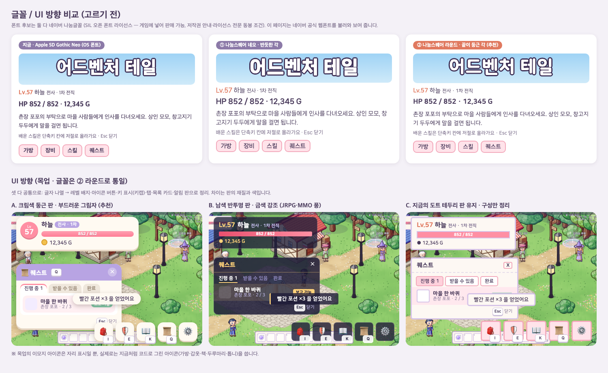

바꾸기 전 (08 의 게임 화면)

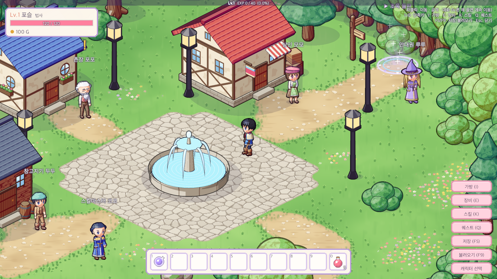

바꾼 뒤: 상태창 · 퀘스트 진행 카드 · 조작 안내 · 핫바 키캡 · 아이콘 메뉴(배지)

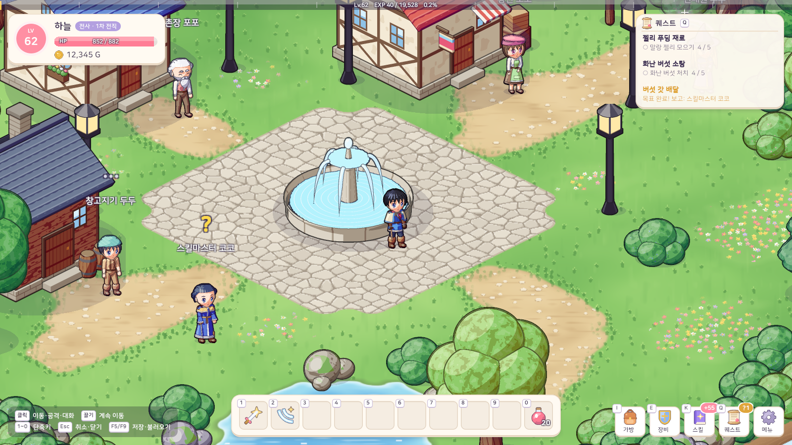

맵 이름 띠와 알림 판 (여러 알림은 쌓인다)

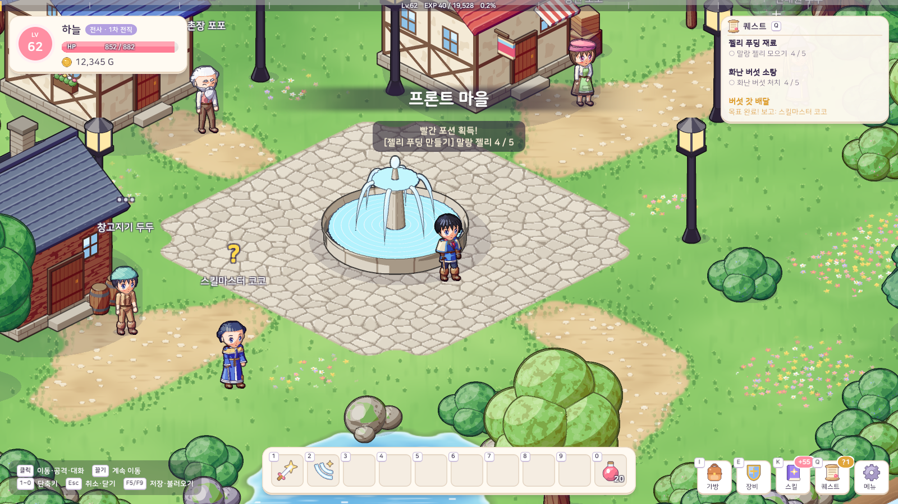

가방 · 장비 창과 툴팁

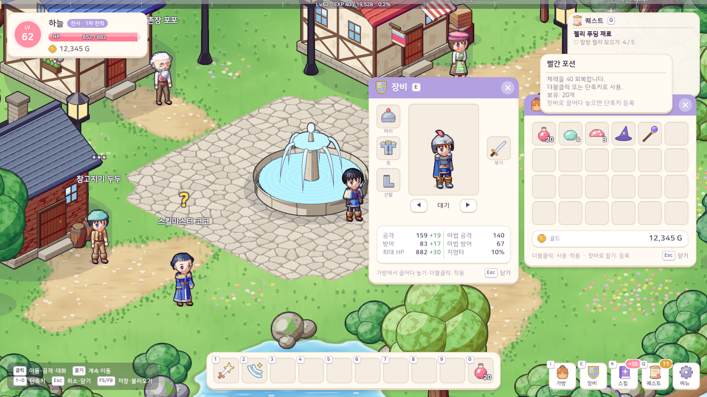

스킬 창: 탭 + 카드 줄, 머리 띠에 직업 · 스킬포인트

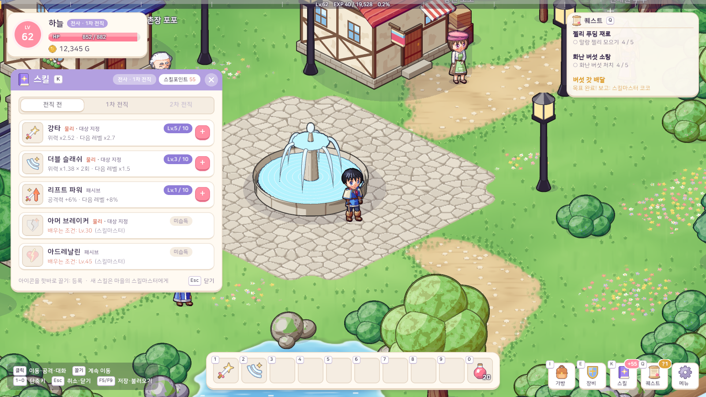

스킬마스터 창: 배운 결과가 아래 안내 줄에

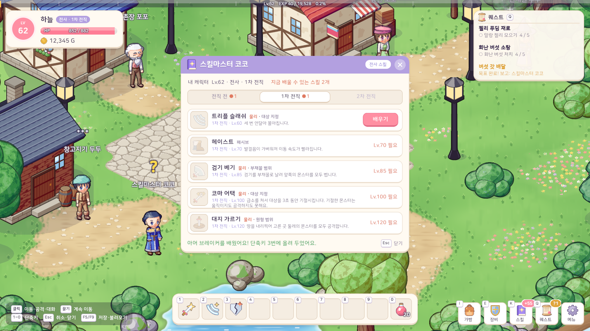

퀘스트 창

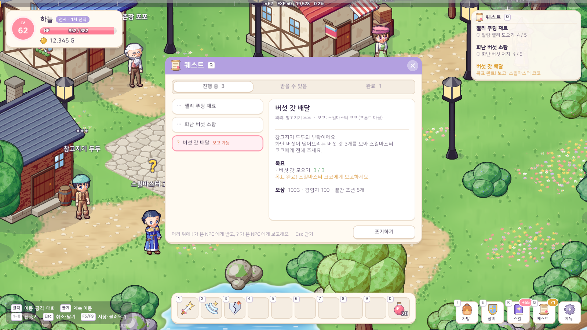

대화창: 가장자리에 걸친 이름표

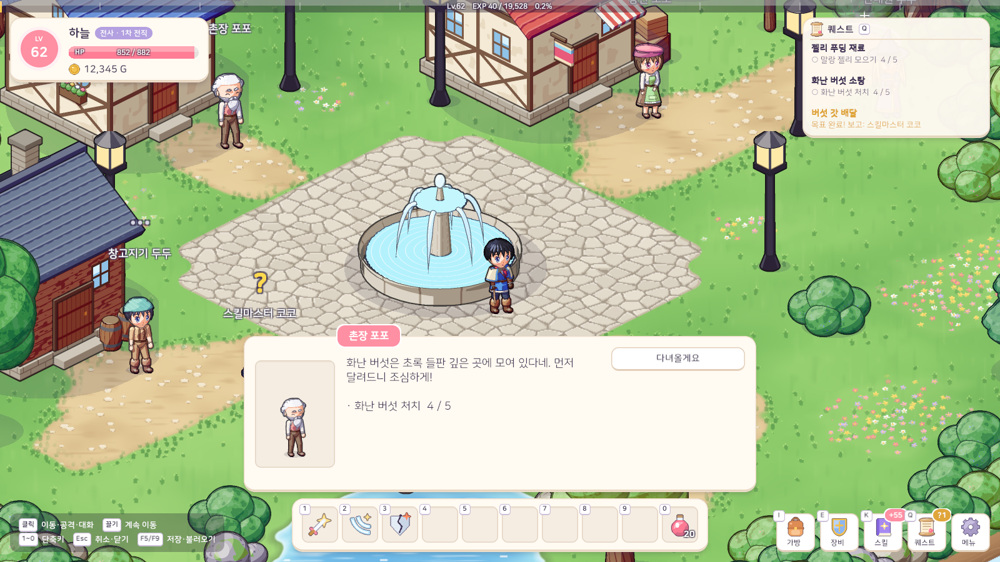

메뉴 버튼 → 저장 · 불러오기 · 캐릭터 선택

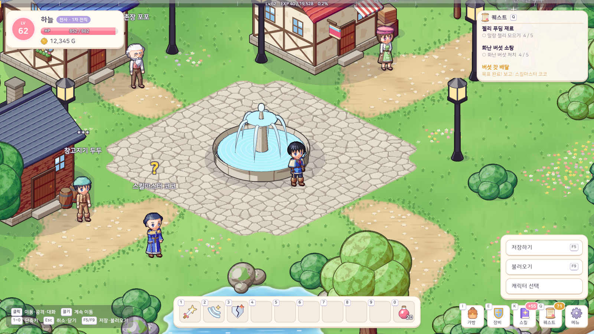

들판: 몬스터 정보 박스와 굵은 데미지 숫자

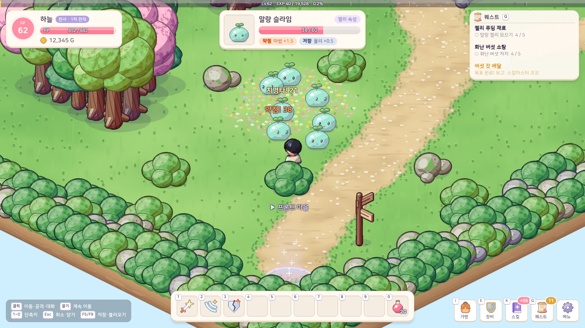

캐릭터 선택창 · 캐릭터 만들기 · 삭제 확인

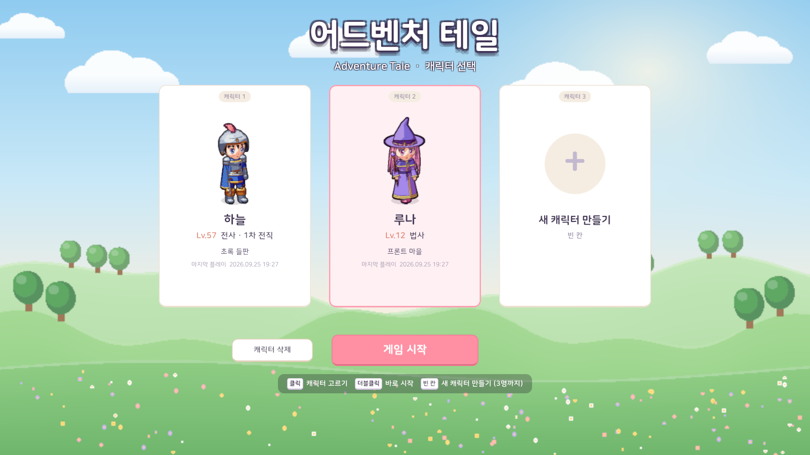

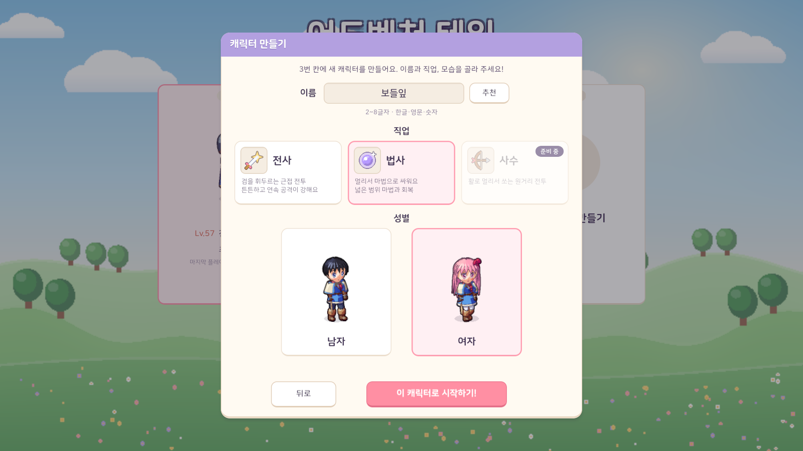

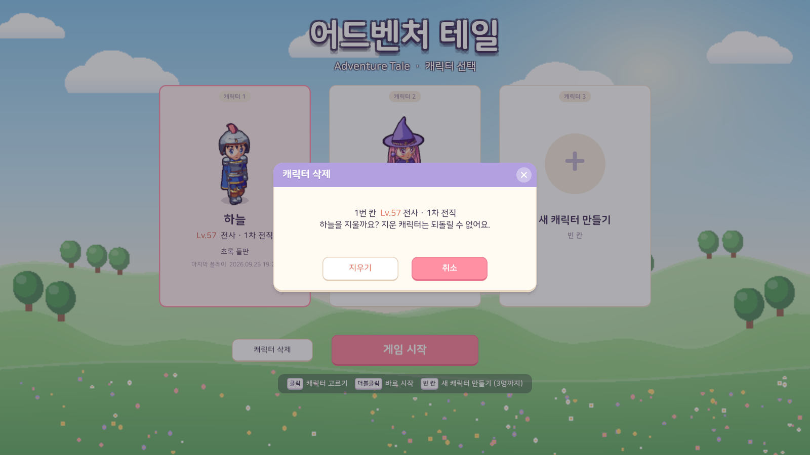

선택창의 오류 안내도 어두운 판 위에

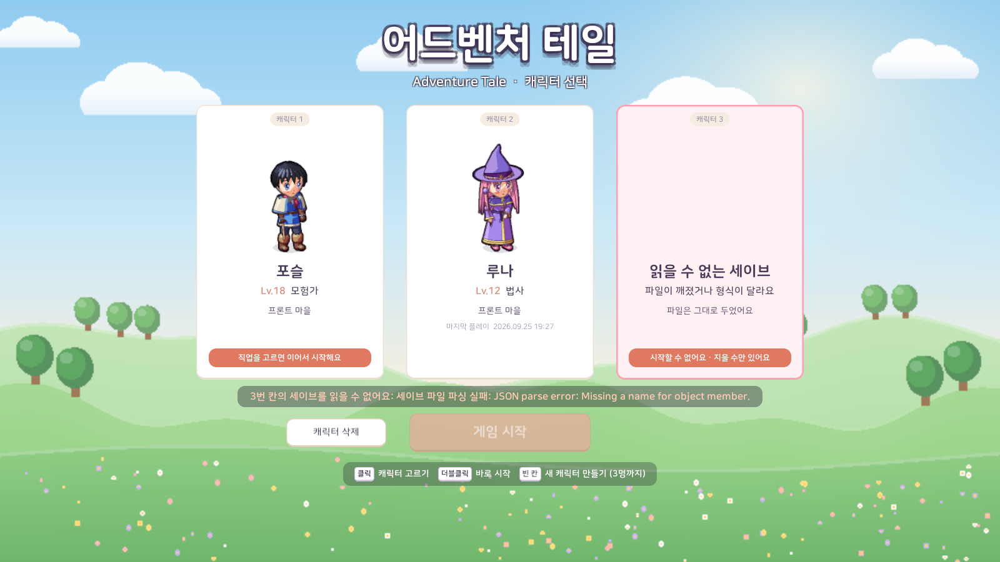

## 문제와 해결

| 문제 | 원인 / 해결 |
|---|---|
| 기본 글꼴 느낌, OS 마다 다른 글꼴 | 라이선스가 확인된 글꼴(나눔스퀘어라운드, OFL)을 게임에 넣었다. 굵기별 파일 세 개를 따로 불러, 글자를 번지게 그리는 가짜 굵게 대신 진짜 굵은 글꼴을 쓴다 |
| 받은 글꼴 압축 파일에 라이선스 문서가 없음 | 네이버 공식 배포처의 원본을 수정 없이 넣고, 네이버가 밝힌 저작권 문구 + OFL 1.1 전문으로 라이선스 파일을 만들어 글꼴 옆에 두었다 (빌드에도 함께 들어간다) |
| 새 글꼴에 없는 글자가 있으면 네모로 나온다 | 글꼴 파일의 글자 표를 읽어 게임 코드에 쓰인 모든 글자와 대조했다. 한글 11,172자는 모두 있지만 ✓ ✔ ✕ 가 없다 → 체크는 ● / ○, 닫기 ✕ 는 코드로 그린 아이콘 |
| 도트 테두리 판이 고해상도 캐릭터와 어긋남 | 판도 고해상도로: UI 1칸 = 2픽셀로 그리고, 둥근 사각형까지의 거리로 가장자리를 부드럽게 깎았다. 9-슬라이스라 어떤 크기로 늘려도 모서리는 그대로 |
| 창에 그림자를 넣으면 창이 안쪽으로 작아 보임 | 그림자 여백까지 들어간 그림을 사각형 밖으로 넓혀 그리는 메시 효과를 붙였다 → 창 안 배치 좌표와 클릭 영역은 그대로 |
| 둥근 막대의 채움 끝이 네모로 삐져나옴 | 알약 모양 바탕을 마스크로 써서 채움의 양 끝을 잘라냈다 (채움 비율을 바꾸는 코드는 그대로) |
| 반투명 닫기 버튼에 마우스를 올려도 변화가 없음 | 버튼 색 변화는 곱하기라 원래보다 진해질 수 없다 → 색 배율 2 + 평소 0.5 로 두어 올렸을 때 진해지게 |
| 창마다 색 · 글자 크기를 제각각 정해 톤이 흩어짐 | 스타일 값(색 · 글자 크기 · 창 틀 치수)을 한 곳에 모으고, 창 틀 · 탭 · 막대 · 키캡 · 알약을 조립 부품으로 만들어 모든 창이 같은 부품을 쓴다 |
| 16:10 화면에서 아래 줄(조작 안내 · 핫바 · 메뉴)이 겹칠 위험 | 16:10 에서 캔버스 폭이 1600 → 약 1518 로 줄어드는 것을 계산해 안내 문구를 줄이고 세 덩어리의 폭을 맞췄다 |
| 풀밭 배경 위의 안내 문구가 잘 안 읽힘 | 글자 테두리 대신 어두운 반투명 판 위에 올렸다 |
| 장비 칸 이름이 아이콘과 겹침 | 칸 이름을 칸 안 모서리에서 칸 아래로 옮겼다 |
| 모든 글자를 TextMeshPro 로 바꿀지 | 모든 글자 · 입력칸을 한꺼번에 바꾸는 부담과 한글 입력칸 위험이 커서 이번에는 기존 글자 컴포넌트를 유지. 글자를 만드는 곳을 한 곳으로 모아 나중에 그곳만 바꾸면 되게 했다 |

## 남은 일
- TextMeshPro 전환 (테두리 · 그림자를 더 또렷하게, 크기 애니메이션)
- 게임패드를 지원하게 되면 키캡 대신 패드 버튼 그림
- 한글 입력칸(캐릭터 이름)의 조합 중 글자 표시를 에디터에서 직접 확인
