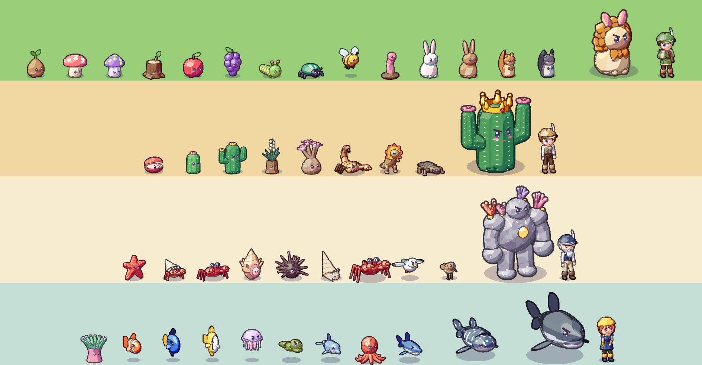
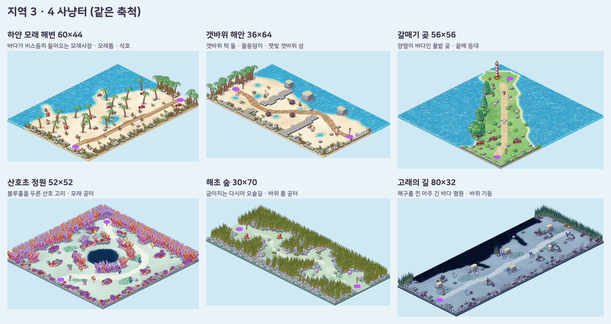
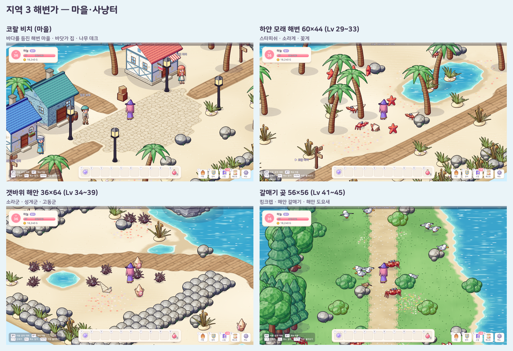
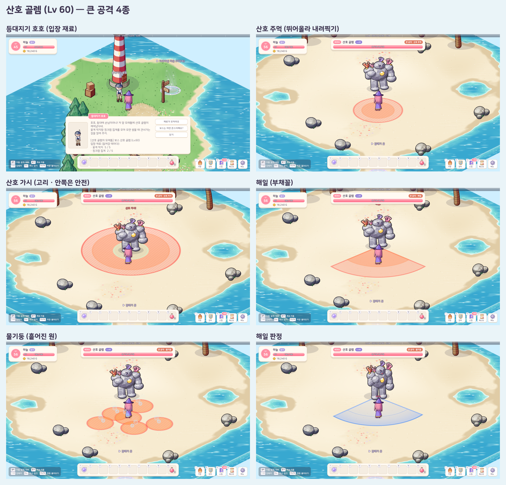
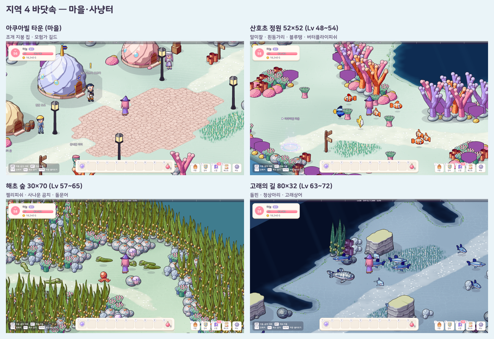
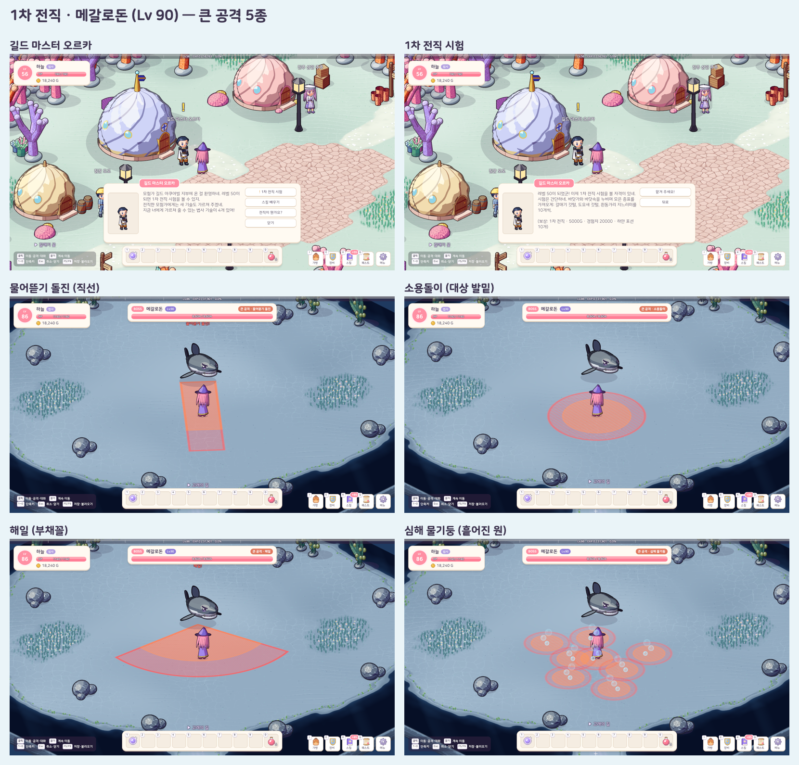
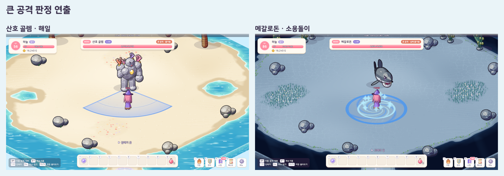
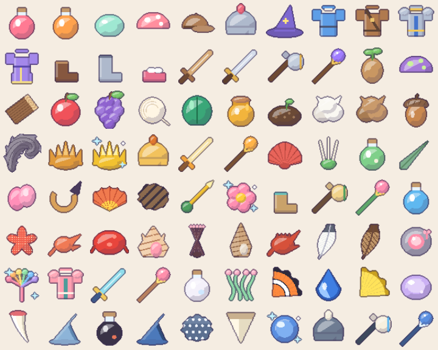

# 11. 지역 3 · 4 (해변가 · 바닷속) · 1차 전직 퀘스트 · 사냥 경험치 1.75배

## 작업 내용

10 에서 만든 지역 · 몬스터 · 보스 틀에 **지역 3 · 4 를 이어 붙이고**, 레벨 50 무렵에 도착하는 바닷속 마을에 **1차 전직 퀘스트**를 넣었다. 몬스터 사냥 경험치도 1.75배로 올렸다.

- **사냥 경험치 1.75배**: 몬스터 경험치는 레벨 공식(`8 × 레벨^1.25`)으로 정하므로, 몬스터마다 고치지 않고 공식 전체에 배율 하나를 곱했다
  - 같은 레벨 몬스터로 한 레벨을 올리는 데 드는 마릿수: 레벨 1 = 5 → 약 3마리, 레벨 20 = 11 → 약 6마리, 레벨 50 ≈ 8마리
  - 보스 배율(10배)과 퀘스트 보상 경험치는 그대로. 배율은 기획 범위(1.7~1.8배)를 테스트가 지킨다
- **지역 3 해변가 (Lv 29~60)**: 붉은 모래 협곡 동쪽 끝 → *코랄 비치*(바다를 등진 해변 마을, 나무 잔교) → 하얀 모래 해변(Lv 29~33) → 갯바위 해안(Lv 34~39) → 갈매기 곶(Lv 41~45) → 곶 끝 등대의 등대지기에게 재료 → 보스 필드 *산호 골렘의 모래톱*
- **지역 4 바닷속 (Lv 48~90)**: 갈매기 곶 등대 옆 잠수 계단 → *아쿠아빌 타운*(조개 지붕 돔 집, 모험가 길드) → 산호초 정원(Lv 48~54) → 해초 숲(Lv 57~65) → 고래의 길(Lv 63~72) → 잠수부에게 재료 → 보스 필드 *메갈로돈의 해구*
- **사냥터 여섯 곳도 크기 · 모양 · 지형을 모두 다르게** (10 에서 정한 규칙)
  - 하얀 모래 해변 60×44 = 바다가 비스듬히 들어오는 넓은 모래사장, 바다로 뻗은 모래톱 둘 · 가운데 석호(야자수 섬)
  - 갯바위 해안 36×64 = 남북으로 긴 바위 해안, 가로로 뻗은 갯바위 턱 둘이 해안을 세 만으로 나누고 틈이 엇갈려 길이 지그재그, 바다 쪽에 잿빛 갯바위 섬
  - 갈매기 곶 56×56 = 양옆이 바다인 풀밭 곶, 뿌리 쪽 바위밭(킹크랩) → 가운데 풀밭(갈매기) → 곶 끝(도요새) · 등대
  - 산호초 정원 52×52 = 가운데 깊은 구덩이(블루홀)를 틈이 넷 난 산호 고리가 두르고 바깥으로 모래 공터가 방처럼 열린다
  - 해초 숲 30×70 = 키 큰 다시마 사이로 굽이치는 좁고 긴 오솔길, 바위 틈 공터(곰치의 굴)
  - 고래의 길 80×32 = 뒤쪽을 따라 해구가 입을 벌린 아주 긴 바다 평원, 잿빛 바위 기둥
- **몬스터 19종 + 보스 2**: 스타피쉬 · 소라게 · 꽃게 · 소라군 · 성게군 · 고동군 · 킹크랩 · 해안 갈매기 · 해안 도요새 / 바다말미잘 · 흰동가리 · 블루탱 · 버터플라이피쉬 · 젤리피쉬 · 사나운 곰치 · 돌핀 · 돌문어 · 청상아리 · 고래상어 / 산호 골렘(Lv 60) · 메갈로돈(Lv 90)
  - 전부 3D 도형 인형 + 툰 렌더러. 비슷한 몬스터는 조립 함수 하나를 변형으로 나눴다 (게 = 꽃게 · 킹크랩 · 소라게, 산호초 물고기 = 흰동가리 · 블루탱 · 버터플라이피쉬, 상어 = 청상아리 · 고래상어 · 메갈로돈)
  - 새 이동 방식 **헤엄**: 몸 전체가 바닥 위에 떠 있고(그림자는 바닥에) 걸음에 맞춰 꼬리를 좌우로(돌고래는 위아래로) 흔든다
  - 고래상어는 보스처럼 2배 해상도 · 2배 크기로 그렸다
- **보스 큰 공격이 지역마다 하나씩 늘어난다** (2 → 3 → 4 → 5종)
  - 산호 골렘: *산호 주먹*(뛰어올라 내려찍기) · *산호 가시*(고리 — 품에 파고들면 안전) · *해일*(부채꼴) · *물기둥*(여러 곳 — 예고 동안 원마다 거품이 올라온다)
  - 메갈로돈: *물어뜯기 돌진*(직선) · *꼬리 후려치기*(둘레) · *소용돌이*(발밑 원) · *해일*(부채꼴) · *심해 물기둥*(여러 곳)
  - 판정 연출 여섯 가지를 새로 만들었다: 솟는 산호 가지 고리 · 바깥으로 밀려가는 물살 · 솟구치는 물기둥 · 빙글빙글 도는 소용돌이 · 거품 자국을 남기는 돌진 · 꼬리 물결
- **바닷가 · 바닷속 분위기 다섯 가지**: 하얀 모래 해변 · 바닷가 풀밭 · 산호초 · 해초 숲 · 깊은 바다
  - 바다: 물가에 모래 띠 + 밀려오는 흰 파도 줄, 맵 앞쪽 가장자리가 바다면 흙 절벽 대신 바닷물 옆면. 해변의 길은 나무 데크(물 위 잔교 아래로 바다가 이어진다), 꽃밭 자리는 조개껍데기 · 불가사리
  - 바닷속: 모래 바닥에 물결 빛 무늬(코스틱), 꽃밭 자리 = 키 큰 해초, 물 = 끝없이 깊은 구덩이. 맵 바깥 배경도 물빛(깊은 바다일수록 짙게)
  - 장식물: 갯그령 · 따개비 갯바위 · 가지 산호(분홍 · 주황 · 라벤더) · 뇌 산호 · 부채 산호 · 관 해면 · 말미잘 무리 · 다시마 · 바닷가 집 · 조개 돔 집(상점 · 창고 · 모험가 길드) · 등대 · 잿빛 갯바위 섬
- **1차 전직 퀘스트**: 레벨 50 무렵 도착하는 아쿠아빌 타운의 **길드 마스터 오르카**
  - *1차 전직 시험*: 바닷가와 바닷속에서 모은 증표(갈매기 깃털 · 도요새 깃털 · 흰동가리 지느러미 10개씩)를 전하면 1차 전직
  - 직업을 고른 전직 전 캐릭터만, 레벨 50부터 받는다. 레벨 50이 되기 전에는 퀘스트 목록에도 보이지 않는다 (새 캐릭터 목록을 어지럽히지 않게)
  - 오르카는 스킬마스터 역할도 해서 전직하자마자 그 자리에서 1차 스킬을 배운다. 전직 알림은 1차 스킬을 언제부터 배울 수 있는지 알려 준다 (법사는 레벨 50, 전사는 60부터)
  - 전직 퀘스트는 퀘스트 정의에 "마치면 오르는 전직 단계" 하나를 더한 것 → 2차 전직도 같은 틀로 잇는다
- **NPC 9명 추가** (지역마다 상인 · 안내원 · 짐꾼 + 보스 안내, 아쿠아빌의 길드 마스터), 재료 아이콘 23종 + 파란 · 하얀 포션, 보스 장비 6종(산호 갑옷 · 파도 가르는 검 · 산호 지팡이 · 상어 투구 · 톱니 이빨 도끼 · 심해 진주 지팡이)
- **퀘스트 4개**: 소라게의 집게발 · 곶을 막은 킹크랩(반복) · 탱글탱글 해파리 젤 · 고래의 길을 지켜라(반복)
- **테스트**: 147개 → 152개. 지역 기획표에 지역 3 · 4 몬스터 20줄 · 보스 2줄, 전직 퀘스트(레벨 50 마을 · 직업 · 전직 단계 조건 · 한 번만 전직 · 전직 알림), 사냥 경험치 배율
  - 실제 Play 모드 흐름 시험에 더했다: 협곡 → 코랄 비치 포탈, 상인 대화, 길드 마스터 대화로 전직 퀘스트 받기 · 보고 → 1차 전직, 새 사냥터 여섯 곳 몬스터, 보스 두 마리의 큰 공격 9종을 하나씩 발동해 연출까지, 처치 · 전리품, 바닷속에서 기절하면 아쿠아빌

## 스크린샷

지역별 몬스터 · 보스 (위부터: 작은 산골동네 / 사막 / 해변가 / 바닷속, 오른쪽 끝 = 보스와 보스 안내 NPC)

지역 3 · 4 사냥터 여섯 곳 (맵 전체, 같은 축척)

지역 3 해변가 — 마을 · 사냥터

산호 골렘 — 보스 안내 NPC · 큰 공격 네 가지 예고 · 판정

지역 4 바닷속 — 마을 · 사냥터

1차 전직 퀘스트 · 메갈로돈 큰 공격 예고

큰 공격 판정 연출 (해일 · 소용돌이)

아이템 아이콘 (아래쪽 = 지역 3 · 4 재료 · 포션 · 보스 장비)

## 문제와 해결

| 문제 | 원인 / 해결 |
|---|---|
| 새 몬스터 몇 종이 하얗게 날아간 색으로 나왔다 (상어가 연한 회색, 게가 분홍) | 재질의 반짝임 값이 "하이라이트가 되는 문턱" 이었는데 0.3~0.5 를 줘서 몸 대부분이 하이라이트가 됐다 → 0.9 근처로 고치고 규칙으로 적어 뒀다 |
| 게 다리가 앞에서 보면 빗살처럼 겹쳐 보였다 | 무릎을 높게 들고 다리를 옆으로만 뻗어서 3/4 시점에서 겹쳤다 → 가늘고 낮게, 앞다리는 앞으로 · 뒷다리는 뒤로 부채처럼 벌렸다 |
| 상어 등지느러미와 꼬리 윗갈래가 앞모습에서 토끼 귀처럼 보였다 | 꼬리 윗갈래를 뒤로 눕히고 등지느러미를 낮고 넓게 · 뾰족한 주둥이를 더했다 |
| 보스 상어를 키우면 옆모습 꼬리가 프레임 밖으로 잘린다 | 프레임은 보스도 논리 48×64 → 몸집 배율은 옆모습이 들어가는 만큼만 주고, 코~꼬리 한가운데를 원점으로 당겼다 |
| 바닷속 바닥의 물결 빛 무늬가 금 간 타일처럼 보였다 | 보로노이 경계가 곧게 이어져서 → 좌표를 노이즈로 흔들어 구불구불하게, 줄을 가늘게, 빛이 드는 곳과 그늘진 곳이 번갈아 나오게 |
| 해초 숲이 벽처럼 빽빽해 몬스터가 안 보였다 | 다시마를 캐릭터보다 조금 큰 정도로 낮추고, 맵 설계에서 숲 안쪽 다시마 셋 중 하나를 해면 · 바위 · 빈틈으로 바꿨다 |
| 해변 야자수가 무리 지으면 기둥 다발처럼 보였다 | 야자수는 한 그루씩 흩어 심고, 맵 뒤쪽 가장자리의 나무 벽도 절반쯤 갯그령 · 바위로 바꿨다 |
| 바다를 맵 앞쪽에 두면 바닷물 아래로 흙 절벽이 그려졌다 | 앞쪽 가장자리 칸이 물이면 절벽 대신 바닷물 옆면(깊어질수록 짙은 물빛 + 물결 빛)을 그린다 |
| 물 위 잔교 둘레에 모래 띠 · 거품이 생겨 모래 곶처럼 보였다 | 양옆이 바다인 데크 칸은 물 번짐 계산에서 물로 본다 → 잔교 아래로 바다가 이어지고, 데크는 물을 칠한 뒤에 칠한다 |
| 포션을 두 종류 파는 상인에게서 "장비 구경하기" · "닫기" 가 안 보였다 | 대화창 선택지는 5개까지인데 포션 1개 · 5개 × 2종 + 장비 + 닫기가 넘쳤다 → 넘치면 "소모품 사기" 화면으로 나눈다 (사막 상인도 같이 고쳐졌다) |
| 전사가 레벨 50에 전직하면 "새 스킬을 배울 수 있어요" 인데 배울 게 없었다 | 전사 1차 스킬은 레벨 60부터 → 전직 알림이 새 단계의 가장 이른 스킬 레벨을 알려 주게 했다 |
| NPC 가 19명이 되자 세션 시작 때 한꺼번에 그리는 시간이 늘었다 | 시작 맵의 NPC 만 바로 그리고 나머지는 백그라운드로 미리 그린다 |
| 전직 퀘스트가 새 캐릭터의 퀘스트 목록에 "레벨 50" 으로 떠 있었다 | 전직 퀘스트는 받을 수 있게 된 뒤에만 목록에 보이게 했다 (선행 퀘스트를 걸면 첫 퀘스트를 건너뛴 캐릭터가 전직을 못 하게 되므로) |
| 해일 판정 연출이 모래 바닥에서 거의 안 보였다 | 캡처로 확인 → 짙은 물빛 부채꼴이 밀려가고 그 위에 옅은 물거품 층 + 튀어 오르는 물방울 |
| 큰 공격 연출 여섯 가지가 실제 게임에서 오류 없이 도는지 | Play 모드 흐름 시험에서 보스의 다음 패턴 번호를 하나씩 바꿔 모든 큰 공격을 차례로 발동시키고, 판정 순간 연출이 떴는지 · 오류 로그가 없는지 확인했다 |

## 남은 일

- 지역 5~9 (바위 동굴 · 산악 · 얼음 · 깊은 바다 심연 · 드래곤 성)
- 2차 전직: 레벨 120 마을(지역 6)의 전직 NPC 와 3단계 퀘스트(여러 종 사냥 → 아이템 모으기 → 보스 사냥). 퀘스트에 단계 개념과 단계별 진행도 저장이 필요하다
- 사냥 경험치 배율(1.75)은 직접 플레이해 보고 1.7~1.8 사이에서 조정
- 몬스터 · 캐릭터 그림체 개편은 따로 방향을 정해 진행
