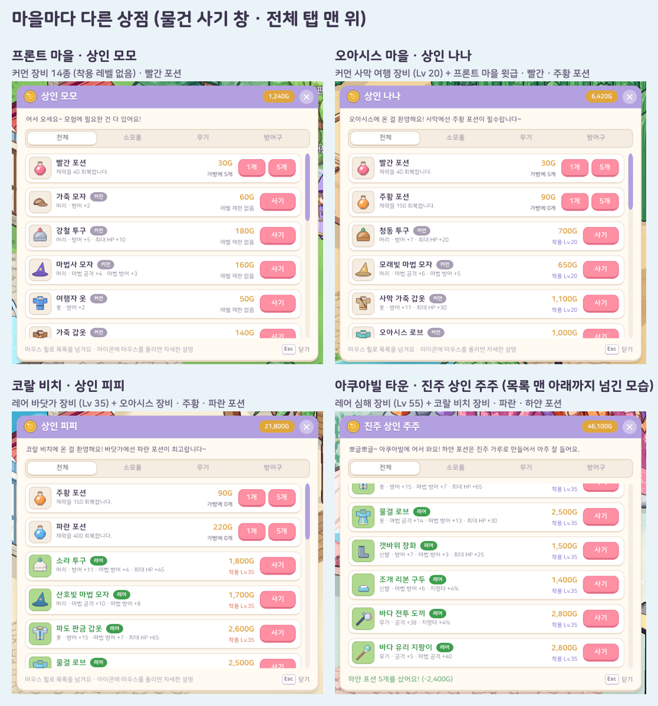
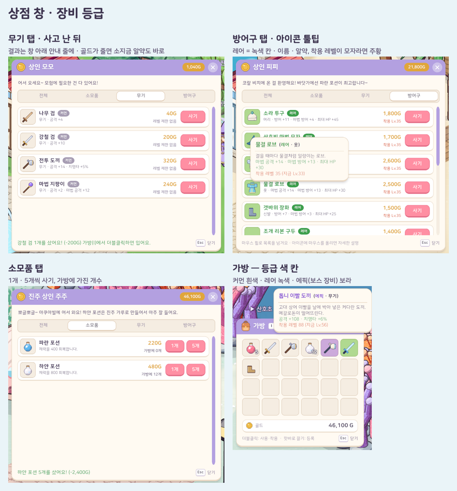
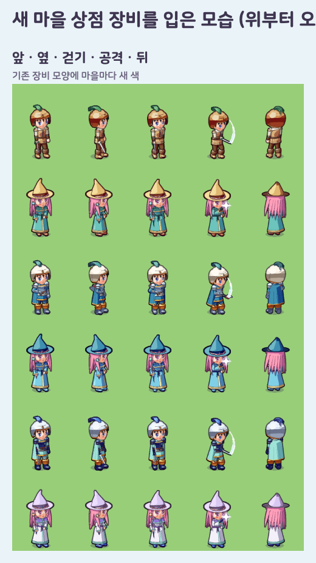

# 12. 마을별 상점 · 장비 등급 · 스크롤 목록 상점 창 · 직업별 레벨 성장

## 작업 내용

지금까지는 네 마을 상인이 거의 같은 초반 장비 14개를 대화창 선택지로 팔았다. 이번에는 **마을마다 레벨대에 맞는 물건을 팔게** 하고, 그 기준이 되는 **장비 등급**을 넣고, 물건을 대화 선택지가 아니라 **스크롤 목록 상점 창**에서 고르게 바꿨다.

- **장비 등급 6단계**: 커먼(흰색) · 레어(녹색) · 에픽(보라) · 유니크(노랑) · 레전더리(빨강) · 미스틱(하늘색)
  - 장비에만 붙는다. 포션 · 재료는 등급이 없다 — 포션은 종류(이름 · 회복량)로 나눈다
  - 가방 · 장비창 · 상점의 아이콘 칸을 등급 색으로 옅게 물들이고(커먼은 그대로 흰 칸), 툴팁 제목에 등급 색 이름 + "(레어 · 옷)" 처럼 등급과 부위를 적는다
  - 흰색(커먼)은 크림색 창 위에서 안 보여서, 글자 · 알약에는 등급마다 "판 위에서 읽히는 진한 색"을 따로 둔다 (커먼 = 잿빛)
- **보스 장비 = 에픽**: 보스가 떨어뜨리는 장비 12종을 에픽으로. 확률은 원래대로 한 개마다 20% (반드시 나오지 않는다) — 테스트가 "에픽 · 20% 이하"를 지킨다
- **상점 판매 등급 상한 = 레어**: 에픽 이상은 보스 드랍과 앞으로 만들 제작으로만 얻는다
  - 상점 판매 목록에 에픽 장비나 재료를 잘못 적어도, 상점 규칙이 목록(창에 보이는 줄)에서 빼고 사기도 거절한다 → 데이터 실수가 게임에 새지 않는다
- **마을마다 다른 판매 목록** — 뒤 마을일수록 높은 등급 · 높은 착용 레벨
  - 프론트 마을: 커먼 장비 14종(착용 레벨 없음) · 빨간 포션
  - 오아시스 마을: 커먼 *사막 여행* 장비 8종(Lv 20: 청동 투구 · 사막 가죽 갑옷 · 모래 장화 · 초승달 검 / 모래빛 마법 모자 · 오아시스 로브 · 사막 샌들 · 오아시스 지팡이) + 프론트 마을 윗급 장비 · 빨간 · 주황 포션
  - 코랄 비치: 레어 *바닷가* 장비 8종(Lv 35: 소라 투구 · 파도 판금 갑옷 · 갯바위 장화 · 바다 전투 도끼 / 산호빛 마법 모자 · 물결 로브 · 조개 리본 구두 · 바다 유리 지팡이) + 오아시스 장비 · 주황 · 파란 포션
  - 아쿠아빌 타운: 레어 *심해* 장비 8종(Lv 55: 진주 투구 · 심해 판금 갑옷 · 심해 장화 · 해류 검 / 해파리 마법 모자 · 진주 로브 · 물방울 구두 · 산호초 지팡이) + 코랄 비치 장비 · 파란 · 하얀 포션
  - 바로 앞 마을의 장비도 같이 파는 건, 레벨을 빨리 올려 넘어온 모험가가 한 단계 아래 장비부터 갖출 수 있게
  - 새 장비 24종은 새 모양을 만들지 않고 기존 투구 · 갑옷 · 로브 · 장화 · 무기 모양에 마을 분위기 색(모래빛 · 바다 · 심해)을 입혔다. 아이콘도 착용 외형에서 자동으로 그려진다
  - 능력치는 "같은 착용 레벨대의 보스 에픽 장비보다 조금 약하게" 맞췄다 (예: 해류 검 Lv 55 공격 +60 < 파도 가르는 검(에픽) Lv 58 공격 +70)
- **상점 창**: 상인에게 말을 걸면 대화창에 *물건 사기* · *닫기* (+ 퀘스트) → 물건 사기를 누르면 상점 창이 열린다
  - 한 줄 = 아이콘(등급 색 칸, 마우스를 올리면 설명) · 이름 + 등급 알약 · 부위와 능력치(포션은 효과) · 가격 · 착용 레벨(모자라면 주황, 포션은 가방에 가진 개수) · *사기* (포션은 *1개* · *5개*)
  - 탭 = 전체 · 소모품 · 무기 · 방어구, 머리 띠 오른쪽에 소지금 알약. 골드가 모자라면 가격이 주황, 버튼이 흐려진다
  - 산 결과는 창 아래 안내 줄에 잠깐 (창 위쪽에 뜨는 알림과 겹치지 않게). 상인에게서 멀어지면 · Esc · 닫기 버튼으로 닫힌다
- **스크롤 목록 부품**: 게임 UI 에 처음 생긴 스크롤 목록. 보이는 칸 밖은 잘리고, 마우스 휠 · 끌기 · 오른쪽 둥근 막대(넘칠 때만 보인다)로 넘긴다
  - 창 높이를 목록 5줄 반으로 잡아 아래 줄이 반쯤 걸쳐 보이게 → 아래에 더 있다는 걸 알 수 있게
  - 휠 한 칸 ≈ 목록 한 줄의 3/4. 입력 모듈이 휠 한 칸을 6 으로 보내는 걸 확인하고 배율(8)을 정했다
  - 부품으로 만들어 두어서 다른 긴 목록(스킬마스터 창 등)에도 그대로 쓸 수 있다
- **그 사이 바뀐 것**
  - 오아시스 마을(스킬마스터 사라) · 코랄 비치(스킬마스터 파도)에도 스킬마스터를 두어 **모든 마을에 스킬마스터**가 있다 (테스트가 새 마을도 확인)
  - **레벨업 공격력은 직업의 주 공격력만**: 전사 = 공격(기본 공격 · 검사 스킬), 법사 = 마법 공격(마법 스킬), 레벨당 +2. 예전에는 둘 다 올라서 법사의 기본 공격도 같이 강해졌다. HP · 방어 · 마법 방어는 직업과 상관없이 오른다
    - 몬스터 능력치 공식의 "같은 레벨 기준 플레이어"는 공격 · 마법 공격이 모두 그 레벨만큼 오른 것으로 둔다 → 전사의 기본 공격 · 법사의 마법이 느끼는 몬스터 단단함은 그대로
  - **스킬 뒤 기본 공격은 검사 스킬만**: 검사는 스킬을 쓴 뒤 그 몬스터에게 다가가 기본 공격으로 사냥을 이어 가고, 법사는 스킬을 쓴 뒤 그 자리에 선다 (대상 지정 · 몬스터 정보 박스는 남는다). 법사는 원거리에서 스킬로 사냥하는 직업
- **테스트**: 153개 → 161개 (직업별 레벨 성장 · 나중에 직업을 고른 옛 캐릭터 · 스킬 뒤 기본 공격은 검사 스킬만 포함). 장비에만 등급, 마을마다 상점 · 목록은 소모품과 레어 이하 장비만, 뒤 마을일수록 등급(같거나 높게) · 착용 레벨(높게), 다른 마을 상점 물건 · 에픽 · 재료는 못 삼 · 골드 부족, 보스 장비 = 에픽 · 20% 이하
  - 실제 Play 모드 흐름 시험에 더했다: 상인 대화 → 물건 사기 → 창의 줄 수 = 판매 목록, 레어는 팔고 에픽은 안 팖, 포션 사기(골드 · 가방), 목록이 넘치면 스크롤 막대, 줄 위 버튼에서 휠 한 칸 → 목록 전체가 내려감, 탭 바꾸면 맨 위로, 상인에게서 멀어지면 창이 닫힘, 새 법사가 들판 몬스터에게 에너지 볼 → 다가가지 않고 대상 지정만 남기고 제자리, 전사로 바꿔 강타 → 다가가 기본 공격으로 이어 감

## 스크린샷

마을마다 다른 상점 (물건 사기 창)

상점 창 · 장비 등급 (탭 · 툴팁 · 소모품 · 가방의 등급 색 칸)

새 마을 상점 장비를 입은 모습

## 문제와 해결

| 문제 | 원인 / 해결 |
|---|---|
| 흰색 커먼 등급이 크림색 창 · 흰 카드 위에서 안 보였다 | 등급 색을 "원래 색"(아이콘 칸 물들이기 · 커먼은 흰 칸 그대로)과 "판 위 글자 색"(진한 색, 커먼은 잿빛) 두 벌로 나눴다 |
| 대화창 선택지가 5개까지라 상점이 커질수록 화면을 계속 나눠야 했다 (포션 두 종이면 소모품 화면 따로 등) | 물건 고르기를 대화창에서 빼 전용 창으로 옮겼다. 대화에는 인사 · 퀘스트 · 창 열기만 남았다 |
| 스킬마스터 창과 상점 창이 화면 같은 자리에 겹쳐 뜰 수 있었다 | NPC 에게서 여는 창은 하나만: 새로 열기 전에 둘 다 닫고, 맵 이동 · 캐릭터 만들기 때도 같이 닫는다 |
| 흐름 시험에서 상점 창이 열리자마자 닫혀 탭 · 휠 확인이 모두 실패했다 | 시험 캐릭터가 포탈 앞(상인에게서 먼 곳)에 서 있어 "멀어지면 닫기"가 제대로 동작한 것 → 시험에서 상인 앞으로 옮긴 뒤 연다 |
| 흐름 시험에서 가짜 마우스 휠이 목록을 움직이지 않았다 | batchmode 는 포커스된 게임 화면이 없어 장치 입력(커서 위치 · 휠)이 아예 들어오지 않는다(커서가 0,0 그대로) → 입력 모듈이 보내는 것과 같은 휠 이벤트를 줄 안의 버튼에 직접 보내 목록 전체가 48 만큼 내려가는지 확인했다. 실제 휠의 손맛은 에디터에서 확인 |

## 남은 일

- 상점에 되팔기(가방의 장비 · 소모품 · 재료 팔기) — 상점 창에 "팔기" 탭으로
- 장비 제작: 보스 재료 · 미스틱 재료로 에픽(과 고난이도 미스틱) 장비 만들기
- 포션 체계 개편(하급 ~ 최상급 · 엘릭서)은 마나가 생길 때 같이
- 지역 5~9 마을 상점도 같은 방식(레어 상한 · 그 지역 레벨대 세트)으로 잇는다
- 법사가 스킬로만 사냥하게 되면서 초반(레벨 1~9: 에너지 볼 하나, 재사용 2.5초) 사냥이 전사보다 느리다 → 스킬 재사용 시간 · 위력 조정 검토
