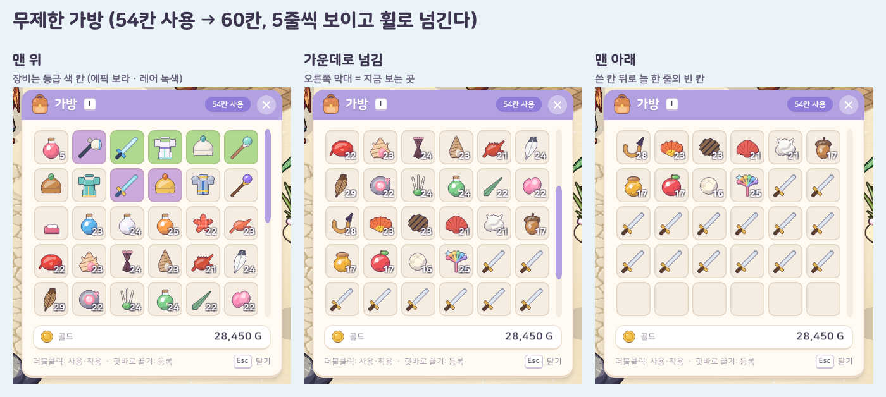

# 13. 인벤토리(가방) 칸 무제한 · 스크롤 목록

## 작업 내용

가방이 24칸으로 정해져 있어서 사냥하다 보면 금방 차고, "가방이 가득 차서 못 주웠어요", 퀘스트 보상 미루기, 보스 입장 빈 칸 확인 같은 예외가 여기저기 생겼다. 이번에 **가방 칸 수 제한을 없애고** 가방 창을 **스크롤 목록**으로 바꿨다.

- **무제한 가방**: 칸이 모자라면 뒤에 칸이 늘어나서 가득 차는 일이 없다
  - 칸 수 = max(24, 마지막으로 쓴 칸 + 1 + 6) → 쓴 칸 뒤로 **늘 한 줄(6칸)의 빈 칸**이 있어서 끌어다 놓을 자리가 있고, 비우면 다시 24칸으로 줄어든다
  - 늘고 줄 때 **뒤쪽 빈 칸만** 바꾼다 → 앞 칸 번호가 흔들리지 않아 드래그 앤 드랍 · 장비 착용이 가리키는 칸이 그대로
  - 핫바는 원래 칸 번호가 아니라 아이템 id 로 가리켰다 → 포션을 다른 칸으로 옮겨도 핫바에서 그대로 쓴다
  - 창고는 24칸 그대로 (창고 개편은 따로)
- **세이브**: 마지막으로 쓴 칸까지만 저장 (가운데 빈 칸은 자리 그대로, 뒤쪽 여유 칸은 저장 안 함) → 세이브는 쓴 만큼만 커진다
  - 저장 형식은 "칸 목록" 그대로라 세이브 버전을 올리지 않았다. 예전 24칸 세이브도 그대로 읽힌다
- **가방 창**: 6열 칸 격자를 상점 창에서 만든 스크롤 목록 부품 안에 넣었다 — 5줄씩 보이고 마우스 휠 · 끌기 · 오른쪽 막대로 넘긴다. 머리 띠에 쓴 칸 수 알약
  - 가방 칸 수가 바뀌면 창이 칸을 더 만들거나 치운다 (스크롤 위치는 그대로)
  - 칸 아이콘을 끌면 스크롤이 아니라 아이템 끌기, 빈 칸 위에서 끌면 목록이 넘어간다
- **"가방이 가득 차면" 규칙 정리**: 상점 사기 · 퀘스트 보상 · 장비 벗기 · 전리품 줍기 · 보스 입장 빈 칸 3칸 확인은 칸 수가 정해진 가방에서만 걸리게 두고(창고 등), 무제한 가방에서는 늘 통과
- **테스트**: 161개 → 164개. 무제한 가방이 늘고 줄기(여유 칸 · 최소 칸 · 칸 번호 유지 · 맨 뒤 칸으로 옮기면 다시 여유 칸), 세이브에 쓴 칸까지만 · 다시 읽기 · 예전 24칸 세이브, 플레이어 가방 세이브 왕복(50칸). 예전 "가방이 꽉 차면" 테스트는 "무제한 가방이면 늘 된다"로 바꿨다
  - 실제 Play 모드 흐름 시험: 강철 검 60개를 넣으면 다 들어가고 가방 창 칸 수 = 가방 칸 수, 목록이 창보다 길고 칸 위 휠 한 칸에 목록이 내려감, 빨간 포션을 맨 뒤 칸으로 끌어다 놓으면 여유 칸이 다시 생기고 핫바의 포션이 옮긴 칸에서 쓰임, 비우면 24칸으로 돌아옴

## 스크린샷

무제한 가방 (54칸 사용 → 60칸, 맨 위 · 가운데 · 맨 아래)

## 문제와 해결

| 문제 | 원인 / 해결 |
|---|---|
| 칸을 리스트로 바꾸자 "칸의 개수 += n" 같은 코드가 컴파일되지 않았다 | 리스트의 칸(구조체)은 꺼낼 때 복사본이라 그 자리에서 고칠 수 없다 → 개수를 바꾼 새 칸을 통째로 다시 넣는 도우미 하나로 모았다 |
| 칸을 한꺼번에 늘리는 경로(한 번에 여러 칸 넣기 · 세이브 불러오기)에서 가방 창이 칸 수 변화를 놓칠 수 있었다 | 칸 수 알림을 "마지막으로 알린 칸 수와 다르면 알린다" 한 곳으로 모았다 |
| 예전 테스트가 "가방이 꽉 찰 때까지 칸 수만큼 넣기"를 해서, 무제한 가방에서는 넣을수록 칸이 늘어 끝나지 않았다 | 꽉 찬 가방을 전제로 한 테스트를 "예전이면 꽉 찼을 양(60개)을 넣어도 된다"로 바꿨다 |
| 가방 창 아래 안내 줄이 두 줄로 넘쳤다 | 캡처로 확인 → 휠 안내는 빼고(스크롤 막대가 보여 준다) 한 줄로 |

## 남은 일

- 창고 개편(창고 ↔ 가방 옮기기 창) — 같은 스크롤 칸 격자를 쓴다
- 가방 정렬 · 종류별 보기 탭 (칸이 많아지면 필요해질 수 있다)
- 상점 되팔기
