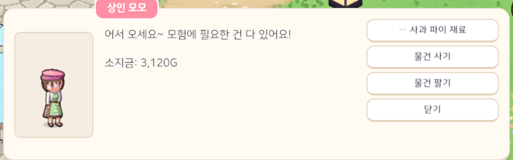
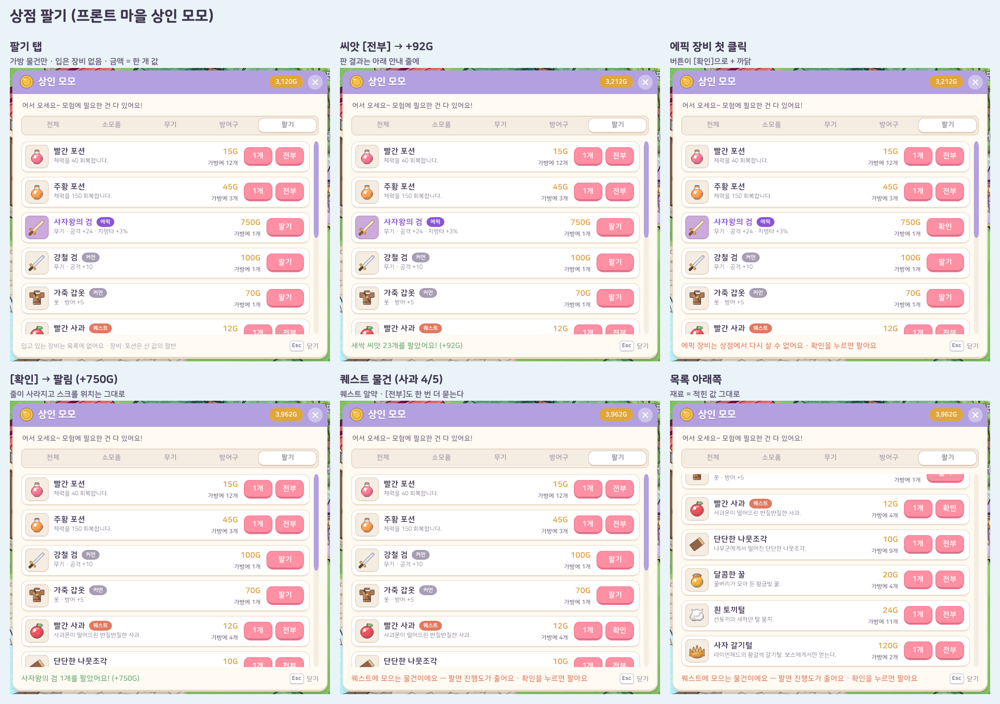

# 14. 상점 팔기

## 작업 내용

상인에게 물건을 사기만 할 수 있었는데, 이제 **가방의 물건을 상인에게 팔 수 있다**. 판 물건은 가방에서 빠지고 그 값만큼 골드가 들어온다.

- **여는 곳**: 상인 대화에 *물건 팔기* 선택지(물건 사기 · 물건 팔기 · 닫기 + 퀘스트) → 상점 창이 새 **팔기 탭**으로 열린다. 상점 창에서 탭을 바꿔 들어가도 된다
- **팔기 탭 목록** = 가방에서 팔 수 있는 물건 (가방 칸 순서, 같은 물건은 한 줄)
  - 입고 있는 장비는 가방에 없으니 목록에도 없다 → 입은 장비를 실수로 파는 일이 없다
  - 한 줄 = 아이콘 · 이름 + 등급 알약 · 한 개 값 · 가방에 가진 개수 · 장비는 *팔기*, 포션 · 재료는 *1개* · *전부*
  - 팔면 그 줄이 줄거나 사라지고, 스크롤 위치는 그대로 둔다 (긴 목록을 위에서부터 다시 찾지 않게)
- **어느 마을 상인이든 무엇이든 산다**: 그 상인이 팔지 않는 재료 · 에픽 장비도 받는다
- **파는 값**
  - 장비 · 포션 = 산 값의 절반 → 사서 바로 팔면 손해라 골드가 불어나지 않는다
  - 재료 = 데이터에 적힌 값 그대로 — 재료는 상점이 팔지 않으니 적힌 값이 곧 상인이 쳐 주는 값이다
- **한 번 더 묻는 물건** (막지는 않는다 — 고르는 건 플레이어)
  - 진행 중인 수집 퀘스트에 모으는 물건: 줄에 주황 *퀘스트* 알약. 팔면 수집 진행도가 준다
  - 에픽 이상 장비: 상점에서 다시 살 수 없다
  - 처음 누르면 버튼이 *확인* 으로 바뀌고 창 아래 안내 줄에 까닭이 뜬다 → 같은 버튼을 한 번 더 눌러야 판다. 4초가 지나거나 탭을 바꾸면 풀린다
- **테스트**: 164개 → 168개. 모든 아이템을 팔 수 있고 장비 · 포션은 산 값보다 싸게, 재료는 적힌 값 그대로 / 팔면 가방에서 빠지고 골드, 가진 것보다 많이 · 상점이 아닌 NPC 에게는 못 팖 / 입은 장비는 목록에 없음 · 같은 장비 두 칸은 한 줄 / 퀘스트 물건 · 에픽 장비는 묻기만 하고 막지 않음, 팔면 수집 진행도가 줆
  - 실제 Play 모드 흐름 시험에 더했다: 상인 대화의 물건 팔기 → 팔기 탭, 줄 수 = 팔 수 있는 물건 수(입은 무기 없음), 씨앗 전부 팔기 → 골드 · 줄 하나 줄어듦, 에픽 장비는 첫 클릭에 안 팔리고 [확인] + 까닭, 한 번 더 누르면 팔림

## 스크린샷

상인 대화 (물건 팔기)

팔기 탭 · 전부 팔기 · 에픽 장비 확인 · 퀘스트 물건 확인

## 문제와 해결

| 문제 | 원인 / 해결 |
|---|---|
| 재료는 원래 "사는 값"이 없어서 파는 값을 어떻게 정할지 | 재료의 값은 사는 값이 아니라 상인이 쳐 주는 값으로 정의했다. 장비 · 포션만 산 값의 절반 |
| 퀘스트 수집품을 팔아 퀘스트를 못 깨게 될 수 있다 | 막으면 퀘스트를 포기하기 전까지 그 물건을 영영 못 판다 → 막지 않고, 표시(퀘스트 알약) + 한 번 더 누르기로 실수만 막았다 |
| 경고 문구가 창 아래 안내 줄에서 두 줄로 넘쳤다 | 문구를 줄였다 ("퀘스트에 모으는 물건이에요 — 팔면 진행도가 줄어요 · 확인을 누르면 팔아요") |

## 남은 일

- 상점 창이 열린 동안 가방 창에서 바로 팔기 (우클릭 등)
- 재료 한꺼번에 팔기 버튼 (퀘스트 물건은 빼고)
- 판 물건 다시 사기(되사기)는 범위 밖
