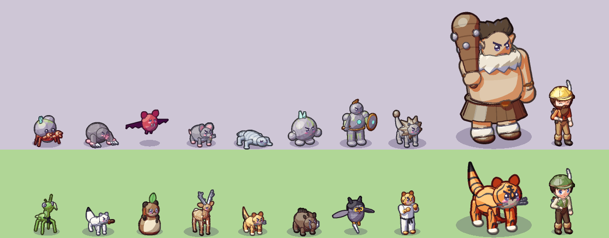
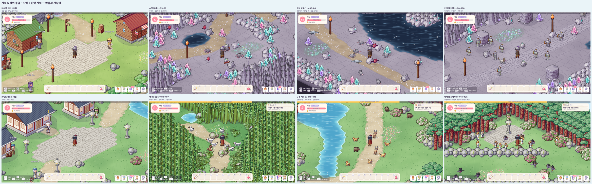
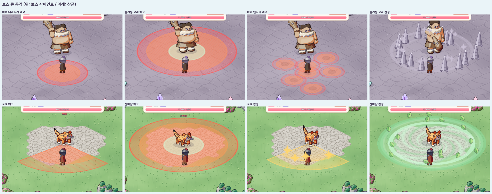
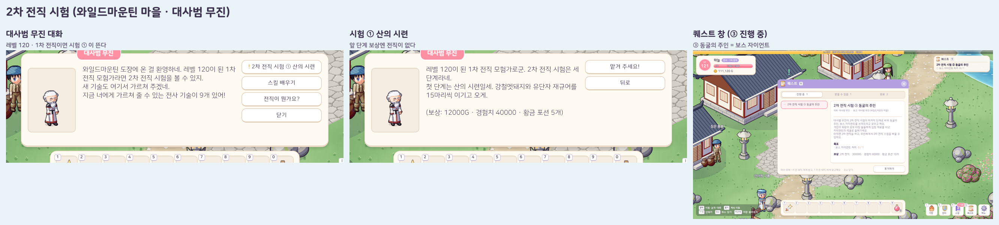

# 15. 지역 5·6 (바위 동굴 · 산악) + 2차 전직 시험

## 작업 내용

바닷속(지역 4) 다음으로 **바위 동굴(Lv 75~120)** 과 **산악 지역(Lv 103~150)** 을 이었고, 레벨 120 의 **2차 전직**을 세 단계 시험으로 만들었다.

- **지역 5 · 바위 동굴**: 고래의 길 동쪽 끝 해저 동굴 포탈 → 바위굴 던전
  - **바위굴 던전**: 바위산 기슭의 광부 마을 (통나무집 · 횃불 기둥 · 산허리의 동굴 입구)
  - **사냥터 (동굴 안)**: 수정 광산 56×40 · 지하 호숫가 46×60 · 거인의 회랑 78×30
  - 동굴 바닥 = 금이 간 판석 + 자갈 + 빛버섯 밭, 장식 = 종유석 기둥 · 빛나는 수정 무리 · 돌무더기, 맵 바깥은 캄캄한 보랏빛
  - 몬스터 8종: 바위게 · 돌두더쥐 · 붉은박쥐 · 바위굴 쥐 · 동굴 도마뱀 · 바위꼬마 · 바위전사 · 바위사자
  - **보스 자이언트 (Lv 120)**: 큰 공격 6종 (바위 내려찍기 · 돌기둥 고리 · 바위 던지기 · 암석 파도 · 몽둥이 휘두르기 · 굴러오기)
- **지역 6 · 산악 지역**: 거인의 회랑 동쪽 산길 → 와일드마운틴 마을
  - **와일드마운틴**: 소나무 숲에 둘러싸인 동양풍 마을 (기와집 · 석등 · 개울 돌다리)
  - **사냥터**: 대나무 숲 32×64 · 구름 계곡 64×46 · 범바위 산마루 50×50
  - 장식 = 소나무 · 진달래 · 기암 / 대나무 · 조릿대
  - 몬스터 8종: 유단자 사마귀 · 칼족제비 · 도술너구리 · 강철뿔사슴 · 레오파드캣 · 강철멧돼지 · 암살자 부엉이 · 유단자 재규어
  - **산군 (Lv 150, 호랑이)**: 큰 공격 7종 (도약 할퀴기 · 포효 · 꼬리 후려치기 · 번개 돌진 · 산바람 · 낙석 · 발톱 가르기)
- **2차 전직 시험** (와일드마운틴의 대사범 무진, 레벨 120)
  1. 산의 시련: 강철멧돼지 · 유단자 재규어 15마리씩
  2. 산과 동굴의 증표: 돌 갈기 · 강철 뿔 · 부엉이 깃털 10개씩
  3. 동굴의 주인: 보스 자이언트 처치 → 전직, 2차 스킬(레벨 130부터)을 그 자리에서 배움
  - 단계마다 퀘스트 하나를 선행 퀘스트로 잇고, 앞 단계는 "시험 단계"라 마쳐도 전직하지 않는다. 진행은 퀘스트 기록에 남아 세이브 구조는 그대로
- **그 밖에**: NPC 10명 · 재료 20종 · 포션 2종(초록 · 황금) · 상점 레어 장비 16종(Lv 80 · 105) · 보스 에픽 장비 6종 · 퀘스트 4개
  - 몬스터 외형 조립 13종 추가 — 네발짐승 다리 · 짐승 머리 도우미를 만들어 쥐 · 고양잇과 · 사슴 · 멧돼지 · 족제비가 같이 쓴다
  - 스킬마스터의 "전직이 뭔가요?" 대답이 1차 · 2차 전직 시험을 누가 어디서 주는지 알려 준다
- **테스트**: 168개 → 171개 (2차 전직 단계 순서 · 마지막 단계만 전직 · 세이브 후 진행 유지 · 다른 길로 먼저 전직한 경우). 지역 기획 표에 16종 추가
  - 실제 Play 모드 흐름 시험 347개 확인: 해저 동굴 → 마을 · 상점 · 사냥터 6곳 · 시험 대화 · 두 보스의 큰 공격 전부 · 처치 · 전직 · 기절하면 산 마을에서 깸

## 스크린샷

몬스터 (위: 바위 동굴 / 아래: 산악, 오른쪽 끝 = 보스 · 보스 안내 NPC)

마을과 사냥터

보스 큰 공격 (보스 자이언트 · 산군)

2차 전직 시험

## 문제와 해결

| 문제 | 원인 / 해결 |
|---|---|
| 전직 퀘스트가 여러 단계일 때 앞 단계에서 전직해 버림 | "시험 단계" 표시를 두고 마지막 단계만 전직하게 했다 — 세이브 필드를 늘리지 않고 선행 퀘스트로 순서를 잇는다 |
| 몬스터가 연못 · 막힌 칸에서 생겨남 | 맵 설계 스크립트의 스폰 좌표를 옮기고 연결성 검사를 다시 돌렸다 |
| 산마루 턱 사이 길이 계산식으로는 막힘 | 대각선 턱을 손으로 정한 좌표로 다시 그렸다 |
| 기암이 뒤에 걷는 칸을 가림 | 뒤쪽 칸이 걸을 수 있으면 낮은 바위로 바꿔 놓는다 |
| 흐름 시험에서 전사 스킬 확인이 가끔 실패 | 치명타 한 방에 몬스터가 쓰러져서 — 시험 대상 몬스터 체력을 넉넉히 두었다 (시험 도구만 수정) |

## 남은 일

- 에디터에서 직접 해 보는 Lv 75~150 사냥 난이도 체감
- 지역 7~9
