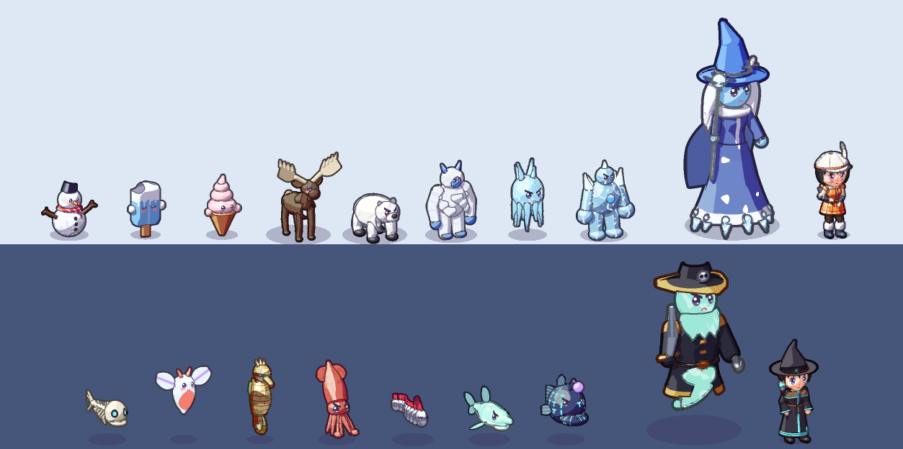
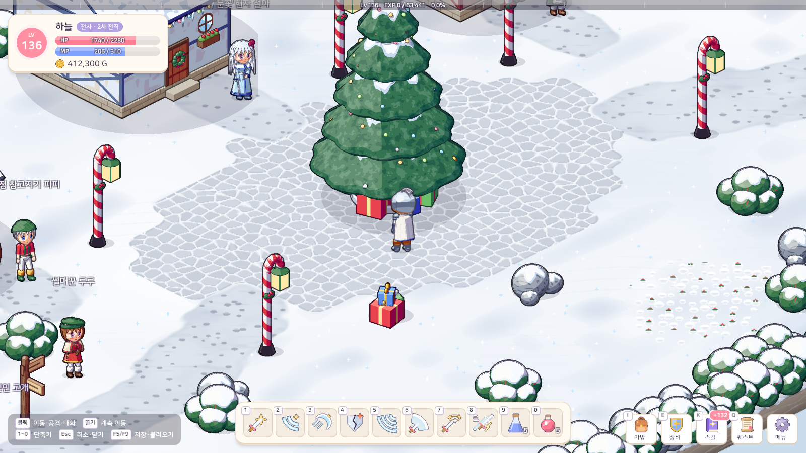
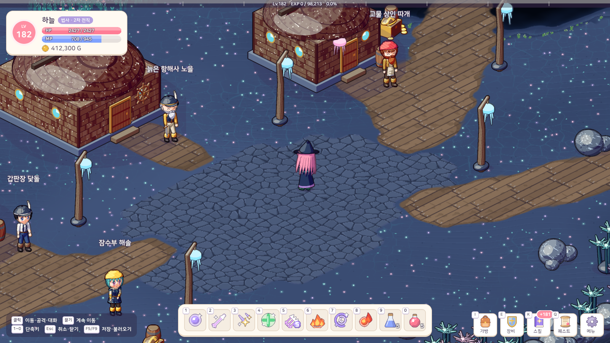
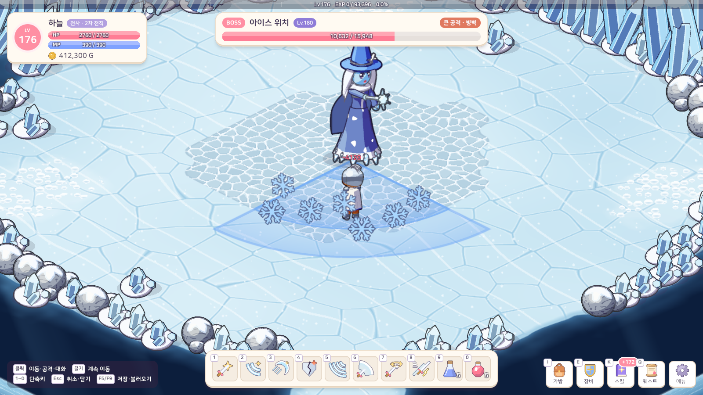
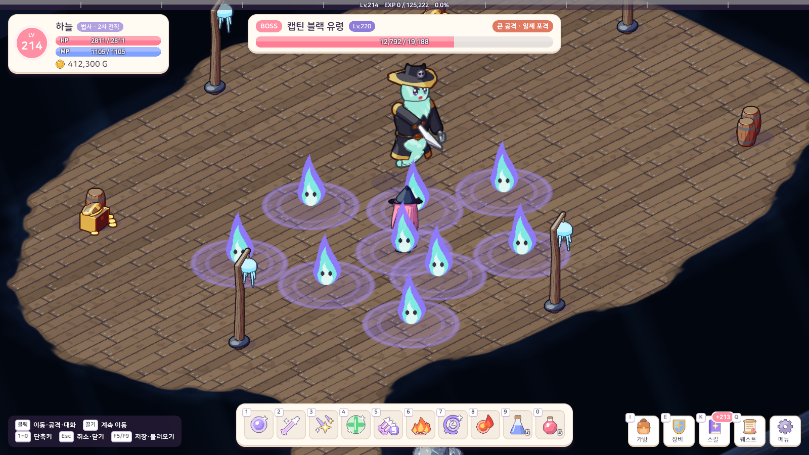
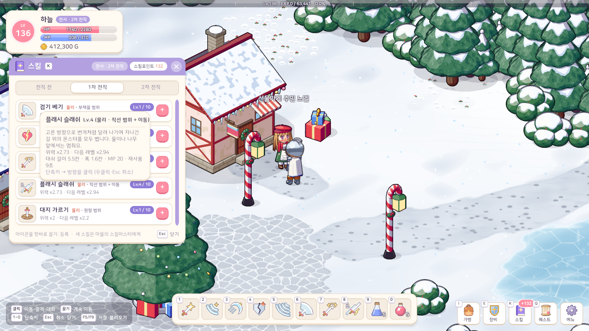
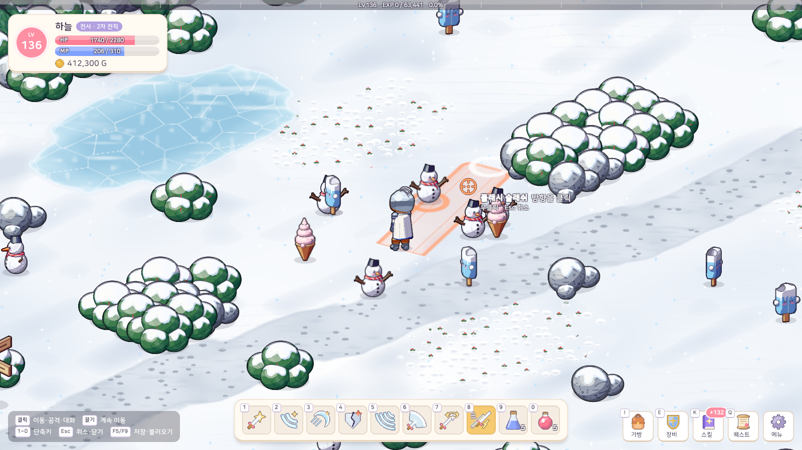
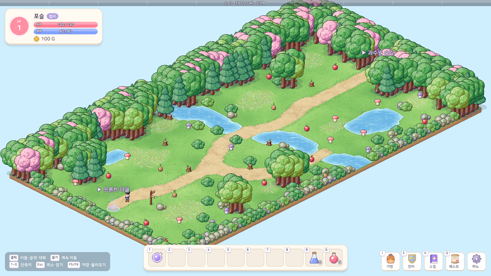

# 16. 지역 7·8 (얼음 · 심연) + 스킬 트리 개편 · MP + 몬스터 배치

## 작업 내용

- **지역 7 · 얼음 지역 (Lv 130~180)**: 범바위 산마루의 눈 덮인 고개 → 크리스마스 타운 (크리스마스트리 광장 · 눈 지붕 집 · 사탕 지팡이 가로등)
  - 사냥터: 눈꽃 설원 64×40 · 설인 고개 34×66 · 고드름 빙하 56×56 (크레바스 · 얼음 다리)
  - 몬스터 8종: 스노우 맨 · 아이스 바 · 아이스 크림 · 자이언트 무스 · 폴라 베어 · 설인 · 아이씨클 · 아이스 골렘
  - **아이스 위치 (Lv 180)**: 큰 공격 8종 (고드름 비 · 눈보라 · 서리 가시 고리 · 얼음 감옥 · 빙벽 · 서리 폭발 · 눈사태 · 빙판 미끄럼)
- **지역 8 · 깊은 바다 심연 (Lv 160~220)**: 빙하의 얼음 구멍 → 블루홀 (가라앉은 배를 고쳐 지은 난파선 마을)
  - 사냥터: 뼈 산호 평원 60×44 · 대왕오징어 해구 30×72 · 유령선 무덤 66×50 (난파선 다섯 척)
  - 몬스터 7종: 본피쉬 · 크리오네 · 고대 해마 · 대왕오징어 · 산갈치 · 고스트 샤크 · 룬피쉬
  - **캡틴 블랙 유령 (Lv 220)**: 큰 공격 9종 (유령 포격 · 닻 내려찍기 · 커틀러스 난도질 · 망령 돌진 · 심연의 소용돌이 · 망령의 파도 · 저주의 도깨비불 · 망령 폭발 · 일제 포격)
  - 새 바닥 테마 3개(눈 · 빙하 · 심연), NPC 10명, 퀘스트 4개, 상점 레어 장비 16종, 보스 에픽 장비 6종
- **스킬 트리 개편**: 직업마다 17개 (전직 전 5 · 1차 7 · 2차 5). 레벨 50 · 120 에 스킬이 있어 전직하자마자 새 스킬을 배운다
  - 새 스킬: 크레센트 블레이드 · 플래시 슬래쉬(조준한 쪽으로 달려가며 베기) · 전투 센스 · 마나 가드 · 예리한 마법 · 마법 센스
  - 옛 세이브는 불러올 때 조건이 안 맞게 된 스킬을 잊고 포인트를 돌려준다 (알림)
- **MP**: 스킬마다 MP 소모 · 저절로 회복 · MP 포션 4종 · 상태창 MP 막대 · 세이브 버전 7
- **몬스터 배치**: 사냥터 몬스터가 정해진 지점에 모이지 않고 맵 전체의 무작위 자리(구조물 · 입구 · NPC 둘레 제외)에서 종류가 섞여 태어난다
  - 쉴 때마다 3~9칸 떨어진 곳까지 길을 찾아 걸어가고 그곳을 새 집으로 삼아 맵 곳곳을 떠돈다. 되살아날 때도 새 자리 (플레이어 코앞은 피함)
- **테스트**: 171개 → 188개. Play 모드 흐름 시험 529개 확인 (두 지역 이동 · 상점 · 퀘스트 · 두 보스 큰 공격 전부 · MP · 새 스킬 · 몬스터 섞임 · 떠돌기)

## 스크린샷

몬스터 (위: 얼음 / 아래: 심연, 오른쪽 끝 = 보스 · 보스 안내 NPC)

크리스마스 타운 · 블루홀

보스 (아이스 위치 눈보라 · 캡틴 블랙 저주의 도깨비불)

스킬창 · 플래시 슬래쉬 조준

섞여 흩어진 몬스터 (초록 들판 전체)

## 문제와 해결

| 문제 | 원인 / 해결 |
|---|---|
| 눈보라 판정 연출이 얼음 바닥에서 안 보임 | 바닥 물결을 진한 하늘색으로, 눈 결정에 테두리를 넣었다 |
| 바위 언덕 색을 더 넣을 자리가 없음 | 모양 번호 인코딩 간격을 3 → 4 로 넓혔다 |
| 산갈치 몸 마디가 엉뚱한 방향으로 돎 | 마디마다 진행 방향 기준 좌표계로 로프트를 이었다 |
| 한 필드의 몬스터가 종류별로 뭉쳐 있음 | 자리를 없애고 몬스터 구역에서 서로 떨어진 무작위 칸을 고른다 |
| 멀리 떠도는 몬스터가 나무에 막혀 멈춤 | 떠돌 곳까지 A* 길을 구해 꺾이는 점을 따라간다 |

## 남은 일

- 에디터에서 직접 해 보는 MP 소모량 · 떠돌기 속도 · Lv 130~220 난이도 체감
- 지역 9~10
