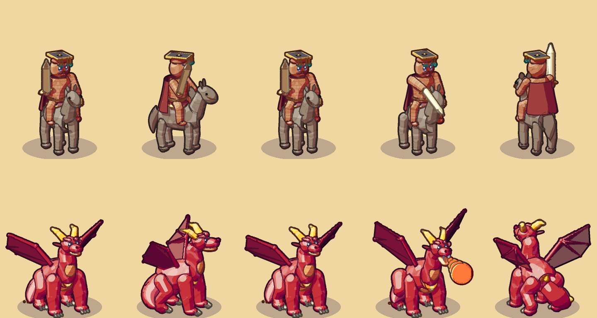
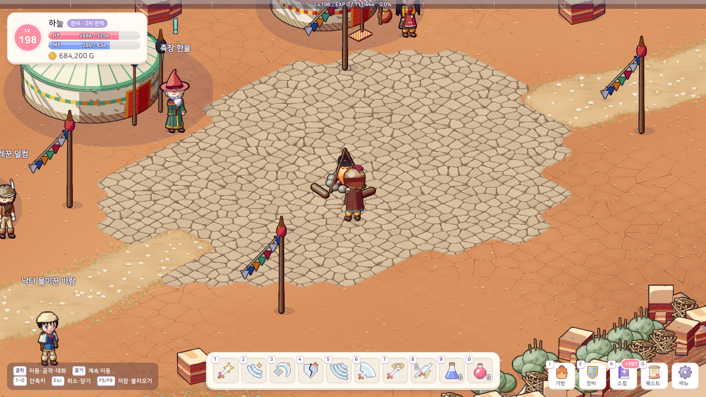
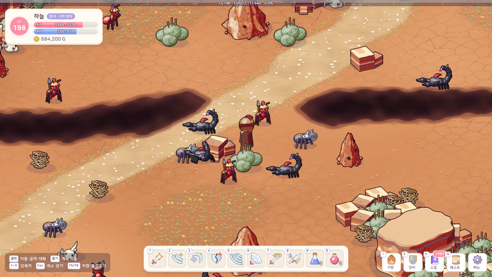
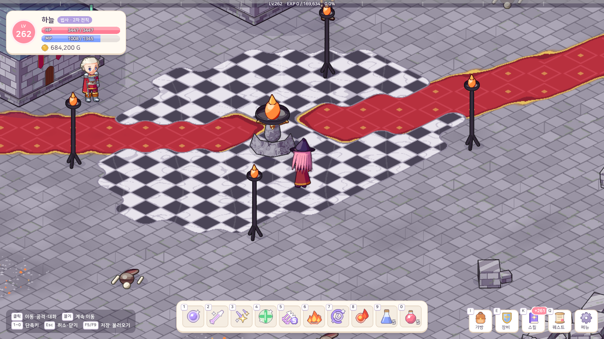
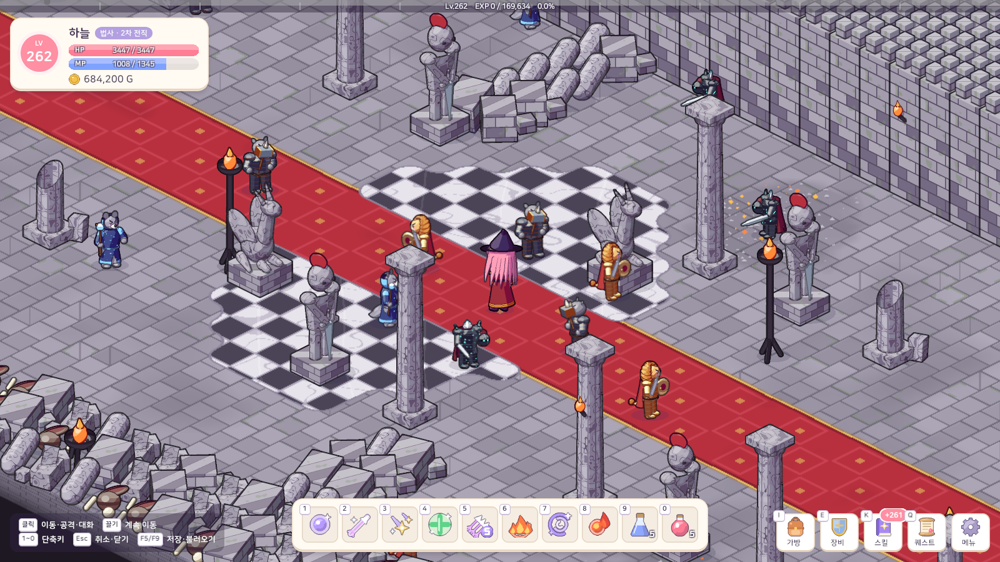
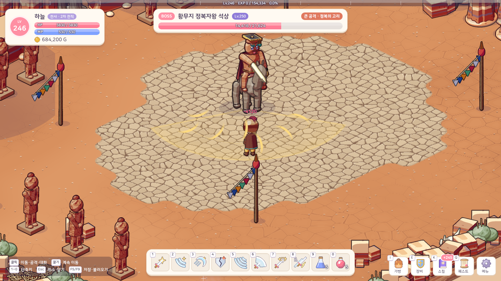
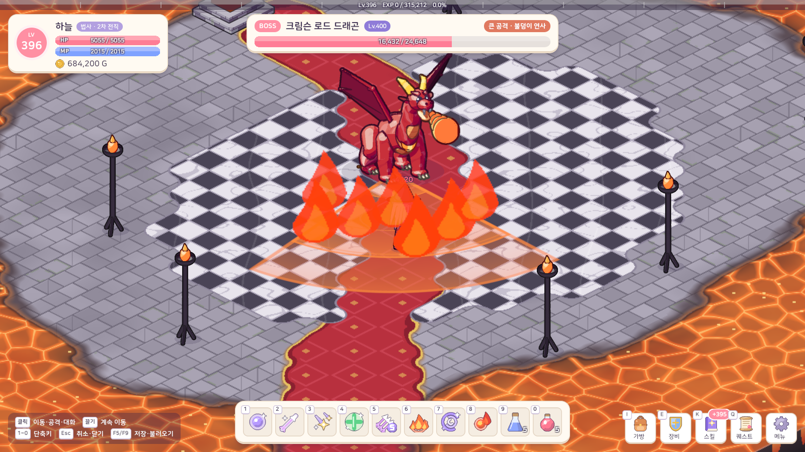

# 17. 지역 9·10 (황무지 협곡 · 드래곤 성) + 최고 레벨 400

## 작업 내용

- **지역 9 · 황무지 협곡 (Lv 190~250)**: 유령선 무덤의 옛 바닷길 → 배드랜드 캠프 (게르 천막 · 모닥불 광장 · 오색 깃발의 유목민 마을)
  - 사냥터: 불개미 둔덕 평원 66×38 · 붉은 독사 협곡 32×68 · 바람 석상 유적 56×52
  - 몬스터 7종: 병정 불개미 · 다크나이트 스콜피온 · 워리어 스파이더 · 데스 플라워 · 홍염 킹코브라 · 황풍 왕도마뱀 · 백암 석상 파수꾼
  - **황무지 정복자왕 석상 (Lv 250)**: 병마용갱에서 큰 공격 10종 (기마 돌진 · 대검 베기 · 말발굽 내려찍기 · 병마용의 창 · 화살 비 · 모래 폭풍 · 석상 행렬 · 정복의 고리 · 낙석 · 황제의 호령)
- **지역 10 · 드래곤 성 (Lv 230~400)**: 석상 유적의 성문 길 → 드래곤 캐슬 (성 정문 안 점령 구역), 사냥터도 모두 성 안
  - 사냥터: 불꽃 연병장 64×40 · 기사의 대회랑 28×72 · 용의 둥지 56×56
  - 몬스터 9종: 케르베로스 · 플레임 살라맨더 · 라이노 워리어 · 라이언 워리어 · 울프 매지션 · 듀라한 · 뱀파이어 집사 · 드래곤 해츨링 · 다크 와이번
  - **크림슨 로드 드래곤 (Lv 400, 최종 보스)**: 큰 공격 11종 (화염 브레스 · 꼬리 휘두르기 · 운석 낙하 · 발톱 강습 · 불꽃 돌진 · 용암 분출 · 화염 고리 · 비상 내려찍기 · 포효 · 지옥불 폭발 · 불덩이 연사)
- 새 바닥 테마 2개(갈라진 붉은 흙 · 판석 바닥 + 붉은 카펫 + 용암), 장식물(줄무늬 바위 기둥 · 게르 · 석상 · 개미 둔덕 / 성벽 · 기둥 · 성문 · 돌집 · 옥좌), NPC 10명, 퀘스트 4개, 레어 장비 16종, 에픽 보스 장비 6종, MP 포션 용의 엘릭서
- **최고 레벨 250 → 400**: 기본 공격으로 잡는 횟수는 251 레벨부터 아주 천천히만 늘게 (레벨 400 ≈ 14.6번)
- **테스트**: 188개 → 189개. Play 모드 흐름 시험 816개 확인 (두 지역 이동 · 상점 · 퀘스트 · 두 보스 큰 공격 전부 · 기절 · 세이브 · 최고 레벨)

## 스크린샷

몬스터 (황무지 / 드래곤 성, 오른쪽 = 보스 · NPC)

배드랜드 캠프 · 불개미 둔덕 평원 · 드래곤 캐슬 · 기사의 대회랑

보스 (정복자왕 대검 베기 · 크림슨 로드 화염 브레스)

## 문제와 해결

| 문제 | 원인 / 해결 |
|---|---|
| 레벨 250 을 넘는 몬스터 능력치가 250 에 묶임 | 최고 레벨을 400 으로 올리고 몬스터 공식도 400 까지 잇는다 |
| 레벨 254 에서 몬스터 HP 가 앞 레벨보다 낮아짐 | 방어력 반올림 탓 → HP 는 반올림 전 방어력으로 재고, 잡는 횟수가 조금씩 계속 늘게 |
| 돌집 지붕이 마름모로 돌아가 보임 | 지붕 단면 분할을 늘려 네모 모양을 맞췄다 |
| 떠도는 몬스터 탓에 스킬 적중 확인이 가끔 실패 | 흐름 시험이 맞을 때까지 기다리게 했다 |

## 남은 일

- 레벨 286 → 400 구간 사냥 양(다크 와이번 약 1,760마리) 체감 · 조정
- 에디터에서 직접 해 보는 고레벨 전투 체감
