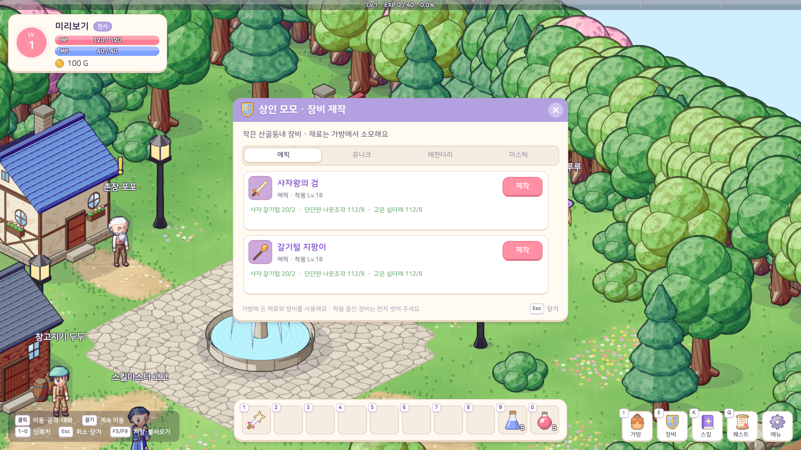

# 23. 아이템 등급·장비 제작 시스템

## 작업 내용

- GitHub 이슈 [#13](https://github.com/lgm1007/adventure-tale/issues/13)과 수정된 [#17](https://github.com/lgm1007/adventure-tale/issues/17)을 반영했다. #17의 기준은 에픽 **부터** 미스틱까지 네 등급 제작이다.
- 장비 6등급과 등급 색·툴팁은 유지했다. 포션·재료는 등급 없음(`None`)이며, 기존 아이템 ID를 유지하면서 하급·중급·상급·최상급 체력/마나 포션의 이름을 정리했다. 엘릭서는 HP 4000과 MP 1500을 함께 회복하며 지역 8~10 마을 상점에서 판다.
- 지역 10곳마다 전사·법사용 에픽·유니크·레전더리·미스틱 제작법을 각각 2개씩 등록했다. 총 **80개 제작법**이다. 재료가 모이면 확정 성공한다.
- 유니크·레전더리 장비는 제작하거나 지역 보스의 희귀 드랍(각 6%, 1.5%)으로 얻는다. 보스의 기본 에픽 장비 드랍과 미스틱용 희귀 재료 드랍도 유지한다. 상위 장비는 기존 착용 외형을 공유하고 등급 색으로 구분한다.
- Core `RecipeDefinition`은 제작법 데이터만 담고, `CraftingRules`는 해당 지역 마을·등록된 제작법·재료 보유량·가방 공간을 검사한 뒤 재료를 소비한다. 착용 중인 장비는 가방에 없으므로 제작 재료로 쓰려면 먼저 벗어야 한다. 제작법 해금·이력 필드가 없어 세이브 스키마는 바뀌지 않았다.
- 마을 상인 대화의 **장비 제작** 창에 에픽·유니크·레전더리·미스틱 탭을 두었다. 결과 장비의 등급 색·착용 레벨·아이콘, 재료별 보유량을 확인할 수 있다. 부족한 재료는 주황색으로 표시되고 제작 버튼이 비활성화된다.

## 등급별 제작 재료

| 결과 | 필요한 재료 |
|---|---|
| 에픽 | 해당 지역 보스 일반 재료 2개 + 서로 다른 필드 재료 8개씩 |
| 유니크 | 같은 장비의 에픽 1개 + 보스 일반 재료 2개 + 필드 재료 12개씩 |
| 레전더리 | 같은 장비의 유니크 1개 + 보스 일반 재료 3개 + 필드 재료 16개씩 |
| 미스틱 | 같은 장비의 레전더리 1개 + 보스 희귀 재료 1개 + 보스 일반 재료 3개 + 필드 재료 20개씩 |

## 검증

- Unity 6000.6.2f1 배치 모드 컴파일 성공, EditMode 테스트 **203개 통과 / 실패 0개**.
- 10개 지역에 네 등급·두 직업 제작법이 모두 있는지, 에픽→유니크→레전더리→미스틱 순서에서 이전 장비가 소비되고 다음 등급이 생기는지, 재료 부족·다른 지역·등록되지 않은 제작법을 거절하는지 확인했다.
- Unity Play 모드에서 프론트 마을의 실제 월드·HUD·상인 제작 창을 띄워 네 탭, 등급 색, 재료 문구, 제작 버튼 배치를 확인했다. 촬영은 임시 캐릭터와 메모리 저장소를 사용해 사용자 세이브 파일을 변경하지 않았다. `git diff --check`도 통과했다.

## 플레이 화면 스크린샷

아래 네 장은 변경된 게임 코드로 실행한 Unity Play 화면이다. 촬영용 가방에 각 제작법의 재료를 넣어 제작 가능한 상태를 보여 준다.

### 에픽

### 유니크

### 레전더리

### 미스틱

## 문제와 해결

| 문제 | 해결 |
|---|---|
| 에픽과 미스틱만 제작 가능했음 | 유니크·레전더리 레시피를 추가하고 네 등급 탭으로 확장했다 |
| 여러 칸에 나뉜 재료와 가방 공간 | 총 보유량을 검사하고 인벤토리 복사본으로 결과를 먼저 검증한 뒤 소비한다 |
| 미스틱의 긴 재료 문구가 제작 버튼에 닿음 | 버튼을 카드 오른쪽 위로 옮기고 재료 문구 폭을 넓혀 Play 화면에서 확인했다 |
| 기존 세이브의 아이템 ID | 기존 ID는 유지하고 새 엘릭서·상위 장비에만 새 ID를 부여했다 |

## 남은 확인

- 일반 플레이에서 상인 대화로 창을 열고 실제 제작 버튼을 눌러, 재료 소모와 착용 외형 및 상인에게서 멀어질 때 창이 닫히는 동작을 확인한다.
- 네 등급의 재료 수량과 보스 희귀 드랍 확률은 실제 사냥 속도에 맞춰 밸런스를 점검한다.
- 유니크·레전더리·미스틱의 별도 착용 외형은 후속 아트 작업에서 다룬다.
