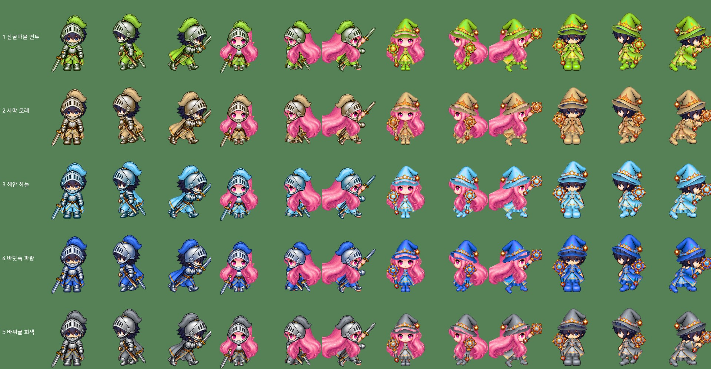
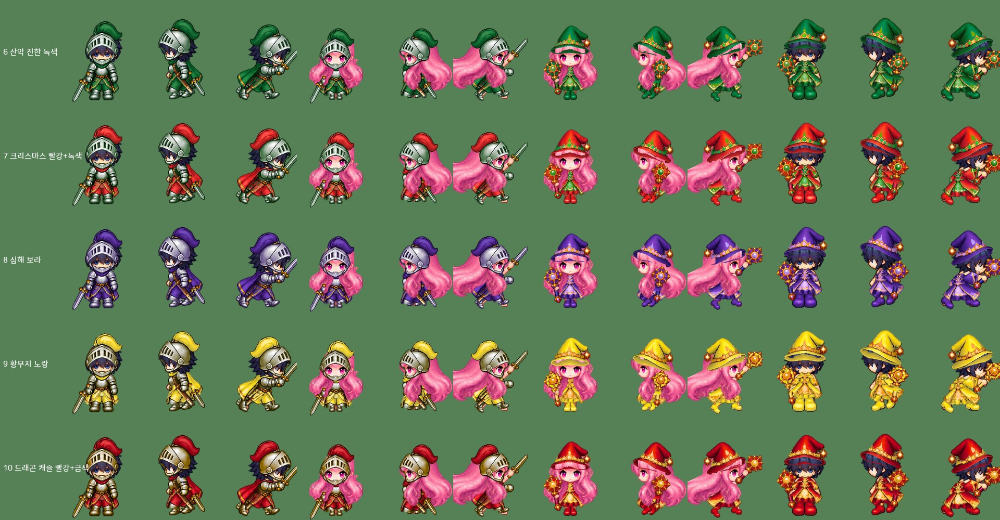
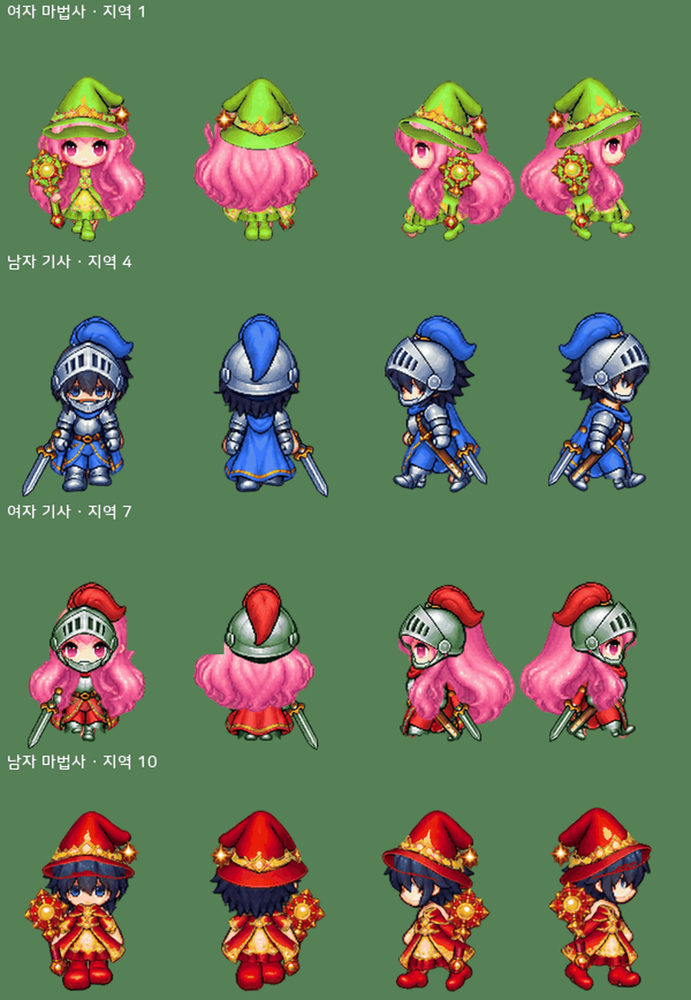
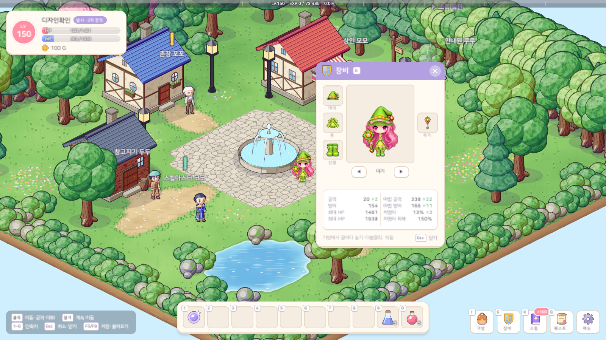
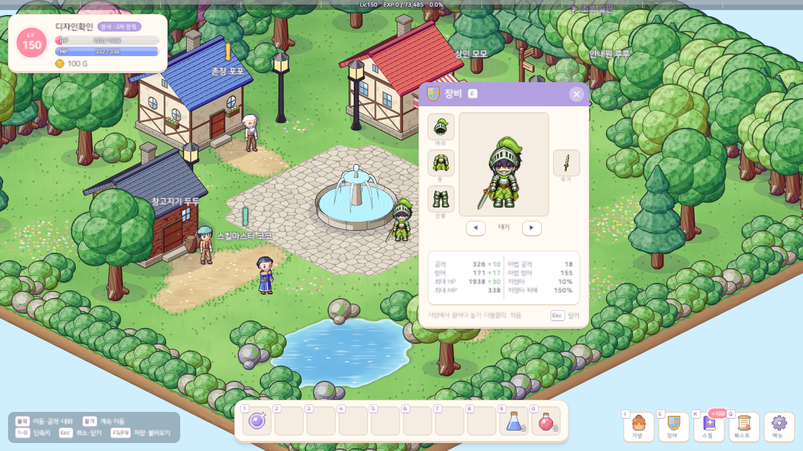
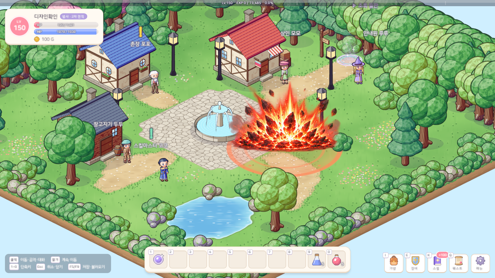
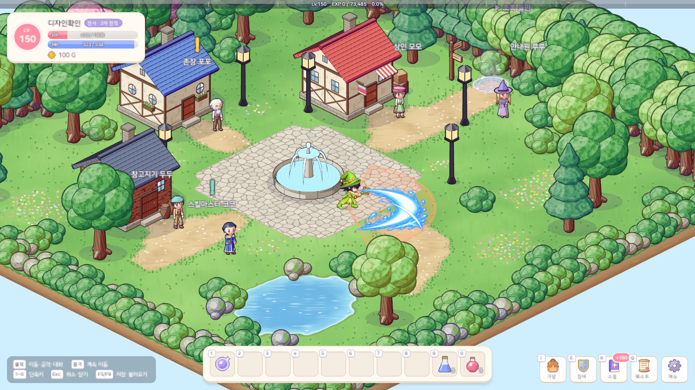
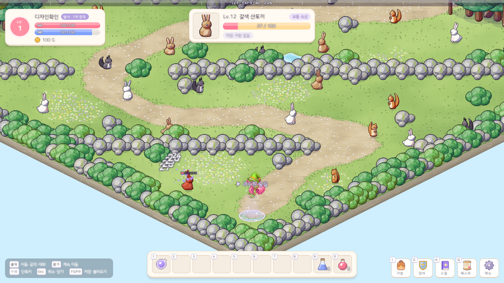
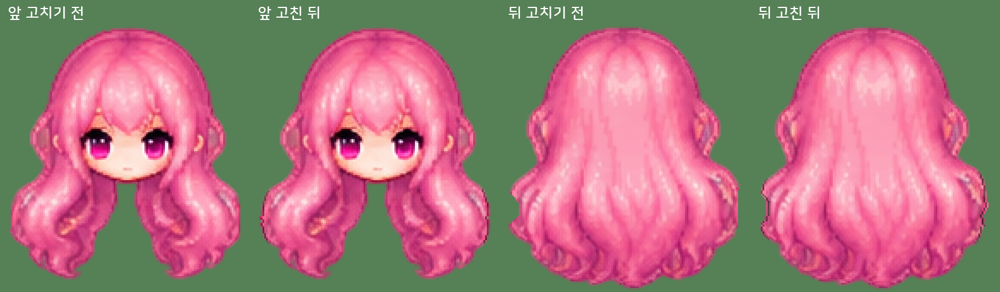

# 29. 캐릭터 · 스킬 이펙트 PNG 적용 — 페이퍼돌 캐릭터 · 지역 장비 색 · 걷기 개선

21번 노트에서 기획한 캐릭터 · 스킬 이펙트 개편을 게임에 적용했다. 플레이어 캐릭터와 스킬 연출은 이제 직접 그린 PNG 시트를 쓴다 (NPC · 몬스터는 아직 3D 도형 인형).

## 작업 내용

### 캐릭터 = 맨몸 + 머리카락 + 장비 4부위를 겹친 페이퍼돌

- 남녀 맨몸 · 머리카락 시트 위에 머리 · 옷 · 신발 · 무기 장비 그림을 칸마다 맞춰 겹친다. 장비를 바꾸면 그 부위 층만 바뀐다.
- 칸 = 4방향(앞 · 뒤 · 왼쪽 · 오른쪽) × 13칸(대기 2 · 걷기 8 · 공격 3, 공격 둘째 칸에 피해가 들어간다). 원본 시트는 줄마다 칸 수와 간격이 달라서, 알파가 가장 옅은 굽은 경로 + 동적 계획으로 칸을 나누고 13칸에 대응시킨다.
- 파이썬 도구(numpy · Pillow)가 원본 시트를 게임용 층 아틀라스 182장 + 칸 표(칸마다 발바닥 기준점)로 만든다. 게임은 층을 발 자리에 겹쳐 놓기만 한다 — 월드 · 장비창 미리보기 · 캐릭터 선택창이 같은 그림을 쓴다.
- 부위 맞추기
  - 머리 장비: 윗머리를 덮고 눈은 가리지 않는 자리. 모자는 챙이 눈 바로 위에 오게 푹 눌러쓰고, 원본 모자 아래쪽에 보이는 어두운 모자 속은 머리카락 뒤로 보낸다
  - 옷: 몸통에 가장 많이 겹치는 자리, 공격 칸은 뻗은 팔에 맞는 그림을 고른다
  - 무기: 손잡이를 주먹에. 대기 · 걷기에서는 늘어뜨린 주먹에 맞게 돌려 쥐고(칼끝은 아래로 비스듬히, 지팡이 머리는 위로), 무기 층의 주먹 자리를 비워 주먹이 손잡이를 감싸게 한다
- 시작 무기는 직업마다 다르다 (전사 = 나무 검, 법사 = 마법 지팡이). 도끼 · 언월도 아이템은 검 그림으로 보이고 이름도 검으로 바꿨다.

### 지역 장비 = 부위 시트를 지역 색으로

장비 그림은 부위 8종(투구 · 모자 · 갑옷 · 로브 · 장화 · 신발 · 검 · 지팡이) × 11개(입문 + 지역 1~10)이고, 같은 지역 · 같은 부위 장비는 등급과 상관없이 같은 그림이다. 처음에는 지역마다 따로 그린 장비 시트를 썼지만, 맨몸에 맞춰 그린 그림이 아니라서 겹치면 어색한 곳이 많았다. 그래서 지역 디자인은 **맨몸에 맞춰 그린 캐릭터 부위 시트(여자 마법사의 모자 · 로브 · 신발 · 지팡이, 남자 기사의 투구 · 갑옷 · 장화 · 검)를 모양 그대로 두고 색만 지역마다 바꿔** 쓰기로 했다. 입문 장비만 장비 시트 그림 그대로다.

| 지역 | 색 |
|---|---|
| 1 산골마을 | 연두 |
| 2 사막마을 | 모래 |
| 3 해안마을 | 하늘 |
| 4 바닷속 마을 | 파랑 |
| 5 바위굴 동굴 | 회색 |
| 6 산악 마을 | 진한 녹색 |
| 7 크리스마스 마을 | 천 = 빨강, 장식 · 강철 = 녹색 |
| 8 심해 마을 | 보라 (원본 보라보다 푸른 남보라) |
| 9 황무지 | 노랑 |
| 10 드래곤 캐슬 | 천 = 빨강, 장식 · 강철 = 금색 |

- 색은 OKLCh(밝기 · 채도 · 색상각)에서 바꾼다. 픽셀을 색 무리로 나눠 천(마법사 보라 · 기사 파랑)과 장식(분홍 안감 · 보석 · 지팡이 구슬)은 지역 색으로 옮기고, 강철은 밝기를 그대로 두고 살짝 물들이며, 금색 테두리 · 가죽 · 살색은 그대로 둔다.
- 밝기는 시트 전체에서 잰 무리의 어두운 쪽 · 가운데 · 밝은 쪽 백분위를 지역 색의 세 밝기로 잇는 꺾은선으로 옮긴다 → 명암 단계와 윤곽선이 원본 그대로 남는다. 시트 전체 통계 하나로 모든 칸을 칠해서 칸마다 색이 흔들리지 않는다.
- 기사 투구는 따로 놓인 물건처럼 얼굴 구멍이 어둡게 칠해진 그림이라, 구멍을 찾아 머리카락 · 얼굴 뒤로 보내 구멍으로 얼굴이 보이게 썼다.

### 걷기

- **옆모습 걷기 8칸을 새로 만든다.** 원본 옆 걷기는 두 다리가 늘 같은 보폭으로 벌어진 채라 미끄러지듯 보였다. 기준 칸에서 두 다리를 떼어 다리마다 뼈 3개(넓적다리 · 정강이 · 발)로 번갈아 흔들고, 흔드는 다리는 무릎을 굽혀 발을 들고, 딛는 발은 뒤꿈치 → 발끝으로 구르며, 딛는 다리가 곧게 설수록 몸이 살짝 오르내린다. 픽셀은 뼈 가중치를 섞어 옮겨(선형 블렌드 스키닝) 관절에 이음매가 없다.
- **신발은 발마다 한 짝씩.** 원본 신발 그림은 두 발을 모은 한 장뿐이라, 옆모습 · 공격 칸은 한 짝씩 다리 기울기에 맞춰 돌려 신기고, 앞 · 뒤 걷기는 두 짝을 나눠 다리 선(엉덩이 → 발)을 따라 옮기고 늘이고 돌린다. 앞 · 뒤 다리는 두 엉덩이에서 동시에 번지는 측지 거리로 나눈다 (어두운 윤곽선은 건너기 비싸서 X 자로 엇갈린 다리도 나뉜다).
- 머리 장비는 대기 · 걷기 내내 한 장을 머리 움직임대로만 옮긴다 (원본 칸마다 모양이 조금씩 달라 바꿔 끼우면 머리 위에서 흔들렸다).

### 스킬 이펙트

- 검사 11종 · 법사 13종 스킬 연출을 직접 그린 이펙트 시트로 바꿨다. 큰 프레임(폭발 · 기둥)이 이웃 칸이나 위 · 아래 줄까지 넘쳐 그려져 있어, 줄 · 프레임 사이를 알파가 가장 옅은 굽은 경로로 나누고 경로에 걸린 작은 조각(불티 · 돌조각)은 대부분이 놓인 프레임에 준다.
- 펜타 매직 애로우는 이펙트 그림이 화살 다섯 발을 한 장에 담고 있어서, 한 번만 쏘고 닿는 순간 다섯 번 맞게 바꿨다.
- 피해가 들어가는 순간과 맞는 범위는 그대로 게임 규칙이 정한다 (보이는 대로 맞는다).

## 스크린샷

### 지역 장비 (빌드된 게임 그림을 게임과 같은 순서로 겹친 것)

줄마다 왼쪽부터 남자 기사 · 여자 기사 · 여자 마법사 · 남자 마법사, 각각 앞 대기 · 왼쪽 걷기 · 오른쪽 공격.

### 네 방향 걷기

앞 · 뒤 · 왼쪽 · 오른쪽 걷기 8칸 (게임 속도 10fps). 옆모습은 두 다리가 번갈아 엇갈리고, 신발은 발마다 따라간다.

### 실제 Play 화면

장비창 미리보기 — 여자 마법사 · 남자 기사, 지역 1 장비.

스킬 이펙트 — 메테오, 검기 베기, 펜타 매직 애로우(한 발이 닿는 순간 다섯 번 맞는다).

### 머리카락 칸 나누기

원본 여자 머리카락 시트의 앞 · 뒤 줄은 옆 컬이 이웃 칸과 맞붙어 그려져 있어, 곧게 가르면 컬 끝이 세로로 평평하게 잘렸다. 맞닿은 곳을 윤곽선을 따라 가르고, 그래도 평평한 곳은 타원 호로 깎아 윤곽선을 칠했다.

## 문제와 해결

| 문제 | 원인 / 해결 |
|---|---|
| 스킬 이펙트 프레임이 직선으로 잘림 | 큰 프레임이 이웃 칸 · 줄로 넘쳐 그려져 있음 → 알파가 가장 옅은 굽은 경로로 나누고 걸친 조각은 대부분이 놓인 프레임에 |
| 원본 장비 시트의 줄마다 칸 수가 다르거나 다른 디자인 그림이 섞인 칸 | 칸 수 · 바꿔 쓸 칸을 표로 적고, 빌드가 튀는 칸(조각 칸 · 색이 다른 칸)을 경고로 알린다 |
| 모자가 머리 위에 떠 보임 | 모자 속(어두운 안쪽)을 머리카락 뒤로 보내고, 윗머리를 다 덮는 자리 중 가장 낮은 곳에 씌운다 |
| 무기가 손 옆에 떠 있음 | 늘어뜨린 주먹에 맞게 돌려 쥐고, 위 층의 주먹 자리를 비워 주먹이 손잡이를 감싸게 |
| 옆으로 걸을 때 다리가 벌어진 채 미끄러짐 | 뼈 3개로 다리를 번갈아 흔드는 걷기 8칸을 새로 만든다 |
| 옆으로 걸을 때 모자 · 신발이 몸과 따로 놂 | 머리 장비는 한 장을 머리 따라 옮기고, 신발은 발마다 한 짝씩 다리에 맞춰 신긴다 |
| 오른쪽을 볼 때 모자가 왼쪽을 보고 머리 위가 드러남 | 원본 오른쪽 줄은 속이 보이게 뒤로 젖힌 그림 → 왼쪽 그림을 좌우 반전해 쓰고, 모자 속 찾기도 좌우 반전에 같은 답을 주게 |
| 앞 · 뒤로 걸을 때 신발이 움직이지 않음 | 원본 신발의 앞 · 뒤 줄은 거의 같은 그림 → 두 다리를 나눠 신발 두 짝이 다리 선을 따라가게 |
| 지역 장비 그림이 맨몸에 잘 맞지 않음 | 맨몸에 맞춰 그린 부위 시트를 모양 그대로 두고 색만 지역마다 바꿨다 |
| 기사 투구가 얼굴을 가림 | 어두운 얼굴 구멍을 찾아 머리카락 · 얼굴 뒤로 보내고, 투구 껍데기가 윗머리를 덮고 눈은 구멍 안에 오게 |
| 여자 머리카락 앞 · 뒤 칸의 옆 컬이 평평하게 잘림 | 이웃 칸 컬끼리 맞붙어 그려짐 → 윤곽선을 따라 가르고, 평평하게 남은 곳은 타원 호로 깎아 윤곽선을 칠한다 (투구 깃털 · 모자 챙도 같다) |
| 장비창 미리보기의 공격 동작에서 휘날린 머리카락 · 칼끝이 잘림 | 미리보기 틀을 양옆 장비 칸 사이 거의 끝까지 넓히고, 그래도 넘치는 끝은 틀 양옆에서 흐리게 사라지게 |

## 검증

- 아틀라스 빌드: 층 아틀라스 182장 + 칸 표, 원본 시트 경고 없음
- Unity 6000.6.2f1 컴파일 성공 · EditMode 테스트 204개 통과 (에디터를 켜 둔 채 프로젝트 복제본에서)
- 아트 계약 검사 통과: 층 · 칸 · 타격 칸, 스킬 이펙트 24종, 장비 176개의 그림 · 아이콘 연결
- 실제 Play 화면 캡처 21장 (캐릭터 선택창, 남녀 × 전사 · 법사 장비창 · 걷기, 스킬 이펙트, 펜타 매직 애로우), 촬영은 메모리 세이브로 해서 실제 세이브 파일은 바뀌지 않았다

## 남은 일

- 에디터에서 직접 걸어 다니며 걸음 박자 · 몸 오르내림 · 지역 장비 색 확인
- 아이템 이름 중 예전 지역 디자인을 가리키는 이름(상어 투구 · 등불 아귀 모자 등)은 그대로 두었다
- 몬스터 그림 개편 (22번 노트)
