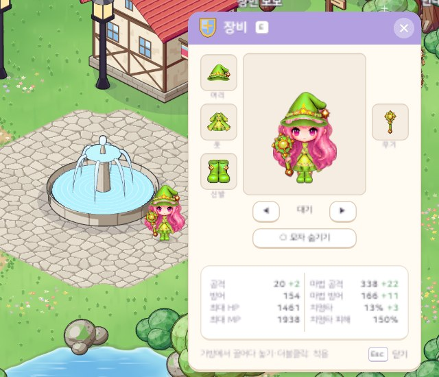
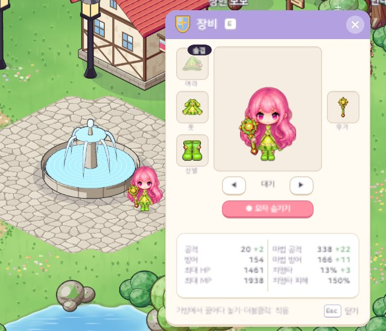
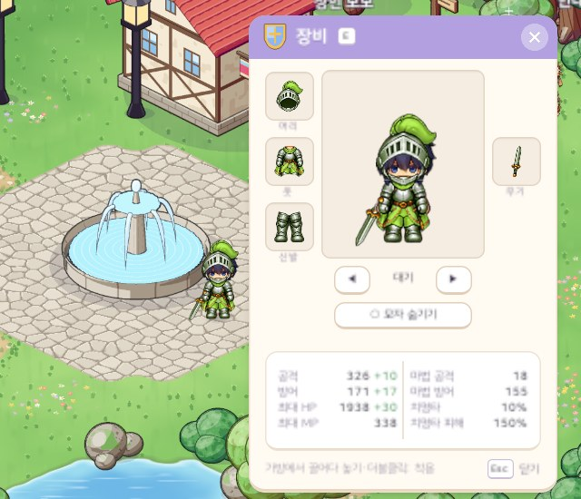
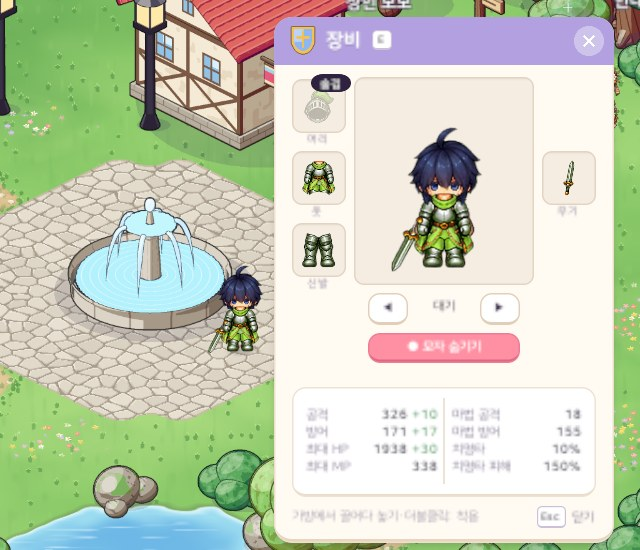

# 31. 장비창 모자 숨기기

머리 장비(모자 · 투구)를 쓴 채로 겉모습에서만 숨기는 설정을 장비창에 넣었다. 좋은 능력치의 모자를 쓰고 싶지만 머리 모양을 보이고 싶을 때 쓴다.

## 작업 내용

- 장비창(E) 미리보기 아래 **○ 모자 숨기기** 단추. 누르면 분홍 단추 **● 모자 숨기기** 로 바뀌고 머리 장비가 그림에서 빠진다. 다시 누르면 보인다. 단추 자리 때문에 장비창이 조금 길어졌다.
- 숨겨도 장비는 입은 그대로다. 능력치 · 착용 레벨은 바뀌지 않고 그림만 그 칸이 빈 것처럼 그린다. 모자와 기사 투구를 같은 단추로 숨긴다.
- **머리카락은 맨머리카락 그림으로 되돌린다.** 플레이어는 층을 겹친 PNG 페이퍼돌(29번 노트)인데, 모자를 쓰면 머리 층이 "모자 + 모자 모양에 맞춰 잘린 머리카락" 한 장이 된다. 모자 그림만 빼면 잘리고 눌린 머리카락이 남으므로, 숨기면 머리 층 자체를 모자를 안 쓴 머리카락으로 바꾼다.
- 월드 캐릭터 · 장비창 미리보기 · 캐릭터 선택창 카드가 모두 같은 규칙으로 그린다: 그릴 장비 = 입은 장비 − 숨긴 칸. 캐릭터 선택창은 게임에 들어가기 전이라 세이브에 저장된 설정을 읽어 그린다.
- 숨긴 동안 장비창의 머리 칸 아이콘이 흐려지고 모서리에 "숨김" 알약이 붙는다. 툴팁에는 "겉모습에서 숨겼어요 · 능력치는 그대로"가 나온다.
- 캐릭터마다 저장한다. 단추를 누르자마자 조용히 저장해서, 다시 접속해도 유지된다.
- 세이브 버전을 v8 로 올렸다. 저장은 "숨긴 부위 목록"이라 나중에 옷 · 신발 · 무기 숨기기도 같은 구조로 늘릴 수 있다. 예전 세이브는 빈 목록 = 모두 보임으로 읽는다.

## 스크린샷

실제 Play 화면 — 왼쪽 월드 캐릭터와 오른쪽 장비창 미리보기가 함께 바뀐다.

여자 마법사 (지역 1 장비): 모자를 쓴 모습 / 숨긴 모습.

남자 기사: 투구를 쓴 모습 / 숨긴 모습. 머리 칸 아이콘이 흐려지고 "숨김" 알약이 붙는다.

## 문제와 해결

| 문제 | 원인 / 해결 |
|---|---|
| 모자 그림만 빼면 모자에 잘린 머리카락이 남음 | 모자를 쓴 머리 층은 모자와 잘린 머리카락이 한 장 → 숨기면 머리 층을 맨머리카락 그림으로 바꾼다 |
| 화면마다 따로 처리하면 어긋날 수 있음 | "입은 장비 − 숨긴 칸" 을 정하는 규칙 하나를 월드 · 장비창 · 선택창이 같이 쓴다 (선택창은 세이브에서 같은 규칙으로) |
| 숨겼는데 능력치까지 빠질 위험 | 숨기기는 겉모습 설정이라 장비 착용 · 능력치 계산을 건드리지 않는다 (테스트로 확인) |
| 숨긴 상태를 장비창에서 알아보기 어려움 | 머리 칸 아이콘을 흐리게 + "숨김" 알약 + 툴팁 안내 |

## 검증

- Unity 6000.6.2f1 컴파일 성공 · EditMode 테스트 207개 통과 (새 테스트 3개: 숨겨도 장비 · 능력치는 그대로이고 그림에서만 빠지는지, 저장 · 불러오기 뒤에도 유지되고 선택창이 같은 규칙을 쓰는지, v7 세이브가 모두 보이는 상태로 넘어오는지) — 에디터를 켜 둔 채 프로젝트 복제본에서
- 실제 Play 화면 캡처: 남녀 × 전사 · 법사 4가지 차림의 쓴 모습 · 숨긴 모습, 캐릭터 선택창. 촬영은 임시 세이브로 해서 실제 세이브 파일은 바뀌지 않았다

## 남은 일

- 에디터에서 단추를 마우스로 직접 눌러 보고, 캐릭터 선택으로 나갔다 들어와 유지되는지 확인
- 옷 · 신발 · 무기 숨기기 (저장 구조는 이미 부위 단위)
