# 32. NPC 60명 PNG 시트 적용 — 마을 NPC 5역할 · 보스 필드 지기

24~28 · 30번 노트에서 기획한 NPC 그림 시트 60장(촌장 · 상점 · 안내원 · 스킬마스터 · 창고지기 · 보스 필드 지기 × 지역 1~10)을 게임에 적용했다. 이제 게임의 NPC 는 모두 직접 그린 PNG 그림이다 (예전에는 3D 도형 인형).

## 작업 내용

### 시트 → 게임 그림

원본 시트는 투명 배경이 없는 옅은 회색 위에 위 줄 정지(앞 · 왼쪽 · 오른쪽 · 뒤) + 큰 그림, 아래 줄 걷기 4방향 + 큰 그림이 있고, 작은 그림마다 밑에 이름표 글자가 있다.

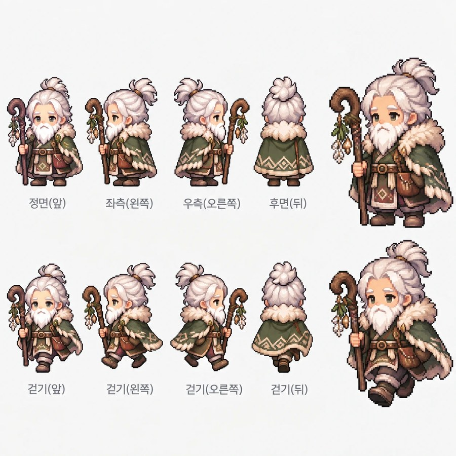

- 파이썬 도구가 배경을 걷어 낸다.
  - 배경색과 다른 픽셀을 모은 뒤, 윤곽선의 작은 틈을 막고(닫기) 테두리에서 이어진 배경을 뺀다.
  - 그림 안에 갇힌 배경(지팡이와 몸 사이, 지팡이 갈고리 안쪽)은 "옅은 무채색 덩어리 + 배경색에 가까운 픽셀이 충분히 있음 + 둘레 둘째 줄(윤곽선 자리)의 절반 이상이 진함"으로 찾아 비운다. 하얀 수염 · 털 · 눈 반짝이는 둘레가 윤곽선으로 닫혀 있지 않아서 남는다.
  - 가장자리 2픽셀은 안쪽 색 + 배경에서 얼마나 떨어졌는지로 정한 반투명 알파로 부드럽게 한다.
- 덩어리 10개(작은 그림 8 + 큰 그림 2)를 줄 · 순서로 방향에 맞춘다. 이름표 글자는 키가 작아 자동으로 빠진다. 좌우 그림은 시트 그대로 쓴다 (반전하지 않는다).
- 칸마다 발 기준점을 따로 기록하는 아틀라스라 고정 칸(48×64) 크기가 없다 → 키보다 긴 창 · 곡괭이 · 지팡이를 든 보스 필드 지기도 잘리지 않는다.
- **키 맞추기:** 원본마다 그림 크기가 달라 역할마다 몸 키를 정해 플레이어와 같은 밀도로 줄인다 (어른 남자인 스킬마스터가 조금 크고, 창고지기 소년이 조금 작다). 몸 키는 머리 위로 솟은 가는 창끝 · 지팡이 끝 · 꽁지머리는 빼고 몸통 · 머리 덩어리까지로 잰다 — 무기 끝까지 재면 무기가 긴 NPC 일수록 몸이 작아졌다.
- 움직임: 시트에 방향마다 정지 · 걷기 그림이 한 장씩뿐이라, 정지는 1픽셀 낮춘 칸과 번갈아 은은하게 숨 쉬게 했다. 숨 쉬는 속도가 NPC 마다 조금씩 달라 한 마을 NPC 가 함께 들썩이지 않는다.
- 대화창 초상화는 시트 오른쪽 위의 큰 정지 그림을 쓴다. 월드에서는 플레이어처럼 발밑 그림자를 깔고 이름표를 그림 키에 맞춰 머리 위에 띄운다.

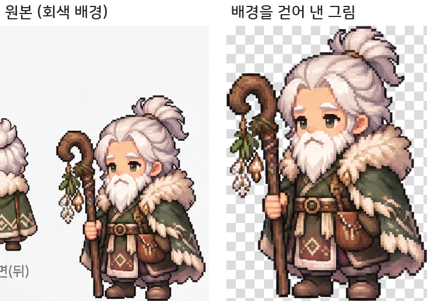

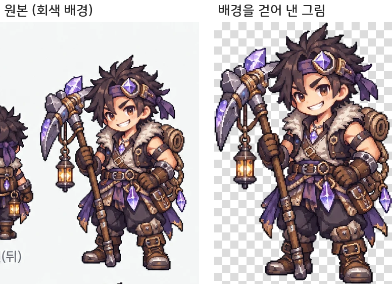

### 마을마다 다섯 역할

- 마을마다 촌장 · 상점 · 창고지기 · 안내원 · 스킬마스터가 한 명씩 있도록 지역 2~10 마을에 촌장 9명을 새로 세웠다 (아직 맡길 퀘스트가 없어 말을 걸면 마을 이야기를 한다). 다른 NPC · 포탈에서 4칸 이상 떨어진 광장 가장자리에 둔다. 테스트가 마을마다 다섯 역할이 한 명씩인지 확인한다.
- 산악 지역 범바위 산마루의 석등이 산지기 바로 앞에서 몸을 가려 옆으로 옮겼다.

### 이름 · 말투를 그림에 맞추기

새 그림과 예전 이름 · 말투가 어긋나는 NPC 를 그림에 맞게 고쳤다 (그 NPC 가 말하는 퀘스트 대사 · 이름이 나오는 퀘스트 설명 · 재료 설명까지 함께).

| 지역 | 바꾼 것 | 그림 |
|---|---|---|
| 2 | 스킬마스터 사라 → **칼리드** | 터번 · 곡검의 수염 난 사막 전사 |
| 4 | 잠수부 마루 → **산호 파수꾼 마루** | 산호 삼지창을 든 인어풍 소녀 |
| 5 | 광부 대장 돌돌 → **꼬마 광부 돌돌**, 노인 말투 → 소년 반말 | 수정 곡괭이를 든 소년 |
| 7 | 눈꽃 현자 설아 → **설봉** | 산타풍 로브의 수염 난 노인 |
| 7 | 얼음 탐험가 오로라 → **서리** | 금발 소년 |
| 8 | 고물 상인 따개 → **심해 마녀 보글** | 마녀 모자 · 빛 구슬의 소녀 |
| 8 | 잠수부 해솔 → **별빛 안내원 해솔** | 별빛 드레스 · 책을 든 소녀 |
| 8 | 늙은 항해사 노을 → **심연의 마법사 노을** | 빛나는 지팡이 · 심해 로브의 남자 |
| 9 | 매사냥꾼 수리 → **유적 지킴이 수리** | 고글 · 녹슨 창의 소년 (매 없음) |
| 3 | 등대지기 호호: 노인 말투 → 소년 말투 | 소년 |
| 6 | 약초 상인 향향: "~있다오" → "~있어요" | 젊은 여자 |
| 1 | 스킬마스터 코코: "가르쳐 줄게" → "가르쳐 주마" | 수염 난 사범 |

지금 NPC 60명:

| 지역 | 촌장 | 상점 | 안내원 | 스킬마스터 | 창고지기 | 보스 필드 지기 |
|---|---|---|---|---|---|---|
| 1 | 포포 | 상인 모모 | 루루 | 코코 | 두두 | 숲지기 바루 |
| 2 | 바바 | 상인 나나 | 미미 | 칼리드 | 짐꾼 타타 | 탐험가 카카 |
| 3 | 고동 | 상인 피피 | 라라 | 파도 | 짐꾼 보보 | 등대지기 호호 |
| 4 | 거북 | 진주 상인 주주 | 리리 | 길드 마스터 오르카 | 짐꾼 도도 | 산호 파수꾼 마루 |
| 5 | 바우 | 광석 상인 토토 | 소소 | 단단 | 짐꾼 쿠쿠 | 꼬마 광부 돌돌 |
| 6 | 청학 | 약초 상인 향향 | 구름 | 대사범 무진 | 짐꾼 봉봉 | 산지기 솔솔 |
| 7 | 니콜 | 선물가게 주인 노엘 | 썰매꾼 루루 | 눈꽃 현자 설봉 | 요정 창고지기 피피 | 얼음 탐험가 서리 |
| 8 | 해월 | 심해 마녀 보글 | 별빛 안내원 해솔 | 심연의 마법사 노을 | 갑판장 닻돌 | 유령 사냥꾼 등불 |
| 9 | 흙바람 | 천막 상인 누리 | 낙타 몰이꾼 바람 | 족장 한울 | 짐수레꾼 덜컹 | 유적 지킴이 수리 |
| 10 | 홍염 | 종군 상인 금화 | 전령 새벽 | 성기사단장 레온 | 보급관 든든 | 용 사냥꾼 아르테 |

## 스크린샷

### 지역별 줄 세우기

줄마다 지역 1~10, 왼쪽부터 플레이어(남 · 여, 키 비교) · 촌장 · 상점 · 안내원 · 스킬마스터 · 창고지기 · 보스 필드 지기 (게임 아틀라스 그대로).

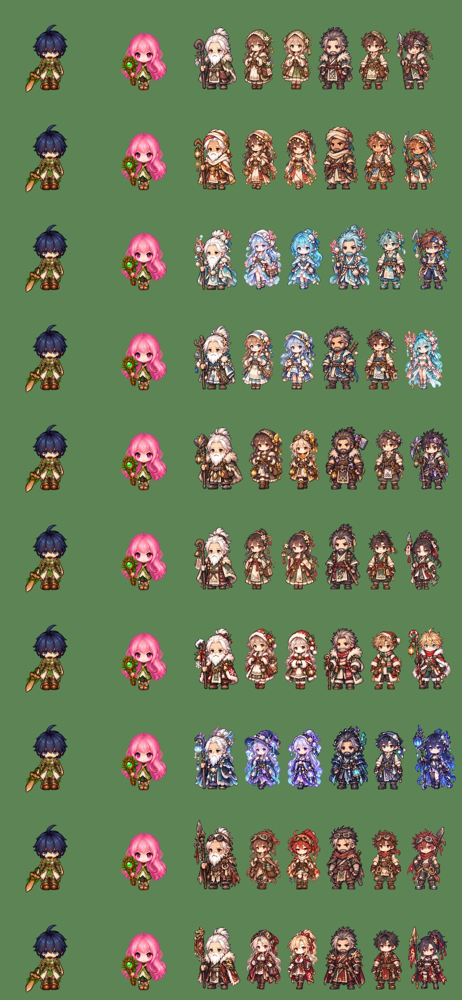

### 방향 · 초상화

보스 필드 지기 10명의 앞 · 뒤 · 왼쪽 · 오른쪽 정지 + 걷기. 키보다 긴 무기도 잘리지 않는다.

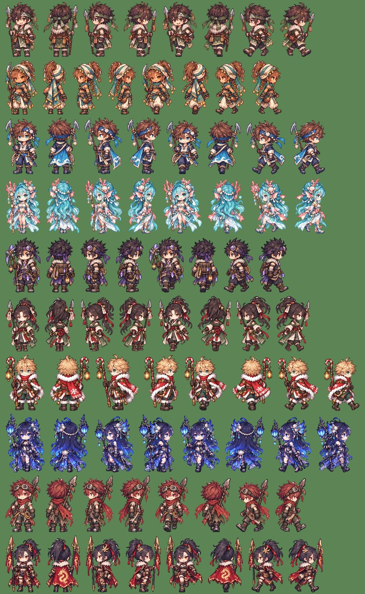

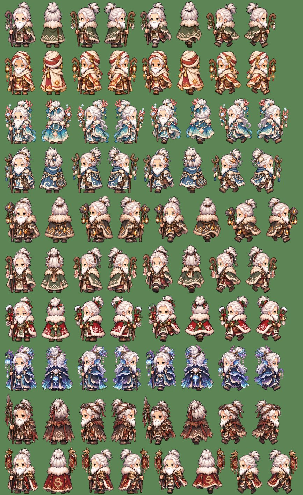

대화창 초상화 60장 (줄마다 촌장 · 상점 · 안내원 · 스킬마스터 · 창고지기 · 보스 필드 지기).

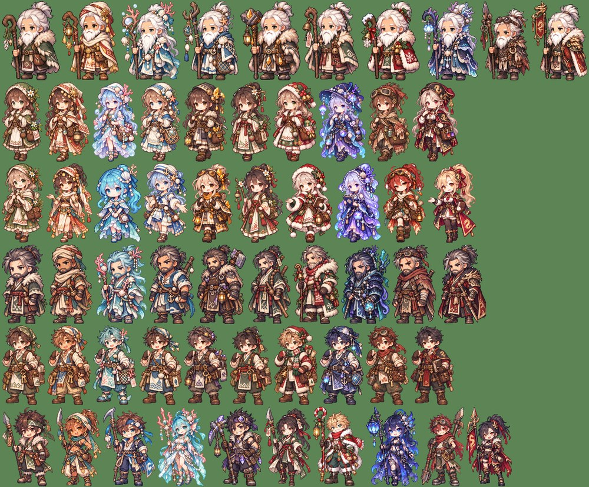

### 실제 Play 화면

프론트 마을 · 와일드마운틴 마을 · 크리스마스 타운 · 드래곤 캐슬.

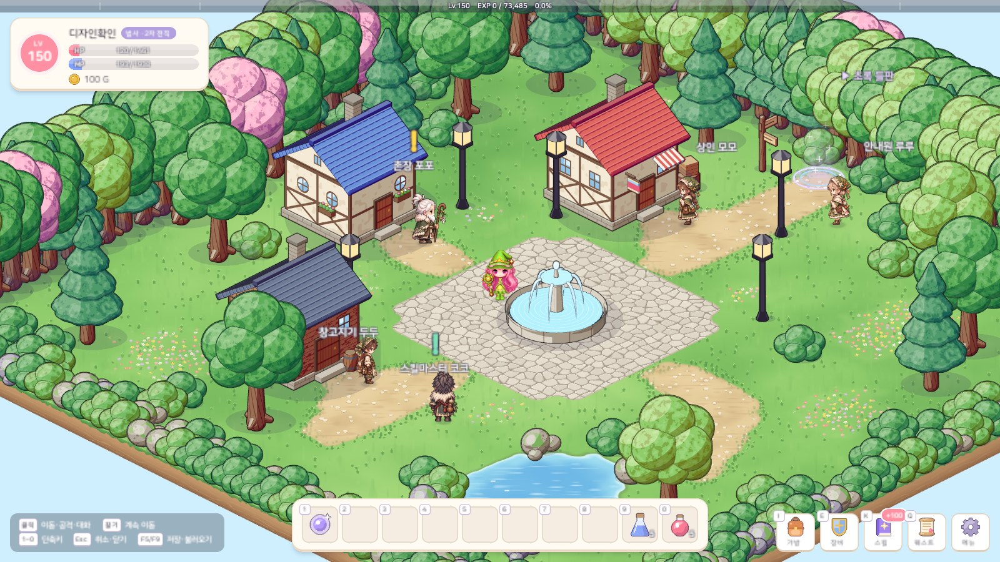

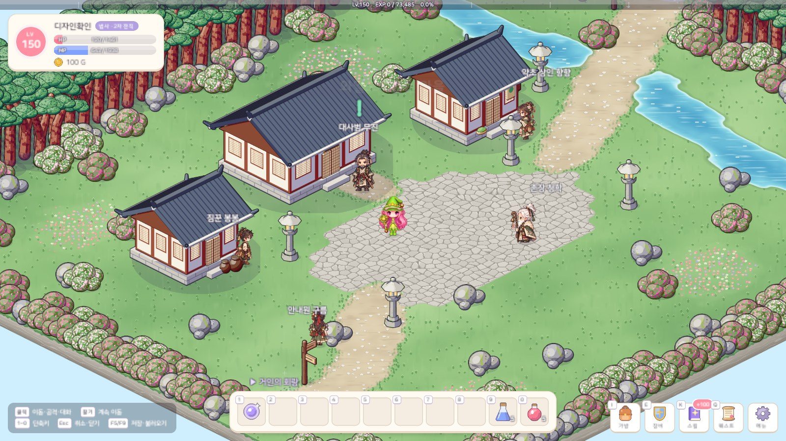

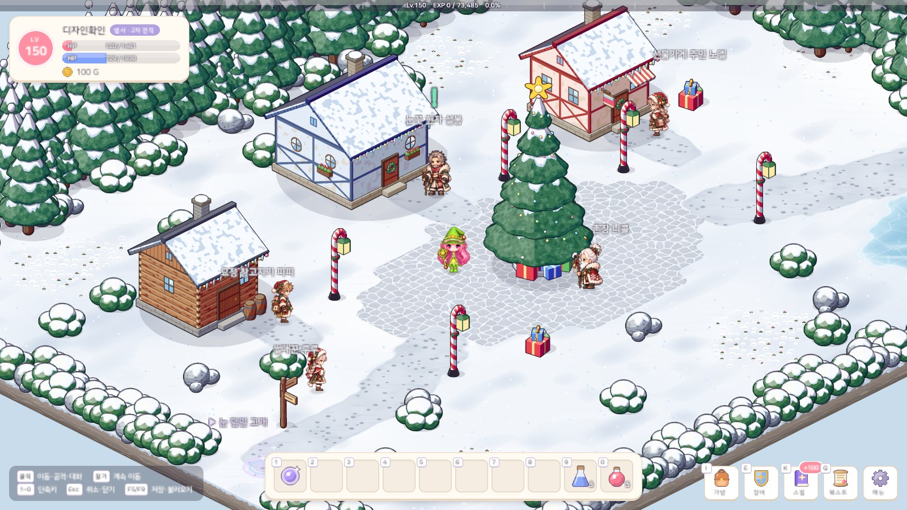

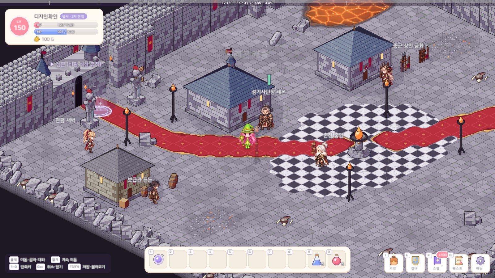

대화창 — 블루홀 촌장 해월, 수정 광산 끝의 꼬마 광부 돌돌.

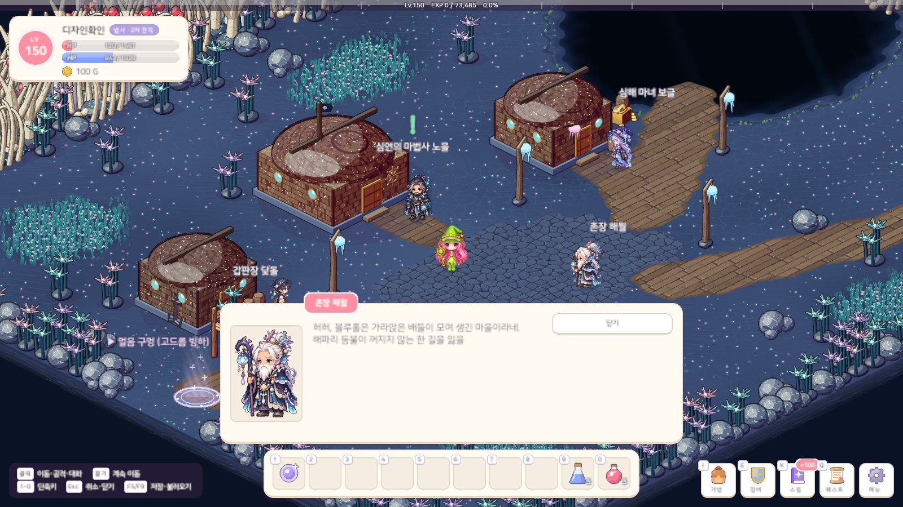

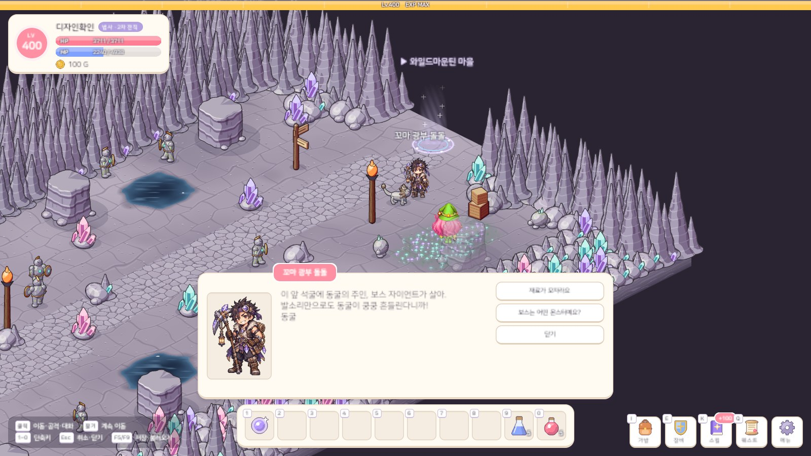

## 문제와 해결

| 문제 | 원인 / 해결 |
|---|---|
| 시트에 투명 배경이 없음 | 배경색과 다른 픽셀 + 닫기로 윤곽선 틈 막기 → 테두리에서 이어진 배경을 빼고, 가장자리는 배경과의 차이로 반투명 알파 |
| 지팡이와 몸 사이 · 갈고리 안쪽의 배경이 남음 | 테두리와 이어지지 않은 갇힌 배경 → 옅은 무채색 덩어리 중 배경색이 충분하고 둘레 윤곽선 자리가 진한 것만 비운다 |
| 하얀 수염 · 털 · 흰 머리카락까지 지워짐 | 처음에는 옅은 덩어리를 모두 지웠다 → 둘레가 진한 윤곽선으로 닫힌 덩어리만 배경으로 친다 (수염 · 털은 그림 속 색과 이어져 있다) |
| 윤곽선 틈으로 배경 지우기가 흰 머리카락 안까지 번짐 | 배경과 다른 픽셀을 반경 3 으로 닫은 뒤 테두리에서 번지게 한다 |
| 이름표 글자가 그림으로 잡힘 | 큰 덩어리(넓이 · 키 기준) 10개만 그림으로 쓰고, 키가 작은 글자는 뺀다 |
| 원본마다 그림 크기가 달라 NPC 키가 들쭉날쭉 | 역할마다 몸 키를 정해 맞추고, 몸 키는 머리 위로 솟은 창끝 · 지팡이 끝을 빼고 잰다 |
| 긴 창 · 곡괭이가 고정 칸(48×64)에서 잘림 | 칸마다 크기 · 발 위치를 따로 기록하는 아틀라스로 |
| 한 마을 NPC 가 함께 들썩임 | 숨 쉬는 속도를 아틀라스 이름으로 조금씩 다르게 |
| 석등이 산지기를 가림 | 석등을 지기 옆으로 옮겼다 |
| 새 그림과 이름 · 말투가 어긋남 (소년인데 노인 말투, 매 없는 매사냥꾼 등) | 그림의 나이 · 성별 · 소품에 맞게 이름 · 대사를 고치고, 그 이름이 나오는 퀘스트 설명까지 함께 고쳤다 (세이브에 들어가는 NPC id 는 그대로) |

## 검증

- Unity 6000.6.2f1 컴파일 성공 · EditMode 테스트 208개 통과 (새 테스트: 마을마다 다섯 역할이 한 명씩) — 에디터를 켜 둔 채 프로젝트 복제본에서
- 아트 계약 검사 통과: 맵에 선 NPC 60명이 모두 서로 다른 시트 · 칸 수 · 초상화 · 키를 가졌는지
- 실제 Play 화면 캡처: 마을 10곳 + 촌장 대화 10장, 보스 필드 지기 10명 + 입장 대화 10장. 촬영은 임시 세이브로 해서 실제 세이브 파일은 바뀌지 않았다
- 용량: 원본 시트 18MB + 게임용 아틀라스 28MB

## 남은 일

- 에디터에서 NPC 를 직접 눌러 보고 숨쉬기 움직임 확인
- 새 촌장 9명에게 맡길 퀘스트
- 몬스터 그림 개편 (22번 노트)
