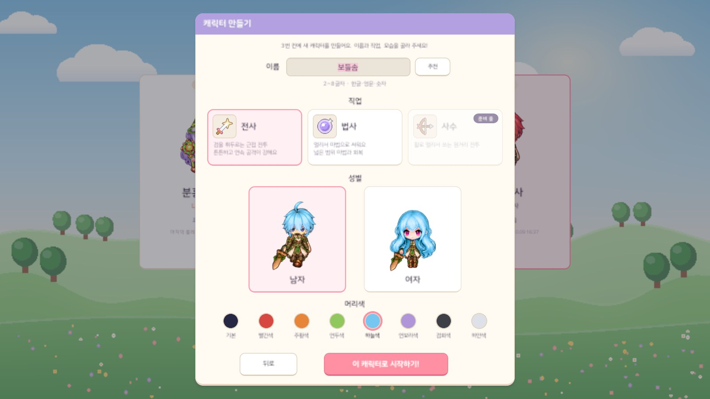
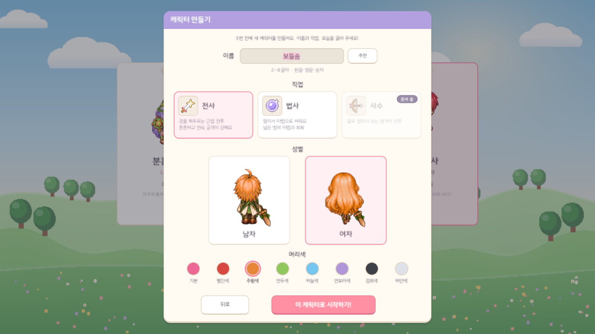
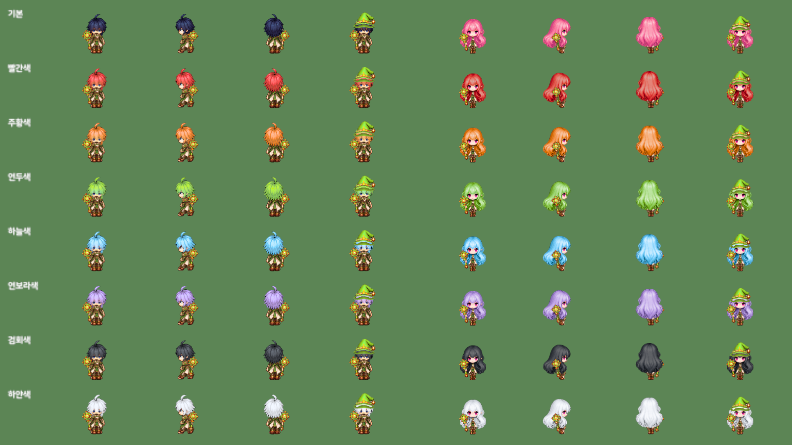
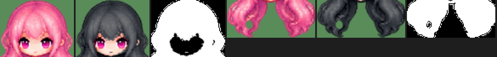
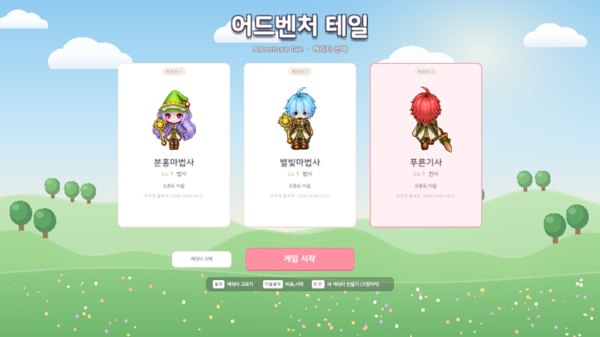
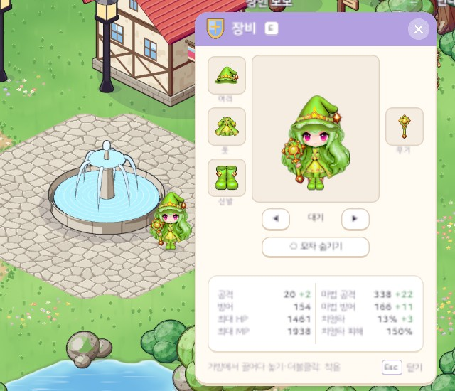
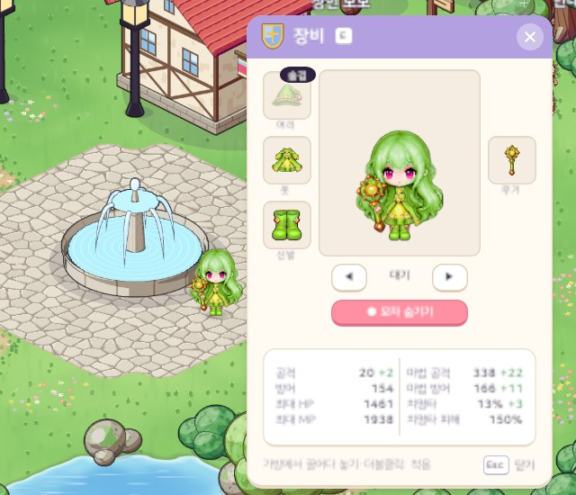
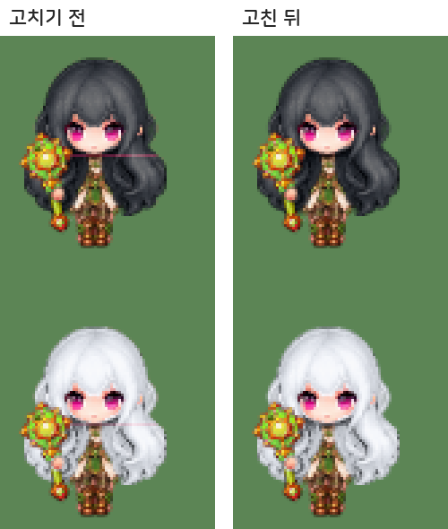

# 33. 캐릭터 만들기 머리색 선택 — 기본 + 7색

캐릭터를 만들 때 머리색을 고를 수 있게 했다. 남녀 모두 같은 8가지(기본 · 빨간색 · 주황색 · 연두색 · 하늘색 · 연보라색 · 검회색 · 하얀색)이고, 고른 색은 월드 · 장비창 미리보기 · 캐릭터 선택창 어디서나 같다.

## 작업 내용

### 캐릭터 만들기 창

- 성별 카드 아래에 동그란 머리색 견본 8개. 견본마다 이름 글자를 붙였다 (색만으로 구분하기 어려운 사람도 고를 수 있게). 고른 견본은 분홍 테두리로 표시한다.
- 고르는 즉시 남 · 여 미리보기 두 캐릭터에 칠해진다. 성별을 바꿔도 고른 색은 그대로다.
- 맨 앞의 **기본** 은 그림의 원래 색(남 = 짙은 남색, 여 = 분홍)이다. 7색만 두면 새 캐릭터가 지금 모습으로 만들어질 수 없어서 기본을 남겼다. 기본 견본은 고른 성별의 원래 머리색으로 보인다.
- 머리색은 캐릭터 상태(플레이어 프로필)에 두고 바꾸는 함수 하나로만 바꾼다. 지금은 만들 때만 고르지만, 나중에 미용실 같은 기능이 이 함수만 부르면 된다.
- 세이브 버전을 v9 로 올렸다. 머리색이 없던 예전 세이브는 기본으로 읽혀 예전 모습 그대로다. 세이브에 모르는 값이 들어 있어도 기본으로 읽는다.

### 그림: 굽지 않고 실행 중에 머리카락만 다시 칠하기

플레이어는 맨몸 · 머리카락 · 장비 층을 겹친 PNG 페이퍼돌(29번 노트)이다. 머리카락이 든 층은 성별마다 24장(맨머리카락 · 목선 아래 긴 머리 · 모자 11종 · 투구 11종 — 모자를 쓰면 모자 모양에 맞춰 잘린 머리카락이 장비와 한 장에 들어 있다)이라, 색마다 아틀라스를 구워 두면 약 180MB가 늘어난다. 그래서 빌드 때 **머리카락 자리 마스크** 만 만들고, 게임이 그 자리만 실행 중에 칠한다.

- **마스크** (파이썬 빌드 도구): 머리카락 층과 같은 크기 · 자리의 흑백 그림 48장, 흰색 = 머리카락, 검정 = 얼굴 · 살 · 눈 · 장비.
  - 머리카락 시트에는 얼굴이 함께 그려져 있다. 살색(복숭아빛)은 얼굴로 친다.
  - 눈 · 입은 맨몸(대머리) 그림에서 살색에 둘러싸인 구멍으로 찾는다. 구멍마다 머리카락 층에도 같은 눈이 그려져 있으면, 그 둘레에서 맨몸과 같은 색이거나 머리카락 색 무리(뒷모습 머리카락에서 모은 색)에 없는 색을 얼굴로 친다. 남자 앞모습처럼 앞머리가 눈을 덮은 구멍은 비교하지 않는다 (앞머리까지 얼굴로 잡히지 않게).
  - 모자 · 투구를 쓴 층은 머리카락과 장비를 합칠 때와 똑같은 순서로 마스크도 합쳐서 장비 자리는 검정이 된다 → 모자 · 투구 · 머리핀은 물들지 않는다.
- **칠하기** (지역 장비 색과 같은 OKLCh 방식): 원래 머리카락 밝기의 어두운 쪽 · 가운데 · 밝은 쪽 백분위를 머리색의 세 밝기로 잇는 꺾은선으로 옮긴다. 명암 단계와 윤곽선이 그대로 남아서 하얀색 · 검회색에서도 머리결이 보인다 (곱하기 틴트는 하얀색 · 검회색에서 명암이 뭉개진다). 채도는 가운데값 비율로, 색상각은 머리색으로 옮기되 원래 무리 안의 작은 차이만 절반 남긴다.
- 칠하는 식은 게임 쪽(C#)과 빌드 도구(파이썬)에 같은 식으로 있고, 테스트가 두 쪽이 같은 색을 내는지 확인한다. 색을 다듬을 때는 빌드 도구의 색 표를 고치고 8색 미리보기를 다시 뽑는다.
- 게임은 (층, 색)마다 한 번 칠한 텍스처를 만들어 두고, 월드 캐릭터 · 장비창 미리보기 · 캐릭터 선택창 · 만들기 창이 모두 같은 함수로 이 그림을 쓴다. 모자를 쓰거나 숨겨도(모자 숨기기, 31번 노트) 같은 색이다.

## 스크린샷

### 캐릭터 만들기 창

하늘색을 고른 모습(남자 선택)과 주황색을 고른 모습(여자 선택). 기본 견본은 고른 성별의 원래 색(남 남색 · 여 분홍)으로 바뀐다.

### 8색 × 남녀

줄마다 위에서부터 기본 · 빨간색 · 주황색 · 연두색 · 하늘색 · 연보라색 · 검회색 · 하얀색, 칸마다 남자 앞 · 옆 · 뒤 · 모자 / 여자 앞 · 옆 · 뒤 · 모자 (실제 게임 화면).

### 마스크

여자 머리카락 층 한 칸: 원래 그림 · 검회색으로 칠한 그림 · 마스크(흰색 = 칠하는 곳). 왼쪽 셋은 목선 위 머리, 오른쪽 셋은 목선 아래 긴 머리. 눈 · 얼굴은 마스크에서 빠져 원래 색 그대로다.

### 캐릭터 선택창 · 월드 · 장비창

캐릭터마다 다른 머리색 (연보라색 + 모자 · 하늘색 · 빨간색).

연두색 머리 여자 마법사 — 월드와 장비창 미리보기가 같은 색, 모자를 숨겨도 같은 색.

### 목선 이음매의 분홍 줄

칠한 뒤 여자 앞모습 입 높이에 원래 머리색(분홍) 가는 줄이 보였다 (검회색 · 하얀색에서 잘 보인다).

## 문제와 해결

| 문제 | 원인 / 해결 |
|---|---|
| 색마다 아틀라스를 구우면 용량이 크게 늘어남 | 모자 · 투구마다 잘린 머리카락 층이 따로 있어 약 180MB → 마스크만 만들고 실행 중에 머리카락 자리만 칠한다 |
| 머리카락 층에 그려진 얼굴 · 눈까지 물듦 | 살색은 얼굴로 치고, 눈 · 입은 맨몸의 살색 구멍으로 찾아 그 둘레에서 맨몸과 같은 색 · 머리카락 색 무리에 없는 색을 뺀다 |
| 남자 앞모습 앞머리가 눈 둘레라서 얼굴로 잡힘 | 구멍마다 눈이 머리카락 층에 실제로 그려져 있는지(밝은 픽셀이 보이는지) 먼저 보고, 앞머리에 가려진 눈이면 비교하지 않는다 |
| 정수리 반짝임 · 뒤통수 윤곽선이 얼굴 구멍으로 잡힘 | 머리 위쪽 30% 는 구멍 찾기에서 빼고, 살색에 둘러싸인 구멍만 쓴다 |
| 앞머리 끝의 따뜻한 그늘이 다른 색 계열(하늘색 → 청록)로 튐 | 원래 색상각 차이를 ±24° 까지만, 그것도 절반만 남기고, 채도는 머리색 채도의 1.5배까지로 묶는다 |
| 모자 · 투구 · 머리핀까지 물듦 | 머리카락과 장비를 합칠 때와 같은 순서로 마스크도 합쳐 장비 자리는 0 |
| 여자 앞모습 입 높이에 원래 분홍 가는 줄 | 목선 위 머리 층은 칸 아래 끝에서 반듯하게 잘려 있다. 그림을 들여올 때 투명 칸에 원래 색이 번져 있어서, 바이리니어 필터가 가장자리에서 그 색을 섞었다 → 칠한 머리카락과 맞닿은 투명 칸도 이웃의 새 색으로 채운다 (아트 검사가 확인) |

## 검증

- Unity 6000.6.2f1 컴파일 성공 · EditMode 테스트 215개 통과 (머리색 테스트 7개 추가: 8색 × 남녀, 세이브 왕복 · 성별 변경, v8 세이브 → 기본색, 칠하는 식이 빌드 도구와 같은 값, 명암 순서 유지) — 에디터를 켜 둔 채 프로젝트 복제본에서
- 아트 계약 검사 통과: 마스크 48장(크기 · 읽기 · 비어 있지 않음), 칠하면 머리카락만 바뀌는지, 머리카락 둘레 투명 칸
- 빌드 도구를 다시 돌려도 기존 아틀라스 · 칸 표는 바이트 하나 바뀌지 않았다 (마스크와 색 표만 늘었다)
- 실제 Play 화면 캡처 70장 (만들기 창 · 8색 표 · 선택창 · 월드 + 장비창 포함), 촬영은 임시 세이브로 해서 실제 세이브 파일은 바뀌지 않았다

## 남은 일

- 에디터에서 견본을 마우스로 직접 눌러 보며 확인 (캡처에서는 같은 함수를 코드로 불렀다)
- 만든 뒤 머리색 바꾸기(미용실 같은 기능)는 이번 범위가 아니다
