# 34. 몬스터 · 보스 PNG 시트 적용 — 지역 1~10, 98종

22번 노트에서 기획한 몬스터 그림 시트 33장(지역 1~10 필드 몬스터 88종 + 보스 10종)을 게임에 적용했다. 이제 게임의 몬스터는 모두 직접 그린 PNG 그림이다 (예전에는 3D 도형 인형). 몬스터 능력치 · 배치 · 전투 규칙은 그대로 두고 그림만 바꿨다.

## 작업 내용

### 시트 → 몬스터마다 칸

시트 한 장에 몬스터 2~5마리가 들어 있다. 한 마리가 블록 하나이고, 가로 줄이 방향(앞 · 왼쪽 · 오른쪽 · 뒤)이며 줄마다 그림이 7~10칸이다. 보통 앞 6칸이 대기 · 걷기, 뒤 1~3칸이 공격(검기 · 흙먼지 · 물보라가 붙어 있다)이다. 칸 경계나 동작 이름은 시트에 적혀 있지 않고, 칸 간격이 고르지 않으며, 큰 공격 칸은 이웃 칸까지 넘친다. 지역 1 시트만 블록이 가로로 3 + 2 개 놓여 있다.

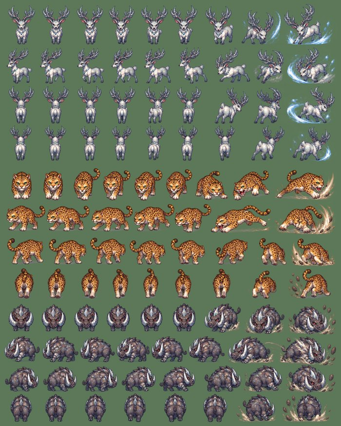

파이썬 도구가 시트를 자른다 (98종 약 1분).

- **줄**: 거의 불투명한 픽셀 수의 가로 투영에서 골짜기를 찾아 시트의 줄 수에 맞추고, 그 근처의 알파가 가장 옅은 굽은 경로로 자른다.
- **칸**: 거의 불투명한 몸통 덩어리를 칸으로 삼고, 이웃 칸 사이를 몸통을 피해 알파가 가장 옅은 굽은 경로로 가른다. 칸에는 몸통에 붙었거나 가까운 그림(이펙트 · 부스러기)만 남긴다.
- **붙은 칸 나누기**: 물살 · 불길 · 날개로 이웃 칸과 통째로 이어진 줄이 있다. 같은 몬스터의 다른 줄보다 칸이 적은 줄에서, 보통 칸 폭의 1.8배가 넘는 덩어리만 그 수가 될 때까지 나눈다 (날개를 편 공격 칸 하나를 둘로 가르지 않게). 따로 떨어져 그린 날개 끝 · 불꽃처럼 작은 조각은 맞닿은 이웃 칸에 붙인다.
- **동작 나누기**: 줄 앞쪽에서 몸통 크기 · 이펙트 양이 비슷한 칸 = 걷기(최대 6), 그 뒤 = 공격(최대 3). 줄 끝에 이펙트만 그린 칸(잎 · 포자 · 씨앗 · 도토리 · 날아가는 얼음 조각)은 몸통 넓이 · 색 분포 · 키로 찾아 버린다.
- **방향**: 오른쪽 줄이 실제로는 뒷모습이거나 왼쪽 줄과 같은 쪽을 보는 몬스터 24종은 왼쪽 줄을 좌우로 뒤집어 오른쪽으로 쓰고, 반대로 왼쪽 줄이 맞지 않는 사과몬 · 산지렁이는 오른쪽 줄을 뒤집어 왼쪽으로, 두 줄이 서로 바뀐 몬스터 5종은 바꿔 쓴다 (아래 "방향 · 크기 다듬기"). 성게 · 갈매기 · 뱀파이어 집사 · 홍염 킹코브라는 시트에 줄이 세 개(앞 · 옆 · 뒤)뿐이라 옆 줄을 뒤집어 반대쪽으로 쓴다.
- 자동 판정이 틀린 몇 곳(공격 칸 수, 칸끼리 통째로 붙은 줄의 칸 수)은 표로 고쳤다.

시트마다 찾은 칸을 그려 확인했다 (초록 = 걷기, 빨강 = 공격, 회색 = 버린 칸).

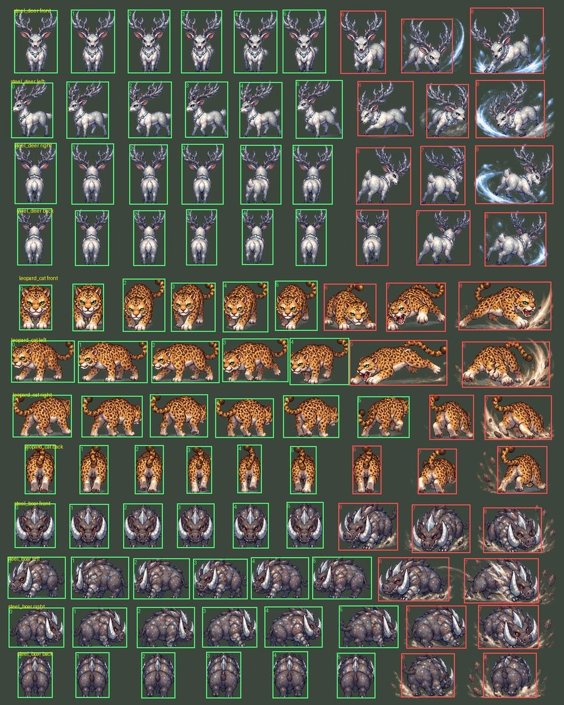

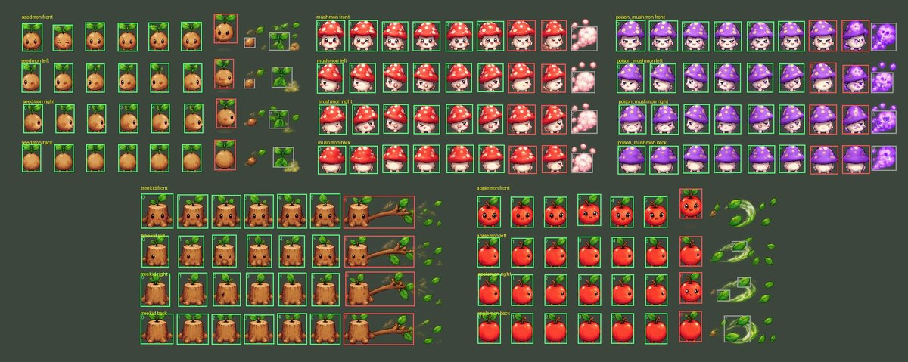

### 크기 · 밀도

- 시트마다 그림 크기가 달라서 몬스터마다 몸 키를 정해 맞춘다. 처음 값은 예전 3D 인형의 높이를 그대로 옮기되, 지금 PNG 플레이어가 예전 사람형보다 0.9배라서 0.9를 곱했다 → 플레이어와의 키 비율이 예전 그대로다. 새 그림은 둥글고 통통하게 그린 물고기 · 똑바로 선 왕도마뱀처럼 예전 인형과 생김새가 달라, 그런 몬스터는 크기를 따로 맞췄다. 보스는 필드 몬스터의 약 2배다.
- 몸 키는 머리 위로 솟은 창 · 더듬이 · 지팡이 끝을 빼고 잰다 (불개미 병정의 창이 길다고 몸이 작아지지 않게).
- **줄이기만 한다.** 원본이 게임 크기보다 작은 몬스터(지역 1 시트 · 보스)는 원본 해상도 그대로 두고, 그 아틀라스의 밀도(유닛당 픽셀)를 낮춰 크게 보이게 했다. 미리 키워 구우면 파일만 커지고 화면은 똑같이 흐리다 — 처음에 키워 구웠을 때 약 103MB였던 아틀라스가 71MB로 줄었다.

게임 축척으로 플레이어(맨몸)와 나란히 세운 모습. 위부터 지역 1~5, 6~10, 줄 끝 = 보스.

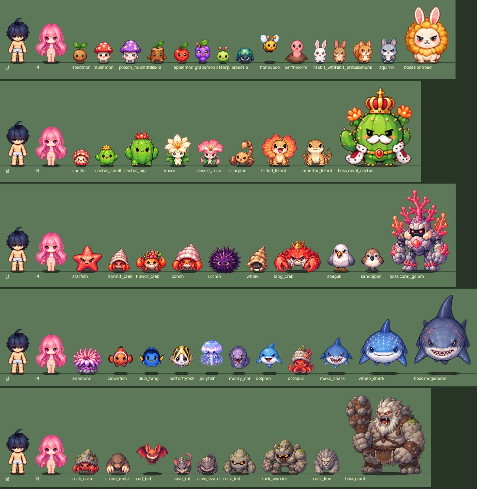

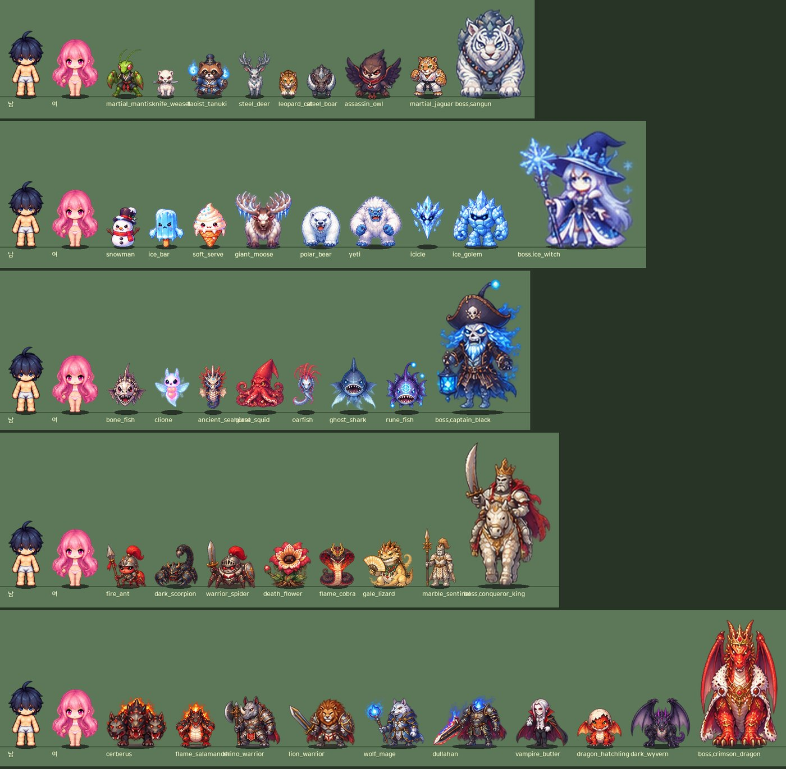

### 기준점 · 움직임

- 칸마다 기준점 = 바닥. 가로는 몸통의 알파 가중 가운데라 다리 · 꼬리 · 이펙트가 바뀌어도 몸이 칸마다 흔들리지 않는다. 세로는 그 줄 걷기 칸들의 발 높이 가운데 값이라 시트에 그린 깡충 · 날갯짓은 그대로 남는다.
- 대기 = 첫 걷기 칸 + 1픽셀 낮게 다시 줄인 숨쉬기 칸 (NPC 와 같은 방식, 몬스터마다 숨 쉬는 속도가 조금씩 다르다). 공격 = 공격 칸들이고 둘째 칸이 타격이다 (공격 칸이 하나뿐이면 첫 걷기 칸 → 공격 칸).
- **떠 있는 몬스터**(물고기 · 해파리 · 클리오네 · 벌 · 박쥐 · 얼음 정령 · 유령 선장)는 기준점이 그림 아래 끝보다 아래에 있어, 몬스터 위치(= 바닥)는 그대로 두고 그림만 떠 보인다. 발밑 그림자 · 앞뒤 정렬은 바닥 기준이다.
- 그림 칸에 움직임을 조금 더했다: 늘 떠 있는 몬스터는 천천히 오르내리고(둥실), 씨앗 · 버섯 · 토끼 · 선인장처럼 통통 튀는 몬스터는 걸을 때 튄다. 그림자는 바닥에 남는다 — 뛰어오르는 보스의 큰 공격 때도 그림자가 바닥에 남는다.

흰동가리 칸 (파랑 = 대기, 초록 = 걷기, 빨강 = 공격, 흰 눈금 = 기준점):

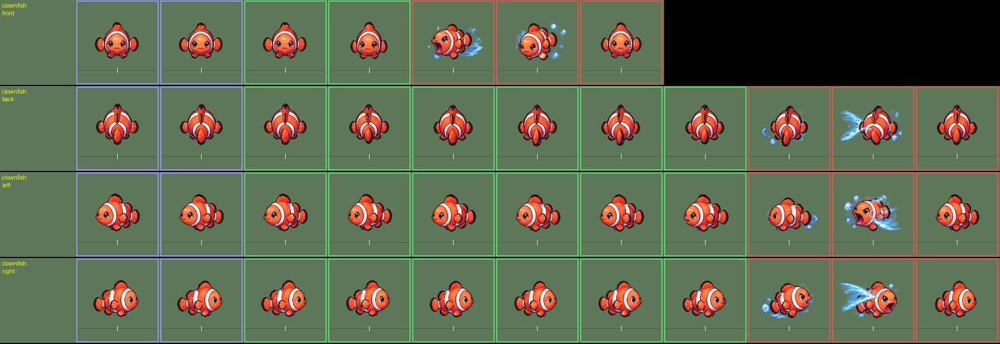

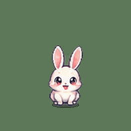

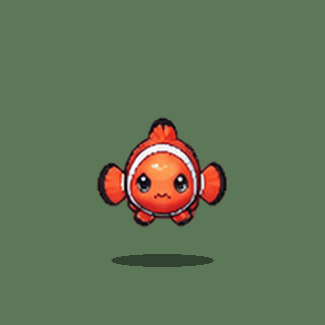

### 방향 · 크기 다듬기

게임에서 움직여 보니 두 가지가 눈에 띄었다. 사막의 유카 · 데저트 로즈가 걸어가는 쪽을 등진 채 뒤로 걸었고, 빅 카투스는 화면 위쪽(뒷모습)으로 걸을 때 몸이 커졌다 작아졌다 했다. 둘 다 원본 시트가 그렇게 그려져 있었다. 이 두 마리만 고치지 않고 98종 전부를 같은 눈으로 다시 봤다.

- **옆 줄이 서로 바뀐 몬스터**: 유카 · 데저트 로즈는 시트의 둘째 줄(왼쪽)에 오른쪽을 보는 그림이, 셋째 줄에 왼쪽을 보는 그림이 들어 있었다. 98종의 옆 줄을 모두 나란히 놓고 보니 스콜피온 · 흰동가리도 같았다 (블루탱은 처음부터 바꿔 쓰고 있었다). 이 5종은 두 줄을 바꿔 쓰고, 오른쪽 줄이 왼쪽과 같은 쪽을 보는 몬스터도 3종 더 찾아 왼쪽 줄을 뒤집어 쓴다.
- **한 줄 안에 반대쪽을 보는 칸**: 줄 전체는 맞는데 몇 칸만 반대쪽을 보는 경우가 훨씬 많았다. 대부분 공격 칸이다 — 왼쪽 줄인데 불 · 검기 · 돌진이 오른쪽으로 나간다. 64종에서 132칸(공격 116 · 걷기 16)을 좌우로 뒤집었다.
- **앞 줄에 섞인 옆모습**: 앞모습 걷기 줄 가운데 옆으로 돌아선 칸이 섞인 몬스터가 있다 (물고기 · 도마뱀 · 갈매기 등 13종 35칸). 앞으로 걸을 때 옆모습이 깜빡 끼어들지 않게 걷기에서 뺀다.
- 칸마다 "줄 첫 칸과 닮았는지 / 뒤집은 것과 더 닮았는지"를 재는 자동 판정도 만들어 봤지만, 이펙트가 큰 공격 칸과 3/4 시점 그림에서 자주 틀렸다. 그래서 자동 판정은 후보를 고르는 데만 쓰고, 98종 모두 그림으로 보고 고칠 칸을 표로 적었다.
- **크기만 다르게 그린 칸**: 빅 카투스 뒷모습 걷기는 6칸 중 4칸이 약 15% 작게 그려져 있었다. 같은 그림을 크기만 다르게 그린 칸은 폭 · 키 · 넓이가 모두 같은 비율로 달라지고, 자세가 바뀐 칸은 비율이 제각각이다 — 이 차이로 그런 칸을 찾아 줄의 다른 칸 크기로 맞춘다. 어느 쪽이 잘못 그려졌는지는 반대쪽 줄(앞 ↔ 뒤)의 키로 가린다: 빅 카투스는 큰 2칸이 앞모습과 키가 같아서 작은 4칸을 키웠다. 이렇게 맞춘 몬스터가 18종이다 (대부분 5~9%).

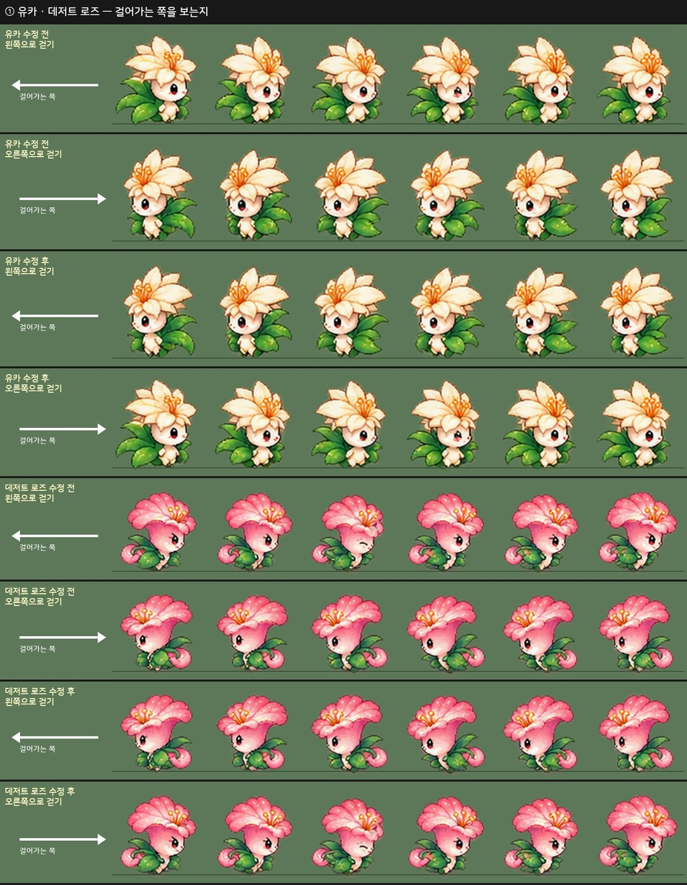

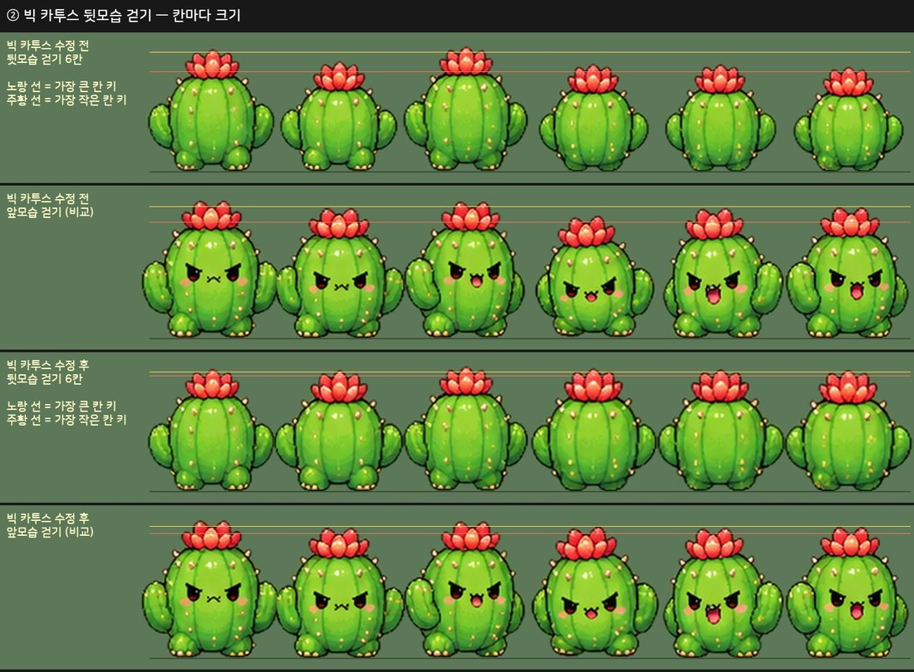

### 게임 연결

- 몬스터 id 로 아틀라스를 찾는다. 시트가 없는 몬스터(새로 만들어 아직 그림이 없는 몬스터)는 예전 3D 도형 인형으로 그린다.
- 클릭 영역 = 몸 상자 (공격 칸은 이펙트까지 그림이라 스프라이트 크기가 칸마다 크게 바뀌어서, 그림 크기 대신 정해 둔 몸 크기로 잡는다). HP 바 · 데미지 숫자는 그림 키 위에 뜬다.
- 몬스터 정보 박스의 초상화 = 앞모습 대기 칸.
- 범위 스킬이 맞는 반경은 게임 규칙이라 예전처럼 크기(보스 2배)로 정한다.

## 스크린샷

실제 Play 화면 — 사냥터마다 종류별로 한 마리씩 플레이어 앞에 세워 찍었다 (위 = 몬스터 정보 박스 초상화).

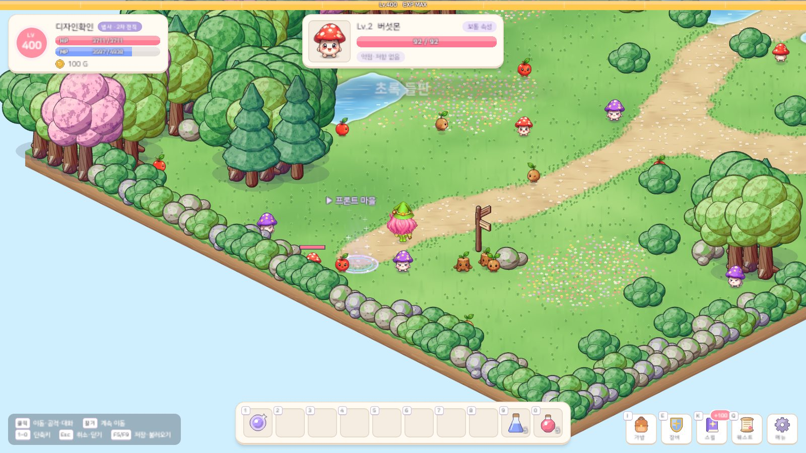

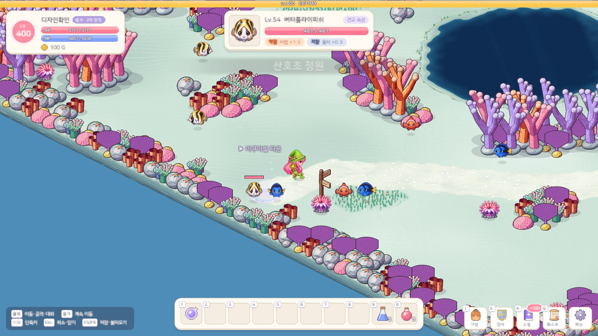

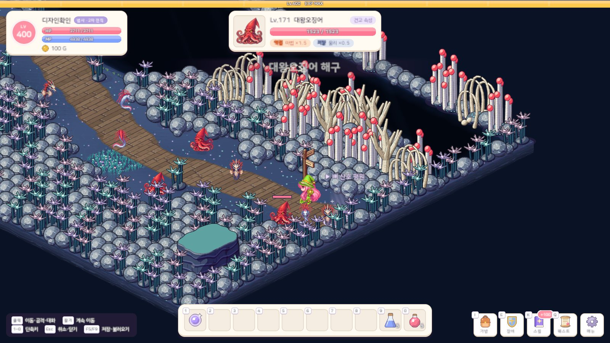

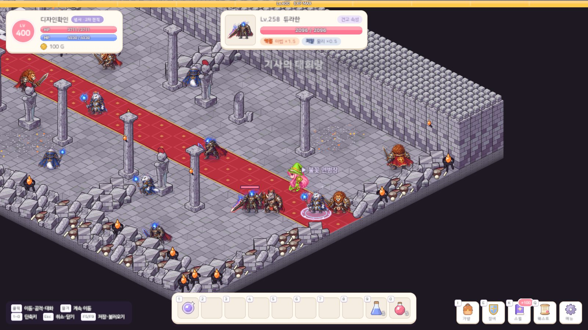

보스 필드 — 라이언헤드 · 메갈로돈 · 크림슨 로드 드래곤 (위 = 보스 HP 막대).

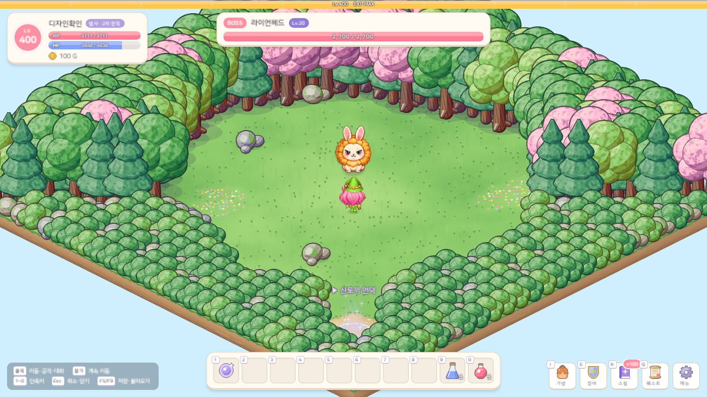

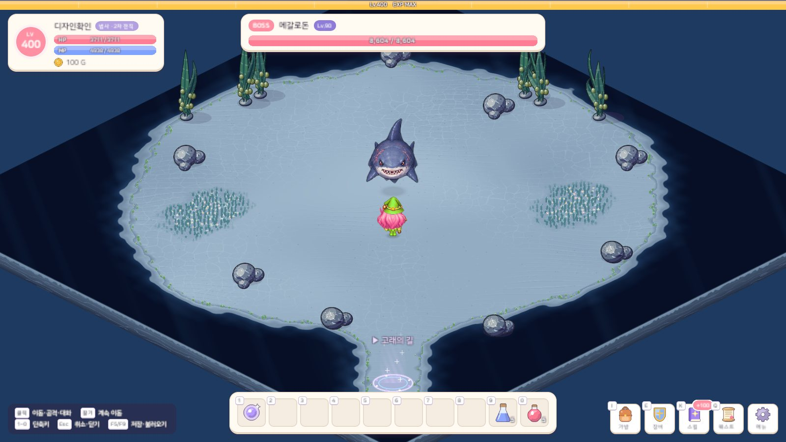

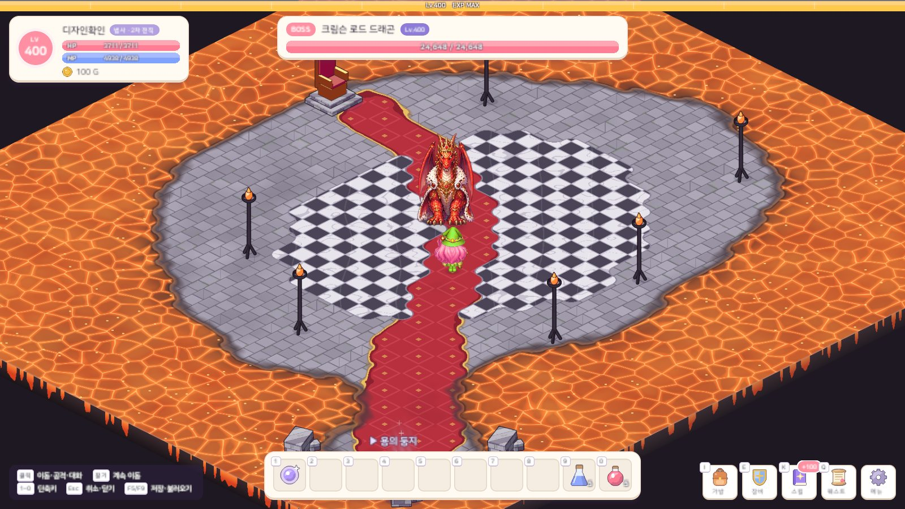

## 문제와 해결

| 문제 | 원인 / 해결 |
|---|---|
| 칸 경계 · 동작 이름이 시트에 없음 | 줄 = 가로 투영 골짜기, 칸 = 몸통 덩어리, 앞 칸 = 걷기 · 뒤 칸 = 공격으로 자동 판정하고, 시트마다 판정 결과를 그려 확인 |
| 줄 끝의 잎 · 포자 · 씨앗 칸이 공격 칸으로 잡힘 | 몸통 넓이가 걷기 칸의 절반이 안 되고 색이 다르거나, 아주 작거나, 키가 낮은 칸은 버린다 |
| 물살 · 불길 · 날개로 이웃 칸이 한 덩어리 | 같은 몬스터의 다른 줄보다 칸이 적은 줄에서만, 보통 칸 폭의 1.8배 넘는 덩어리를 그 수까지 나눈다 |
| 넓은 공격 칸(날개를 편 박쥐 · 불 뿜는 도마뱀)이 둘로 갈라짐 | 처음에는 넓은 덩어리를 모두 나눴다 → 칸 수가 모자란 줄에서만 나누도록 |
| 떨어져 그린 날개 끝 · 불꽃이 따로 칸이 됨 | 몇 픽셀 안으로 이웃 칸 그림과 이어진 작은 조각은 그 칸에 붙인다 (서로 떨어진 공격 칸끼리는 붙이지 않는다) |
| 오른쪽 줄이 뒷모습이거나 왼쪽과 같은 쪽을 봄 | 방향 줄을 한 장에 모아 확인하고, 그런 몬스터는 왼쪽 줄을 뒤집어 쓴다 |
| 유카 · 데저트 로즈가 걸어가는 쪽을 등지고 뒤로 걸음 | 시트의 왼쪽 · 오른쪽 줄이 서로 바뀌어 있었다 → 바꿔 쓴다. 98종 옆 줄을 다시 봐서 스콜피온 · 흰동가리도 찾았다 |
| 왼쪽으로 공격하는데 불 · 검기가 오른쪽으로 나감 | 한 줄 안에 반대쪽을 보는 칸이 섞여 있다 → 그림으로 확인한 표대로 좌우 반전 (64종 132칸) |
| 앞으로 걷다가 옆모습이 끼어듦 | 앞 줄에 옆모습 걷기 칸이 섞여 있다 → 걷기에서 뺀다 (13종 35칸) |
| 방향 자동 판정이 자주 틀림 | 이펙트가 큰 칸 · 3/4 그림에서는 닮은 정도를 믿기 어렵다 → 후보로만 쓰고 98종 모두 그림으로 확인 |
| 빅 카투스가 뒤로 걸을 때 커졌다 작아졌다 | 뒷모습 6칸 중 4칸이 약 15% 작게 그려져 있었다 → 폭 · 키 · 넓이가 같은 비율로 다른 칸을 찾아 크기를 맞춘다 (18종) |
| 시트마다 그림 크기가 다름 | 몬스터마다 몸 키를 정해 맞춘다 (머리 위로 솟은 창 · 더듬이는 빼고 잰다) |
| 원본이 작은 시트(지역 1 · 보스)를 키워 구우니 파일이 커짐 | 키우지 않고 아틀라스 밀도를 낮춘다 (103MB → 71MB) |
| 떠 있는 몬스터의 그림자 · 앞뒤 정렬 | 기준점을 그림 아래 끝보다 아래(바닥)에 두고, 그림자를 따로 그려 바닥에 남긴다 |
| 공격 칸마다 스프라이트 크기가 달라 클릭 영역이 흔들림 | 정해 둔 몸 상자로 클릭 영역을 잡는다 |

## 검증

- Unity 6000.6.2f1 컴파일 성공 · EditMode 테스트 215개 통과 — 에디터를 켜 둔 채 프로젝트 복제본에서 (방향 · 크기 다듬기 뒤에 다시 돌렸다)
- 아트 계약 검사 통과: 몬스터 98종 모두 서로 다른 시트, 4방향 × 대기 · 걷기 · 공격 클립(공격은 한 번 · 둘째 칸 타격), 초상화, 높이 · 폭, 지역마다 보스가 필드 몬스터보다 큰지
- 빌드를 다시 돌려도 같은 결과 (칸 표와 아틀라스 98장이 바이트 하나 다르지 않다)
- 방향 · 크기: 98종 4방향을 나란히 놓은 그림으로 옆 줄이 걸어가는 쪽을 보는지, 걷기 칸끼리 크기가 튀지 않는지 확인
- 실제 Play 화면 캡처 39장 (사냥터 29곳 · 보스 필드 10곳). 촬영은 임시 세이브로 해서 실제 세이브 파일은 바뀌지 않았다

## 남은 일

- 에디터에서 직접 사냥하며 걷기 · 공격 박자, 통통 · 둥실 움직임 확인
- 보스는 원본 그림이 필드 몬스터와 같은 크기로 그려져 있어 2배로 보이면 덜 또렷하다 — 더 큰 원본이 생기면 바꿔 넣기만 하면 된다
- 몬스터 크기는 처음 값이라, 플레이하며 어색한 몬스터는 크기 표를 고친다
- 방향은 그림으로 모두 확인했지만, 게임 속에서 몬스터가 걸어가는 모습을 98종 전부 보지는 못했다 — 어색한 칸이 보이면 고칠 칸 표에 한 줄 더한다
