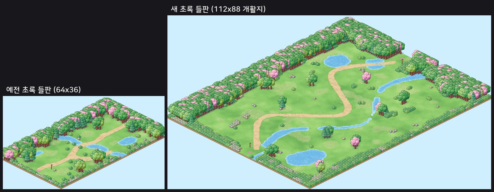
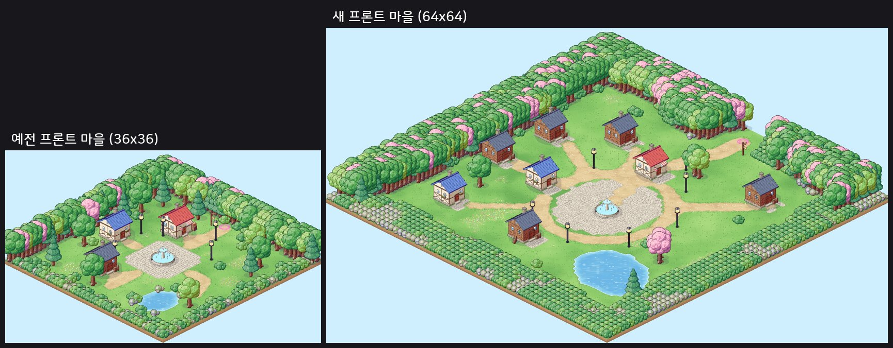
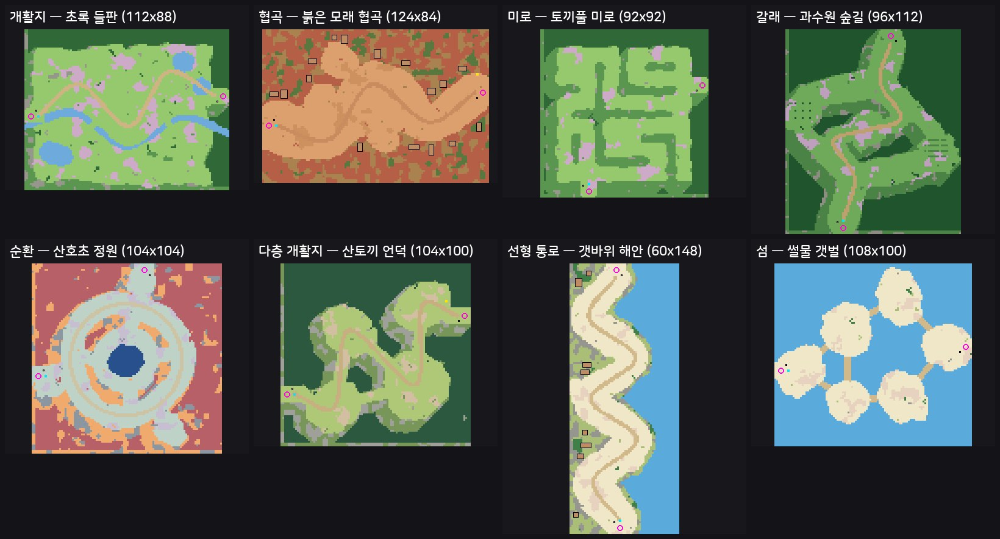
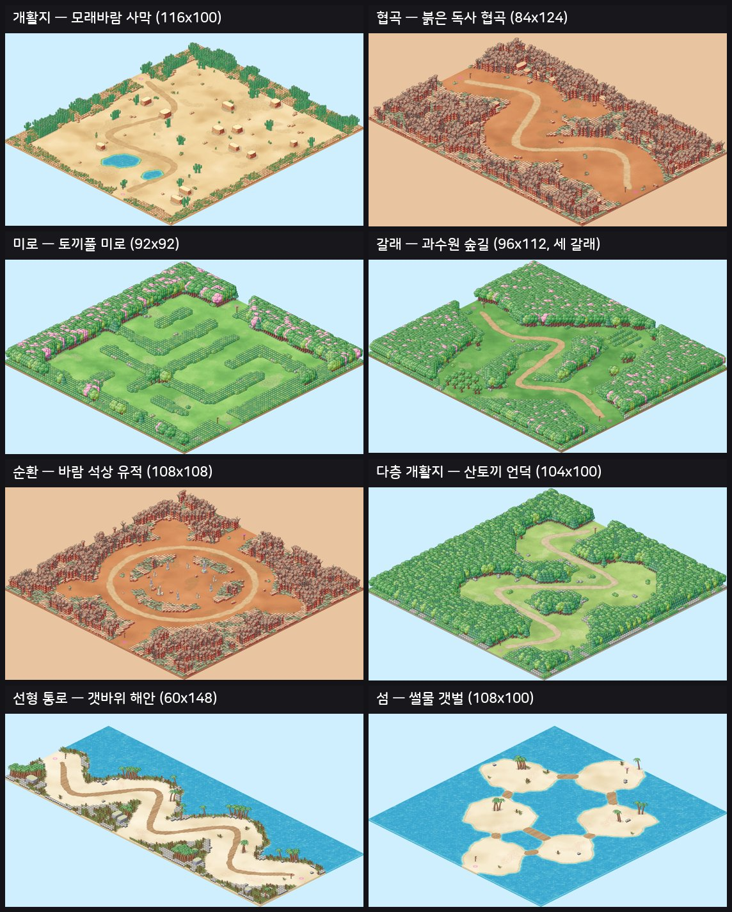
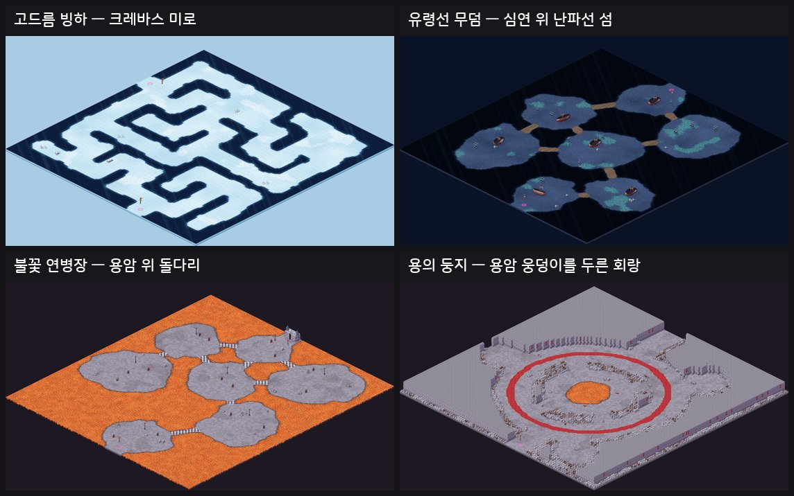
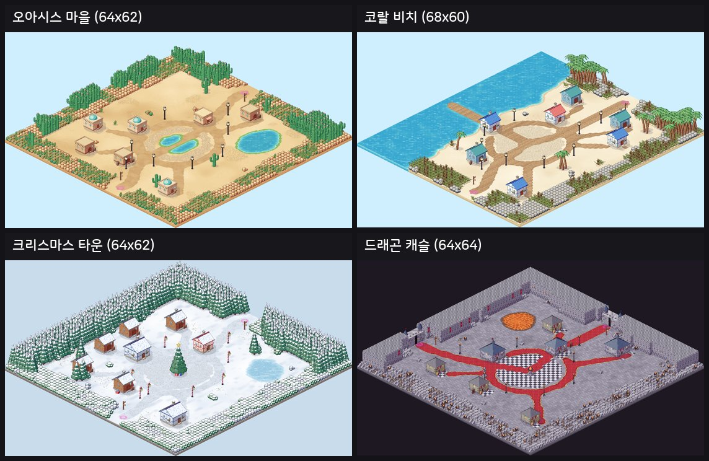
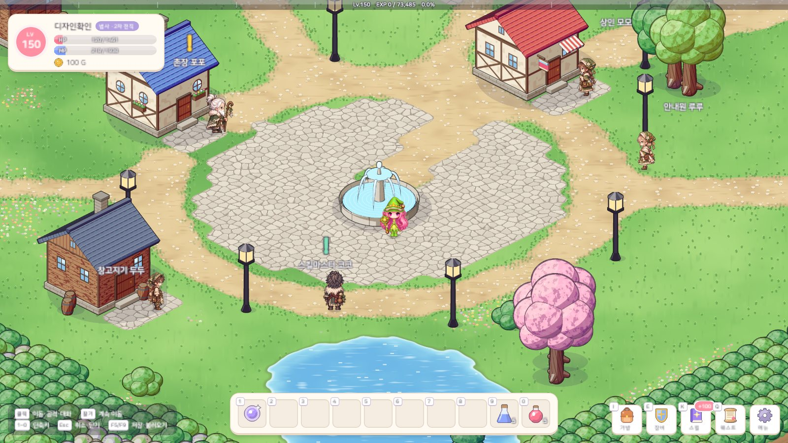
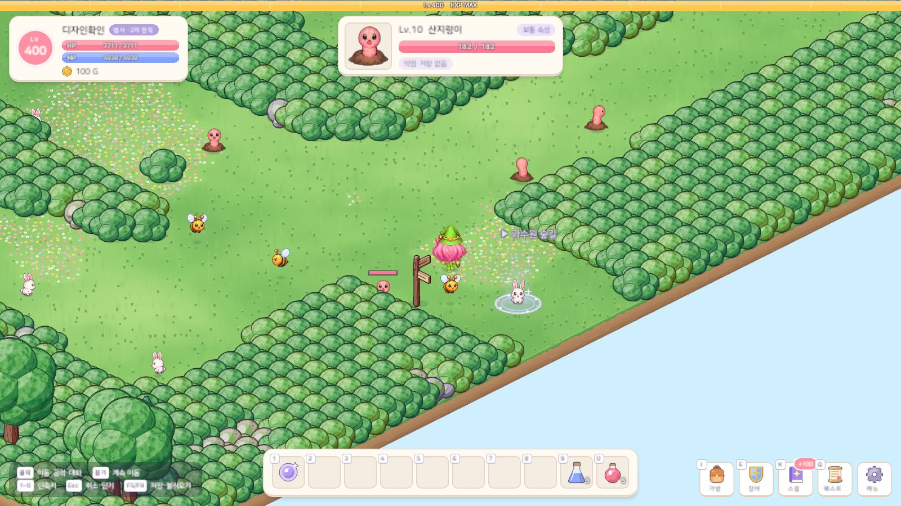
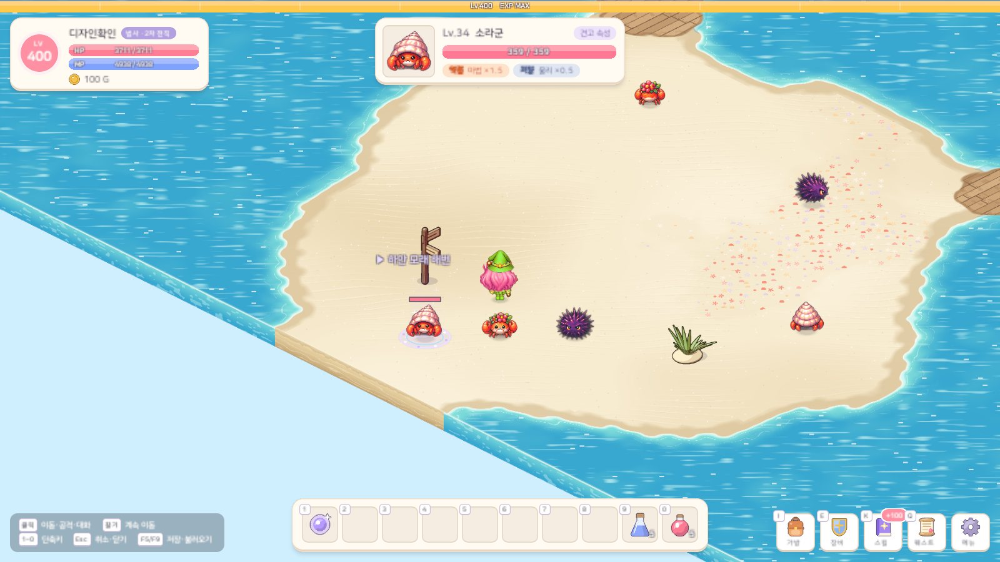
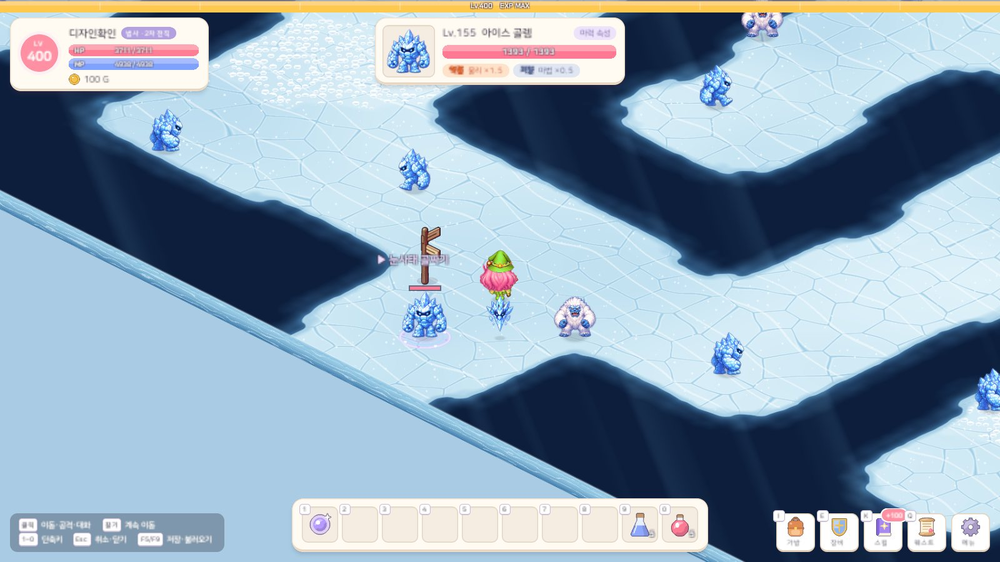

# 35. 월드맵 확장 · 사냥터 구성 다양화 — 마을 64 · 사냥터 100, 지역마다 3~6곳

몇 걸음이면 지나가던 맵들을 가로세로 약 2배로 넓히고(마을 36~52칸 → 약 64칸, 사냥터 30~80칸 → 약 100칸), 캐릭터 기본 이동 속도를 초당 5칸에서 8칸으로 올렸다.
그리고 모든 지역이 "넓은 맵 → 좁은 맵 → 넓은 맵" 사냥터 3곳을 되풀이하던 구성을 8가지로 늘려, 지역마다 사냥터 수(3~6곳)와 순서가 다르게 했다.
맵 65장 가운데 마을 10장과 사냥터 45장(새 사냥터 16곳 포함)을 새로 그렸고, 보스 필드 10장은 보스전이 답답하지 않게 예전 크기 그대로 두었다.

## 작업 내용

### 크기 · 이동 속도

- **크기 기준**: 마을 약 64×64, 사냥터 대표 100×100 (사냥터마다 70~120, 길고 좁은 통로는 56~60×150). 예전보다 가로세로 약 2배, 넓이 약 4배다.
- **이동 속도**: 초당 5칸 → 8칸 (1.6배). 사냥터를 끝에서 끝까지 가로지르는 시간은 예전 약 10초 → 12~13초로, 맵이 커진 만큼 조금만 늘었다.
- **걷기 동작**: 걷기 그림은 초당 5칸에 맞춰져 있어 그대로 두면 발이 땅 위를 미끄러진다 → 이동 속도 비율만큼 걷기 칸을 빨리 돌린다.
- **몬스터 밀도**: 몬스터 구역 80칸에 한 마리 (예전 약 55칸). 플레이어가 1.6배 빨라져 조금 성기게 둬도 다음 몬스터를 만나는 속도는 비슷하다.
  모든 사냥터가 같은 밀도라 지역마다 사냥 속도가 크게 어긋나지 않는다 (지역마다 198~373마리, 사냥터마다 36~96마리).

### 구성 8가지

| 구성 | 모양 | 예 |
|---|---|---|
| 개활지 | 맵 대부분이 트인 땅 + 시냇물 · 연못 · 낮은 바위 줄기 · 나무 무리 | 초록 들판 · 모래바람 사막 |
| 협곡 | 절벽 사이로 굽이치는 폭 20칸 남짓 골짜기 + 곁 골짜기 | 붉은 모래 협곡 · 구름 계곡 |
| 미로 | 통로 8칸 · 벽 5칸 격자. 막다른 길 일부를 틔워 고리를 만들고(골라 가는 길), 2×2 방 둘 | 토끼풀 미로 · 지하 감옥 |
| 갈래 | 입구 길이 두세 갈래로 나뉘었다 다시 합쳐진다 + 막다른 곁길 | 과수원 숲길 · 대나무 숲 |
| 순환 | 가운데 공터를 넓은 고리 길이 두른다 (막다른 길 없음) | 산호초 정원 · 바람 석상 유적 |
| 다층 개활지 | 넓은 공터 4~5개를 좁은 목으로 잇는다 | 산토끼 언덕 · 수정 광산 |
| 선형 통로 | 갈림길 없는 긴 길 하나 (56~60×150) | 갯바위 해안 · 기사의 대회랑 |
| 섬 | 물 · 용암 · 낭떠러지로 나뉜 땅들을 다리로 잇는다 | 썰물 갯벌 · 불꽃 연병장 |

### 지역마다 다른 개수 · 순서

| 지역 | 사냥터 | 구성 순서 |
|---|---|---|
| ① 작은 산골동네 | 4 | 개활지 → 갈래(세 갈래) → 미로 → 다층 개활지 |
| ② 사막 | 3 | 개활지 → 순환 → 협곡 |
| ③ 해변가 | 5 | 개활지 → 섬 → 선형 통로 → 다층 개활지 → 갈래 |
| ④ 바닷속 | 4 | 순환 → 선형 통로 → 다층 개활지 → 개활지 |
| ⑤ 바위 동굴 | 5 | 다층 개활지 → 섬 → 미로 → 갈래 → 선형 통로 |
| ⑥ 산악 지역 | 4 | 갈래 → 협곡 → 순환 → 다층 개활지 |
| ⑦ 얼음 지역 | 6 | 개활지 → 섬 → 갈래 → 선형 통로 → 협곡 → 미로 |
| ⑧ 깊은 바다 심연 | 3 | 개활지 → 협곡 → 섬 |
| ⑨ 황무지 협곡 | 5 | 개활지 → 미로 → 협곡 → 갈래 → 순환 |
| ⑩ 드래곤 성 | 6 | 섬 → 갈래 → 선형 통로 → 미로 → 다층 개활지 → 순환 |

- 한 지역 안에서는 구성이 겹치지 않고, 지역마다 순서가 다르며, 구성마다 세 지역 이상에서 쓴다.
- 예전 사냥터 29곳은 이름 · 분위기 · 몬스터 · 랜드마크(등대 · 난파선 · 석상 · 개미 둔덕 · 성문 …)를 그대로 두고 새 구성으로 다시 그렸다.
  새 사냥터 16곳(토끼풀 미로 · 신기루 분지 · 썰물 갯벌 · 해송 숲 공터 · 진주 동굴 · 버려진 갱도 · 종유석 숲 · 천년 송림 · 얼어붙은 호수 · 눈 덮인 전나무 숲 · 눈사태 골짜기 · 개미굴 미로 · 황풍 고원 · 그을린 왕실 정원 · 지하 감옥 · 용의 탑)은
  앞뒤 사냥터의 몬스터를 섞어 두었다 → "과수원 숲길의 애벌레"처럼 퀘스트 · 아이템 문구에 적힌 자리가 그대로 맞다.

### 마을

- 마을마다 원래 있던 자리를 살렸다: 프론트 마을 분수 광장 · 오아시스 마을 야자수 오아시스 · 코랄 비치 바다와 나무 잔교 · 아쿠아빌 블루홀 · 바위굴 던전 바위산과 동굴 입구 ·
  와일드마운틴 개울 · 크리스마스 타운 트리 · 블루홀 심연 · 배드랜드 캠프 모닥불 · 드래곤 캐슬 성문 둘과 용암 웅덩이.
- 가운데 광장 둘레에 NPC 집 셋(상점 · 창고 · 촌장 집 또는 길드 · 도장)과 다섯 NPC, 그 바깥에 집 몇 채 · 등불 · 상자 · 꽃밭. NPC 가 광장 둘레에 모여 있어 마을이 넓어져도 오가는 길은 짧다.

### 맵 설계 도구

100칸이 넘는 맵 55장을 손으로 ASCII 를 그릴 수는 없어서, 파이썬 도구가 **월드 계획 → 구성 뼈대 → 지형 · 랜드마크 → 꾸미기 → 칸 확정 → 검사 → C#** 순서로 맵을 만들게 했다.

- **월드 계획**: 지역마다 사냥터 목록(이름 · 분위기 · 구성 · 크기 · 들어오고 나가는 변 · 몬스터 가중치 · 보스 안내 NPC · 랜드마크)을 표 한 장에 적는다. 같은 계획이면 언제 다시 돌려도 같은 맵이 나온다.
- **나무 자리**: 나무 그림(캐릭터 키의 약 2.5배)은 뒤로 12칸 남짓까지 가린다. 그래서 큰 나무는 **뒤(화면 위)로 12칸 · 좌우 2칸 폭 안에 걸을 수 있는 칸이 없는 자리**에만 두고,
  걷는 곳 앞은 덤불 · 바위로 채운다. 숲이 자연스럽게 맵 뒤쪽에 모이고, 앞쪽 가장자리는 낮은 덤불 띠가 된다. 공터의 작은 나무 무리만 예외다.
- **검사**: 걸을 수 있는 칸이 모두 이어졌는지, 포탈 도착 칸 · NPC 옆 · 몬스터 구역 · 사분면에 고루 퍼졌는지를 게임 테스트와 같은 규칙으로 먼저 확인한다. 갇힌 작은 틈은 덤불로 막고, 큰 땅이 갇히면 설계 오류로 알린다.
- **검토 그림**: 색 칸 미리보기(수 초)와, 실제 게임 그림으로 맵 전체를 한 장에 담는 전경 그림(에디터 메뉴)을 나란히 보며 다듬었다.

### 큰 맵 성능

- **바닥 그림**: 맵 한 장을 그림처럼 칠하는 바닥이 사냥터 한 장에 1.5~3.4초 · 50~65MB(마을 0.7~1.2초 · 25~28MB)가 되었다. 65장을 다 들고 있으면 3GB 라서,
  **지금 맵과 포탈로 이어진 맵만 남기고** 나머지는 내린다 (이웃 맵은 미리 칠해 두어 포탈을 타도 멈칫하지 않는다).
- 순간이동 · 게임 시작처럼 미리 칠하지 못한 맵은 **화면이 어두워진 동안** 칠한다 (멈춘 화면 대신 어두운 화면에서 2~3초 기다린다. 캐릭터 선택창에는 '세계를 불러오는 중이에요…').
- **나무 반투명**: 맵마다 나무가 수천 그루라 나무마다 붙이던 반투명 처리(플레이어가 뒤로 가면 흐려짐)를 **걷는 곳을 가리는 나무에만** 붙인다. 위 나무 자리 규칙 덕분에 숲 나무 대부분은 아무것도 가리지 않는다.
- **길찾기**: 멀리 클릭할 때 길찾기가 살펴보는 칸 수 한도를 6000 → 12000 으로 올렸다 (미로 끝을 눌러도 길을 찾게).

### 그 밖

- **순간이동 안내원**: 목적지가 이웃 마을 + 사냥터 3~6곳으로 늘어, 한 화면 선택지(5개)를 넘으면 '다른 곳 보기 ▶'로 넘긴다.
- **옛 세이브**: 맵이 새로 그려져 저장된 좌표가 막힌 칸 · 맵 밖이 되면 처음 마을로 돌려보내지 않고 **그 맵의 입구**에서 이어 한다.

## 스크린샷

실제 Play 화면 (게임 배율).

## 문제와 해결

| 문제 | 원인 / 해결 |
|---|---|
| 크기 요구가 서로 어긋남 ("예전 확장폭보다 크게" vs 예시 60 · 90 = 약 1.7배) | 마을 64 · 사냥터 100 (약 2배)로 정했다 |
| 지역 2 는 사냥터가 2곳뿐 (최소 3곳) | 10개 지역 모두 3~6곳으로 다시 구성 |
| 새 사냥터 몬스터가 퀘스트 문구와 어긋날 수 있음 | 예전 사냥터의 몬스터는 그대로 두고, 새 사냥터는 앞뒤 사냥터 몬스터를 섞는다 |
| 큰 나무가 뒤쪽 길 · 몬스터를 가림 | 나무는 뒤로 12칸 안에 걷는 칸이 없는 자리에만, 걷는 곳 앞은 덤불 · 바위 |
| 갈래 구성의 가운데 길이 곧게 뻗어 갈래가 안 보임 | 가운데 갈래를 옆으로 흔든다는 것이 진행 방향으로 흔들고 있었다 → 옆으로 S 자, 기본을 두 갈래로 |
| 세 갈래가 서로 붙어 큰 공터처럼 보임 | 갈래 사이를 넓히고 공터를 줄였다, 세 갈래는 큰 맵(과수원 숲길)에만 |
| 다층 개활지의 공터들이 한 줄 골짜기처럼 이어짐 | 공터 사이를 11칸 넘게 띄우고 목을 좁혔다 |
| 시내 여울이 길과 안 이어진 흙길 토막처럼 보임 | 여울은 풀밭 징검목으로 (흙길은 큰길이 건너는 곳만) |
| 개울이 마을 땅을 갈라 일부가 갇힘 | 개울을 작은 소(沼)에서 끝내고 돌다리를 놓았다 |
| 마을에 등불 · 상자가 거의 없음 | 길 바로 옆을 막던 검사를 풀어 광장 둘레 · 큰길을 따라 등불, 집 옆에 상자 |
| 맵 바닥 그림이 한 장에 50~65MB, 다 들고 있으면 3GB | 지금 맵 · 이웃 맵만 남기고 내린다 |
| 미리 칠하지 못한 맵(순간이동)에서 2~3초 멈춤 | 화면이 어두운 동안 백그라운드에서 칠한다 |
| 맵마다 나무 수천 그루 × 반투명 처리 | 걷는 곳을 가리는 나무에만 |
| 전경 그림 첫 장에 바닥이 빠짐 | 그리기 도구의 첫 렌더가 준비 전이었다 → 작은 맵을 한 번 그려 버린다 (게임과는 상관없음) |

## 검증

- Unity 6000.6.2f1 컴파일 성공 · EditMode 테스트 220개 통과 (새 테스트: 크기 기준 · 지역마다 3~6곳과 구성 다양성 · 안내원 목적지 · 이동 속도 · 바뀐 맵의 옛 세이브 위치) — 프로젝트 복제본에서
- 맵 설계 도구의 검사 통과 (65장: 걸을 수 있는 칸 모두 이어짐 · 포탈 도착 칸 · NPC 옆 · 몬스터 구역 · 사냥터 크기가 지역 안에서 모두 다름)
- 실제 Play 화면 캡처 125장 (마을 10곳 · 사냥터 45곳 · 보스 필드 10곳), 맵 전경 그림 65장. 아트 계약 검사 통과. 촬영은 임시 세이브로 해서 실제 세이브 파일은 바뀌지 않았다

## 남은 일

- 에디터에서 직접 걸어 보며 이동 속도 · 걷기 동작 박자 · 맵 크기 체감 확인 (숫자로 정한 첫 값이다)
- 사냥터마다 몬스터 수 · 사냥 동선은 플레이하며 다듬는다 (밀도는 계획 표의 숫자 하나로 바꿀 수 있다)
- 마을은 광장 둘레에 모여 있고 바깥은 비교적 한산하다 — 필요하면 마을 볼거리(시장 · 밭 · 다리 …)를 더한다
