# 36. 스킬 이펙트 새 시트 적용 — 검사 12종 · 법사 13종

21번 노트의 스킬 이펙트 시트가 새 그림 7장으로 바뀌고 강타 시트 한 장이 더해져, 게임의 스킬 25종 연출을 새 시트로 교체했다. 스킬 종류 · 범위 판정은 그대로이고, 바뀐 것은 그림과 재생 방식이다.
새 시트는 스킬마다 9~12칸(예전 4~6칸)이라 모이고 → 터지고 → 흩어지는 동작이 훨씬 부드럽다. 그림이 터지는 칸이 실제로 데미지가 들어가는 순간에 오게 맞췄다.
같이 **헬 파이어**를 "지옥불 구슬을 던지는 스킬"에서 "대상 몬스터 발밑에서 지옥불이 바로 솟는 스킬"로 바꿨고, 너무 진해서 캐릭터를 가리던 **검사 베기 이펙트를 반투명하게** 다듬었다.

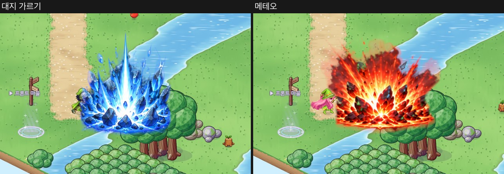

## 작업 내용

### 새 시트

- 검사 시트 4장(2172×724, 시트마다 2~3행) · 법사 시트 3장(1448~1774 폭, 4~5행). 행 하나가 스킬 하나이고, 칸은 왼쪽 → 오른쪽 시간 순서다.
- 작업 중에 **강타** 시트(1672×941, 한 줄 11칸 — 작은 반짝임 → 바닥 고리 위로 얼음 결정이 솟고 → 큰 별 모양 섬광 → 사그라듦)가 더해져, 검사 첫 스킬인 강타도 시트 그림을 쓴다.
- 예전 시트와 달리 **알파가 없는 RGB + 까만 배경**이다.
- 루미너스 행만 칸이 아니라 한 줄로 이어진 빛줄기다 (마법진 → 출발 고리 → 나선 빛줄기 → 빛 덩어리 → 퍼져 나가는 고리).

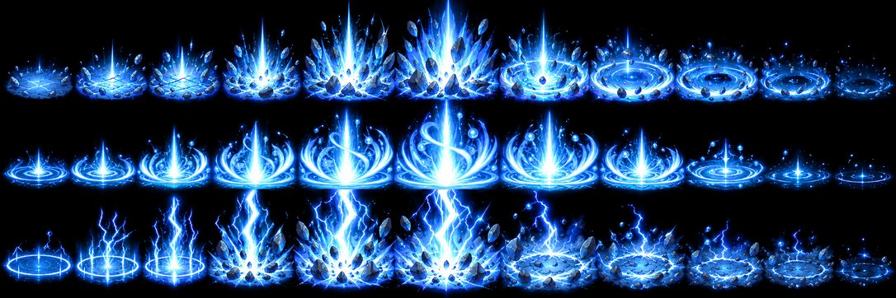

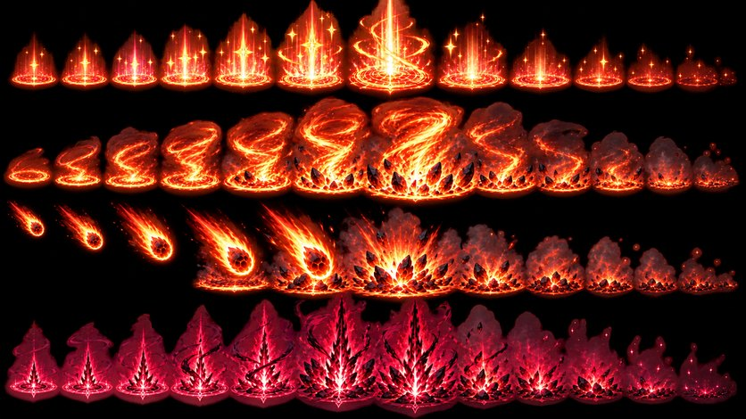

### 까만 배경 걷기

빛 이펙트는 까만 바탕 위에 빛을 더해 그린 그림이다. 그래서 **밝기를 알파로 보고, 색은 알파로 나눈다**(알파 곱셈 되돌리기). 밝기만 알파로 쓰고 색을 그대로 두면 반투명한 빛 번짐 가장자리가 까맣게 테두리진다 — 색을 나눠 주면 풀밭 · 모래 위에서도 원래 빛 색이 그대로 번진다.

그런데 이 방법만 쓰면 어두운 **물체**가 유령이 된다. 대지 가르기의 바위, 메테오의 운석, 윈드 블레이드의 나뭇잎, 아머 브레이커의 방패가 바닥이 비쳐 보이는 옅은 덩어리가 됐다. 까만 바탕 그림에서는 "어두운 빛"과 "어두운 물체"를 픽셀 하나만 보고는 가를 수 없어서 **둘레를 본다**.

- 밝은 빛에 사방(16방향 가운데 거의 모두)이 둘러싸인 어두운 픽셀 = 물체 → 불투명하게 남긴다.
- 바깥으로 퍼지는 빛 번짐, 그림 안의 검은 틈 바로 옆은 빛으로 둔다 (물체로 잡으면 테두리가 어둡게 얼룩진다).
- 물체가 있는 행(8종)에만 쓴다. 순수한 빛 이펙트(베기 · 검기 · 마법 구슬 · 회복 …)는 모두 빛으로 걷는다.
- 화염 폭풍 · 메테오의 잿빛 연기는 빛으로 걷으면 풀밭 위에서 희뿌연 안개가 됐다 → 채도가 낮은 어두운 픽셀은 **어두운 반투명 연기**로 본다.

왼쪽 = 원본(까만 바탕), 가운데 = 밝기만 알파로, 오른쪽 = 물체 살리기 (모두 풀밭 위):

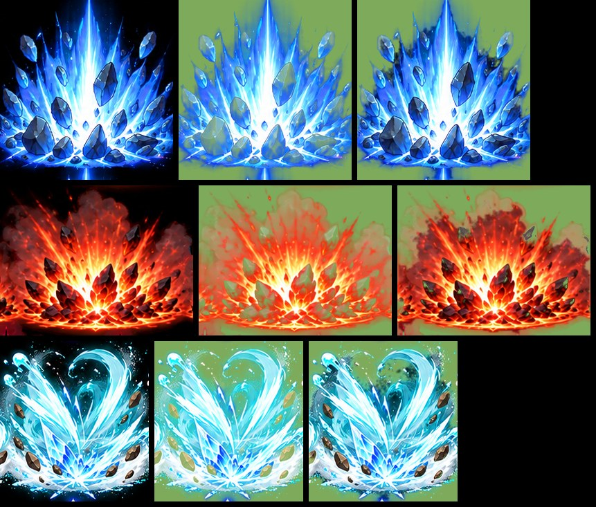

### 칸 나누기 · 기준점

- **행 · 칸 경계**: 행마다 밝기를 세로로 더한 그래프의 골짜기를 그림으로 확인해 칸 수(9~12)와 대략의 경계를 표에 적고, 그 근처에서 알파가 가장 옅은 굽은 경로로 자른다. 경로에 걸친 불티 · 돌조각은 대부분이 놓인 칸에 통째로 준다. 잘린 자리는 8픽셀 동안 알파를 줄여, 칸 사이에 걸친 옅은 빛이 곧은 선으로 끊겨 보이지 않게 한다.
- **기준점**: 바닥 이펙트(대지 가르기 · 메테오 · 아이스 필러 …)는 **바닥 마법진 가운데** — 진한 부분의 아래쪽에서 가장 넓은 줄을 타원의 가운데로 잡는다. 하늘에서 떨어지는 메테오의 앞 칸들은 마법진이 없어 칸 가운데를 쓴다(운석이 그 왼쪽 위에 그려져 있다). 투사체는 가장 밝은 곳(머리), 베기는 가운데, 루미너스는 빛줄기 출발 고리.
- **아틀라스**: 예전에는 칸마다 512×512 로 키워 한 줄로 이었다. 새 시트는 칸이 작고(약 130~250픽셀) 수가 많아서, 칸마다 내용 상자만 원본 해상도로 잘라 모으고 칸 자리 · 기준점 · 타격 칸 · 재생 속도를 프레임 표에 적는다. 스킬 24종 기준 메모리 135MB → 56MB 로 줄었다.

메테오 시트 자르기 (노랑 = 칸 경계, 분홍 = 기준점과 바닥 마법진 타원):

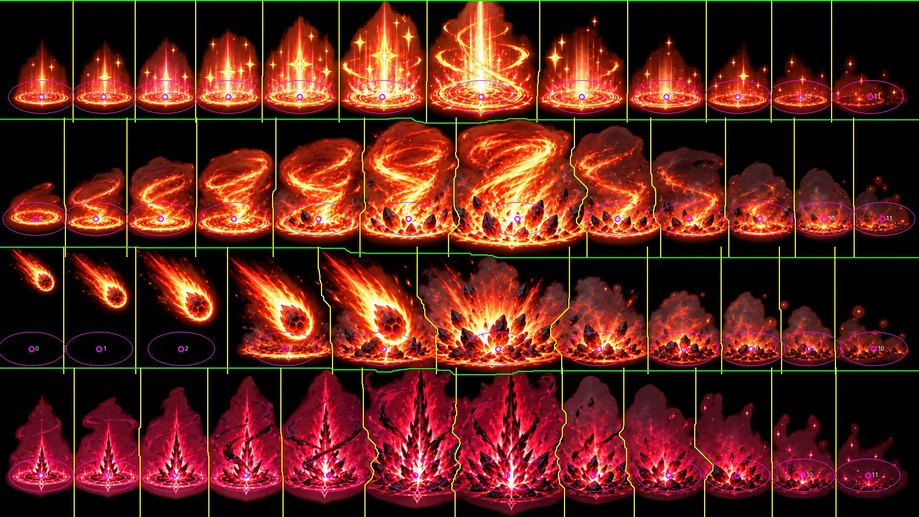

### 그림이 터지는 순간 = 데미지가 들어가는 순간

스킬마다 **타격 칸**을 정했다 — 대지 가르기 = 바위가 솟는 칸, 메테오 = 땅에 닿아 터지는 칸, 아이스 필러 = 얼음 기둥이 솟는 칸. 게임은 판정 순간(스킬마다 0.06~0.55초)에 타격 칸이 오도록 앞 칸들을 고르게 펼치고, 그 뒤는 시트 속도(초당 12~20칸)로 흩어진다. 예전에는 대부분 0.08초 만에 판정이라, 칸이 많아진 새 시트로는 모이는 그림이 보이지 않는다 → 큰 범위 스킬은 0.16~0.32초로 조금 늦췄다 (메테오 0.55초는 그대로).

- **바닥 범위**: 마법진 폭 = 실제 범위의 화면 폭. 다만 기둥이 화면 높이의 절반을 넘으면 그만큼 작게 그리고, 실제 범위는 판정 전까지 바닥 타원이 보여 준다.
- **날아가는 검기 · 창**(크레센트 블레이드 · 라이트닝 스피어): 앞 칸들이 직선 끝까지 날아가 끝에서 터진다.
- **플래시 슬래쉬**: 출발점 빛 고리 → 달려간 길에 맞춰 늘인 잔상 → 도착점의 X 섬광.
- **루미너스**: 출발점 마법진 → 빛줄기 한 장을 직선 길이로 늘여 쭉 펼쳤다가 가늘어지며 사라진다.
- **근접 스킬**(강타 · 더블 · 쿼드러플 슬래쉬 · 아머 브레이커 · 코마 어택): 대상 자리에서 베기가 모였다가 타격 칸에 첫 타격, 연속 타격은 그 뒤 0.13초 간격. 몬스터가 클수록 크게. 강타는 대상 발밑의 바닥 고리에서 결정이 솟다가 별 모양 섬광이 터지는 순간(0.1초) 맞는다.
- **투사체**(에너지 볼 · 매직 애로우 · 펜타 매직 애로우): 날아가는 동안 구슬 · 화살이 자라는 칸, 닿으면 터지는 칸부터.
- 왼쪽으로 쓰면 그림을 좌우로 뒤집는다 (돌리기만 하면 검기가 거꾸로 선다).

칸 묶음 (노란 테두리 = 타격 칸):

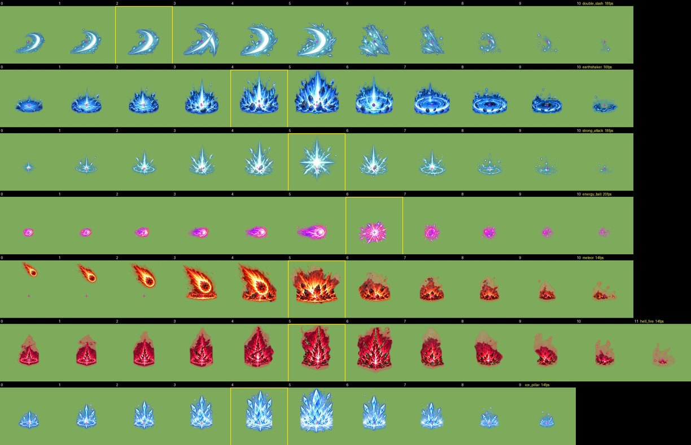

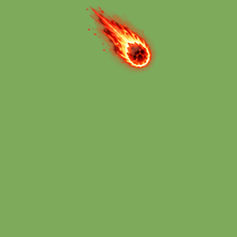 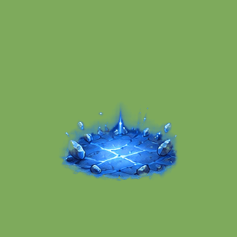 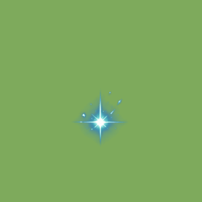 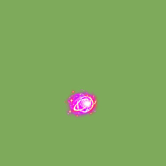

### 검사 베기 이펙트 다듬기

처음 적용해 보니 더블 슬래쉬 · 검기 베기 같은 베기 이펙트가 너무 진하고 커서 캐릭터를 통째로 가렸다. 시트의 베기는 짙은 파란 빛이 거의 불투명하게 칠해져 있다.

- **반투명하게 굽기**: 베기 스킬 6종(더블 · 쿼드러플 · 플래시 슬래쉬 · 크레센트 블레이드 · 검기 베기 · 파도 가르기)과 강타는 색이 짙을수록(흰 빛에서 멀수록) 알파를 반까지 줄여 굽는다. 흰 검기 심은 그대로 또렷하고, 둘레의 파란 빛 너머로 캐릭터 · 몬스터가 비친다. 자르기 · 기준점 · 크기는 줄이기 전 그림으로 재서 위치와 크기는 그대로다.
- **크기 · 자리**: 대상 자리 베기(더블 · 쿼드러플 슬래쉬 · 아머 브레이커)는 지름을 약 20% 줄이고, 부채꼴 검기(검기 베기 · 파도 가르기)는 조금 작게 해서 부채꼴 가운데보다 앞쪽에 둔다 — 그림 뒤끝이 캐릭터에 닿지 않는다. 강타의 별 섬광은 바닥 고리보다 두 배쯤 넓어, 바로 옆에 선 캐릭터를 덮지 않게 작게 둔다.

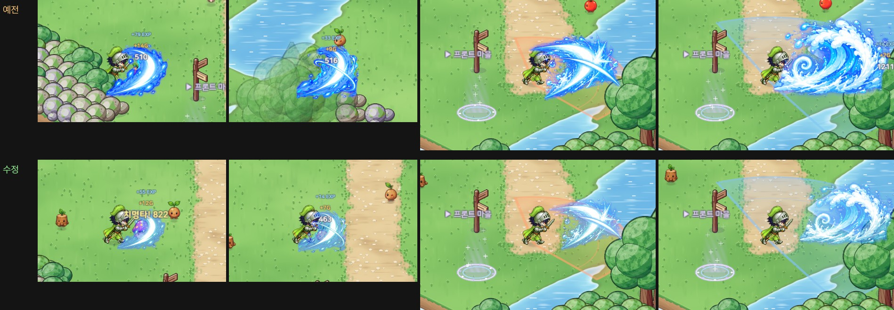

### 헬 파이어

예전에는 지옥불 구슬을 던지는 투사체였다. 새 시트의 헬 파이어는 붉은 마법진에서 검붉은 불기둥이 솟는 그림이라, **대상 몬스터 발밑에서 바로 솟는 스킬**로 바꿨다. 아이스 필러처럼 불기둥이 솟는 순간(0.22초) 데미지와 화상이 들어간다. 스킬 설명도 "대상 발밑에서 지옥불이 솟아오릅니다"로 바꿨다.

## 스크린샷

실제 Play 화면 (게임 배율, 판정 순간).

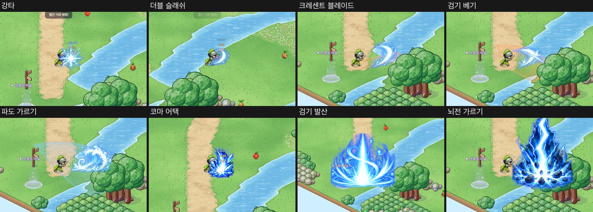

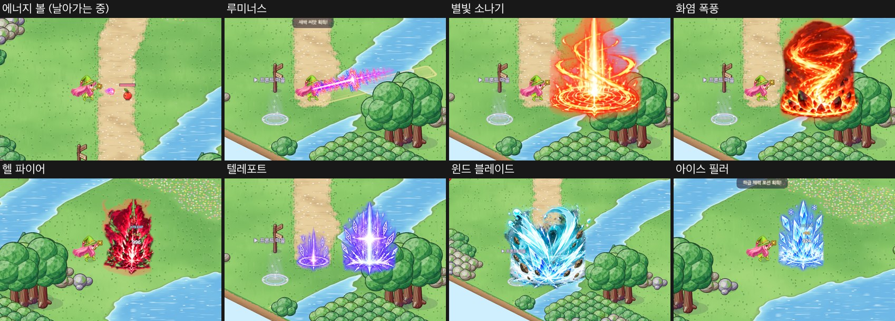

## 문제와 해결

| 문제 | 해결 |
|---|---|
| 새 시트에 알파가 없다 (까만 배경) | 밝기 = 알파, 색 = 알파로 나눈 값 (빛 가장자리가 까매지지 않게) |
| 바위 · 운석 · 잎 · 방패가 유령처럼 비친다 | 밝은 빛에 사방이 둘러싸인 어두운 픽셀은 불투명 물체로 |
| 바깥 빛 번짐까지 물체로 잡혀 테두리가 어둡게 얼룩진다 | 바깥 배경 · 검은 틈 가까이는 빛으로 |
| 화염 폭풍 · 메테오 연기가 풀밭 위에서 희뿌연 안개 | 무채색의 어두운 픽셀 = 어두운 반투명 연기 |
| 칸 사이에 걸친 옅은 빛이 곧은 선으로 끊긴다 | 잘린 자리 8픽셀 동안 알파를 줄인다 |
| 루미너스 행은 칸이 아니라 이어진 빛줄기 | 마법진 두 칸 + 빛줄기 한 장으로 자르고, 게임이 직선 길이로 늘인다 |
| 루미너스 마법진이 점처럼 작게 나왔다 (축척을 긴 빛줄기로 재서) | 축척은 마법진 칸들로 잰다 |
| 칸이 9~12개라 0.08초 판정이면 모이는 그림이 안 보인다 | 판정 순간을 스킬마다 정하고, 큰 범위 스킬은 조금 늦춘다 |
| 첫 캡처에서 근접 · 투사체 · 날아가는 검기가 작게 보였다 | 1.5~1.8배로 키웠다 |
| 메테오 앞 칸(하늘의 운석)에는 마법진이 없어 기준점을 못 잡는다 | 칸 가운데를 기준점으로 |
| 베기 이펙트 · 강타가 너무 진하고 커서 캐릭터를 가린다 | 짙은 파란 빛을 반투명하게 굽고(흰 심은 그대로), 근접 베기 · 강타는 작게 · 부채꼴 검기는 앞쪽에 |

## 검증

- Unity 6000.6.2f1 컴파일 성공 · EditMode 테스트 220개 통과 (헬 파이어 · 아이스 필러가 투사체가 아님을 확인하는 검사 추가) — 프로젝트 복제본에서
- 아트 계약 검사 통과 (스킬 25종: 칸 표 · 타격 칸 · 재생 속도 · 투사체의 날아가는 칸)
- 실제 Play 화면: 스킬 25종을 실제 명령(대상 공격 · 범위 시전 · 즉시 시전)으로 써서 판정 순간 · 흩어지는 중간 + 투사체 비행 모습 53장. 촬영은 임시 세이브로 해서 실제 세이브 파일은 바뀌지 않았다

## 남은 일

- 에디터에서 직접 써 보며 크기 · 타이밍 체감 확인 (판정이 조금 늦어진 큰 범위 스킬, 근접 스킬의 짧은 모으기)
- 눈 · 모래처럼 밝은 바닥에서 빛 이펙트가 옅어 보이지 않는지
- 스킬 아이콘은 이번 범위 밖이라 그대로다
