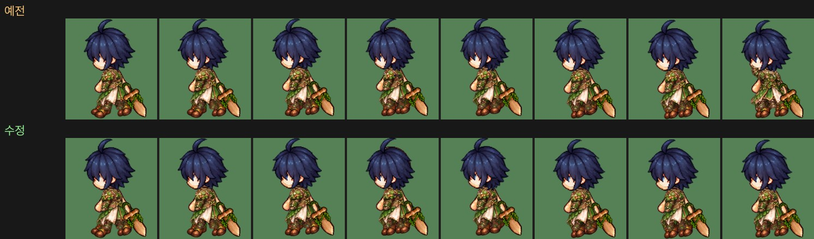
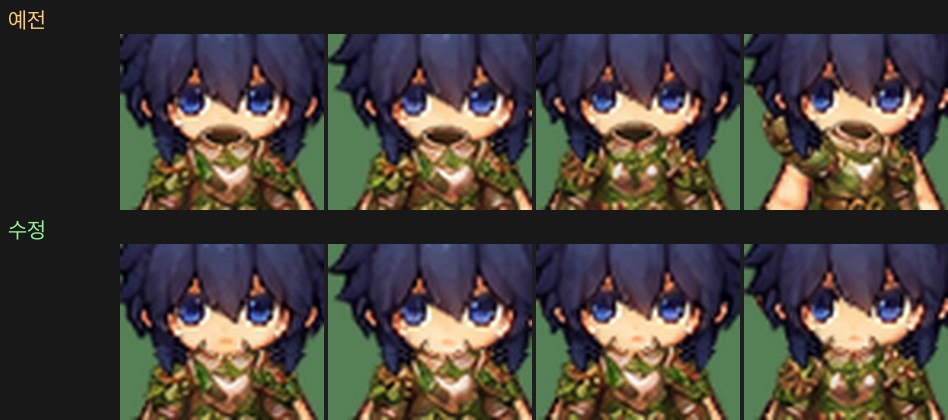
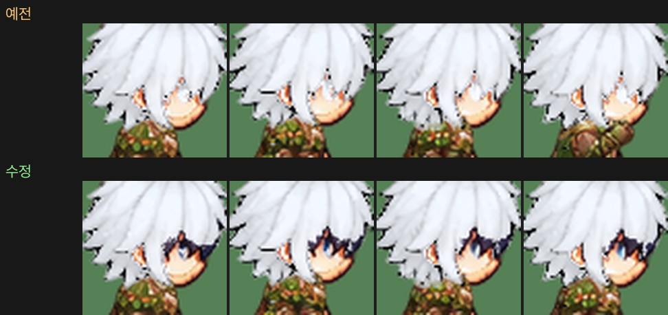
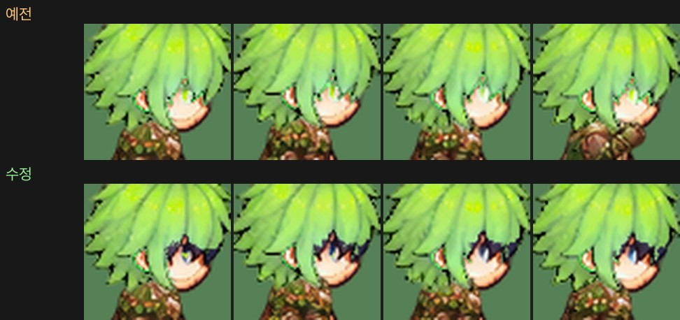

# 37. 남자 캐릭터 걷기 그림 다듬기 — 옷 팔 · 턱 그늘 · 오른쪽 눈

게임에서 남자 캐릭터를 걸려 보니 자잘한 생김새 문제가 세 가지 보였다.

- 양옆으로 걸을 때 옷의 팔 부분이 한두 칸 동안 앞으로 튀어나온다.
- 정면으로 걸을 때 턱 아래에 검은 그늘이 진다.
- 오른쪽으로 걸을 때 눈이 보이지 않는다 (머리색을 바꾼 캐릭터).

셋 다 캐릭터 PNG 를 게임 그림으로 바꾸는 도구(29번 노트)에서 생긴 문제라, 원본 시트는 그대로 두고 도구를 고쳐 다시 구웠다. 바뀐 그림은 입문 옷 · 입문 로브(남녀)와 남자 머리카락의 머리색 마스크뿐이다.
입문 옷은 새 캐릭터의 시작 옷(여행자 옷)과 가죽 갑옷이 쓰는 그림이라 처음 시작하면 바로 보인다.

## 작업 내용

### 옷의 팔이 한두 칸 앞으로 — 공격 칸이 걷기에 섞임

입문 디자인의 옷 · 로브는 캐릭터 부위 시트가 아니라 장비 시트에서 온다 (지역 1~10 디자인은 부위 시트). 장비 시트의 옷은 한 줄에 서 있는 칸들 뒤로 팔을 들거나 뻗은 공격 칸이 2~3개 붙어 있는데, 그 수가 시트에 적혀 있지 않아 "첫 칸과 실루엣이 크게 다른 칸"을 줄 끝에서부터 세어 공격 칸으로 잡았다.

그런데 이 두 옷은 공격 칸의 실루엣이 서 있는 칸과 꽤 비슷해(겹침 73~84%) 공격 칸이 **0개**로 세어졌다. 그래서 줄 끝의 공격 칸이 걷기 8칸의 마지막 칸들에 섞였고, 걸을 때 한두 칸 동안 옷의 팔만 앞으로 뻗었다 (몸의 팔은 그대로라 소매만 튀어나와 보인다).

두 옷의 칸 대응을 표에 직접 적었다 (옷 = 한 줄 14칸 중 0~10 서 있는 칸 · 11~13 공격, 로브 = 12칸 중 0~9 · 10~11). 표에 없는 디자인은 예전처럼 실루엣으로 센다.

### 턱 아래 검은 그늘 — 옷의 목 구멍

장비 시트의 옷은 따로 놓인 물건처럼 그려져 있어 목둘레 안쪽(뒤쪽 깃과 옷 속)이 어둡게 칠해져 있다. 이 그림을 몸 위에 겹치면 그 어두운 속이 턱 · 목을 덮어 정면 얼굴 아래에 검은 그늘이 졌다.

앞 · 뒷모습의 옷 그림에서 **목 구멍을 찾아 지운다**.

- 깃 = 옷 실루엣의 맨 위(키의 8% 안)에 윗선이 있는 가운데 열들 (어깨는 깃보다 낮다).
- 열마다 윗선 바로 아래에서 시작해 이어지는 어두운 픽셀(옷 밝기 가운데값의 85% 미만) = 뒤쪽 깃 + 옷 속 → 그 줄까지 지운다. 앞쪽 깃 테두리는 남는다.
- 가운데에서 이어진 열 묶음만 쓰고, 어깨 쪽으로 떨어진 짧은 그늘 줄은 버린다.

옷을 몸에 맞추는 기준(옷 윗선)은 원본 그대로 재고, 자리를 정한 뒤에 지운다 → 옷의 자리는 바뀌지 않는다. 지운 자리로 아래 몸 층의 목 · 턱이 보인다. 캐릭터 부위 시트의 지역 옷(1~10)은 처음부터 몸에 맞춰 그려져 있어 그대로 둔다.

### 오른쪽을 볼 때 눈이 안 보임 — 머리색 마스크

머리카락 그림에는 얼굴(눈 · 살)이 함께 그려져 있어, 머리색을 바꿀 때는 머리카락만 고르는 마스크를 쓴다(33번 노트). 눈은 "맨몸 얼굴에서 살색에 둘러싸인 구멍"으로 찾는데, 남자 오른쪽 보기는 눈이 얼굴 옆 윤곽선에 닿아 있어 살색에 둘러싸이지 않았다 → 눈을 못 찾아 눈까지 머리카락으로 잡혔고, 하얀 · 연두 머리로 바꾸면 눈이 머리색으로 칠해져 사라졌다 (왼쪽 보기는 눈이 윤곽선에서 떨어져 있어 괜찮았다).

옆모습 눈도 찾게 했다: 맨몸 실루엣 안쪽(윤곽선 2픽셀 빼고)의 살색 아닌 덩어리 중 푸른 눈동자 색이 15% 넘는 것 = 옆눈. 옆눈은 맨몸 눈과 머리카락 그림의 눈 모양이 조금 달라 "머리카락 그림에도 그려진 눈"인지 보는 문턱을 45% → 35% 로 낮췄다 (정면 앞머리에 가려진 눈은 37% 까지라 정면은 예전 문턱을 그대로 쓴다).

## 문제와 해결

| 문제 | 해결 |
|---|---|
| 옆 걷기에서 한두 칸 동안 옷의 팔이 앞으로 뻗는다 | 입문 옷 · 로브의 공격 칸이 0개로 세어져 걷기에 섞였다 → 칸 대응을 표에 적는다 |
| 정면에서 턱 아래 검은 그늘 | 옷 그림의 어두운 목 구멍이 턱을 덮었다 → 앞 · 뒷모습 옷의 목 구멍을 지운다 |
| 목 구멍 옆 어깨선의 짧은 그늘 줄까지 지워짐 | 가운데에서 이어진 열 묶음만 |
| 오른쪽 보기에서 머리색을 바꾸면 눈이 사라진다 | 윤곽선에 닿은 옆눈은 구멍으로 안 잡혔다 → 실루엣 안쪽의 푸른 덩어리도 눈으로 |

## 검증

- 플레이어 아틀라스 다시 굽기: 바뀐 그림은 입문 옷 · 로브(남녀 4장)와 남자 머리카락 마스크(머리카락 · 모자 · 투구 23장)뿐, 나머지는 같다
- Unity 6000.6.2f1 컴파일 성공 · EditMode 테스트 220개 통과 (머리색 다시 칠하기 테스트의 남자 머리카락 기준값을 새 값으로) — 프로젝트 복제본에서
- 아트 계약 검사 통과 (플레이어 층 아틀라스 182장 · 머리색 마스크 48장), 실제 Play 화면 캡처 166장 정상. 촬영은 임시 세이브로 해서 실제 세이브 파일은 바뀌지 않았다
- 남녀 × 입문 옷 · 로브 × 머리색(기본 · 하양 · 연두) × 4방향 걷기 칸을 게임과 같은 순서로 겹쳐 확인

## 남은 일

- 옆눈 둘레의 짙은 속눈썹 선은 원래 머리색(남색) 그대로 남는다 (왼쪽 보기와 같다). 눈동자 반짝임 한 픽셀이 머리색으로 물드는 곳이 있다
