# 38. 보스 큰 공격 다양화 — 보스마다 다른 조합 · 새 패턴 8가지

10번 노트에서 만든 보스 큰 공격은 모양이 여섯 가지(발밑 원 · 자기 둘레 · 부채꼴 · 직선 · 고리 · 여러 곳)뿐이고, 모두 "한 번 예고하고 한 번 친다"였다. 그래서 보스가 바뀌어도 비슷한 공격을 쓰는 느낌이었고, 뒤 지역 보스는 패턴 수만 하나씩 많았다 (예고 시간은 보스마다 평균 1.35~1.50초로 거의 같았다).

이번 작업에서는 큰 공격 하나가 **판정을 여러 번** 가질 수 있게 틀을 바꾸고, 그 위에 새 모양 8가지와 연속 공격 · 연계 · 넉백 후 강타를 더했다. 그리고 보스 10마리의 패턴 표를 **보스마다 조합이 다르고, 뒤 지역일수록 예고는 짧고 범위는 넓고 연계는 많게** 다시 짰다.
"바닥에 보인 경고 = 실제로 맞는 범위" 원칙은 그대로다. 판정마다 경고가 따로 뜨고, 맞았는지는 그 경고를 그린 것과 같은 범위 계산으로 정한다.

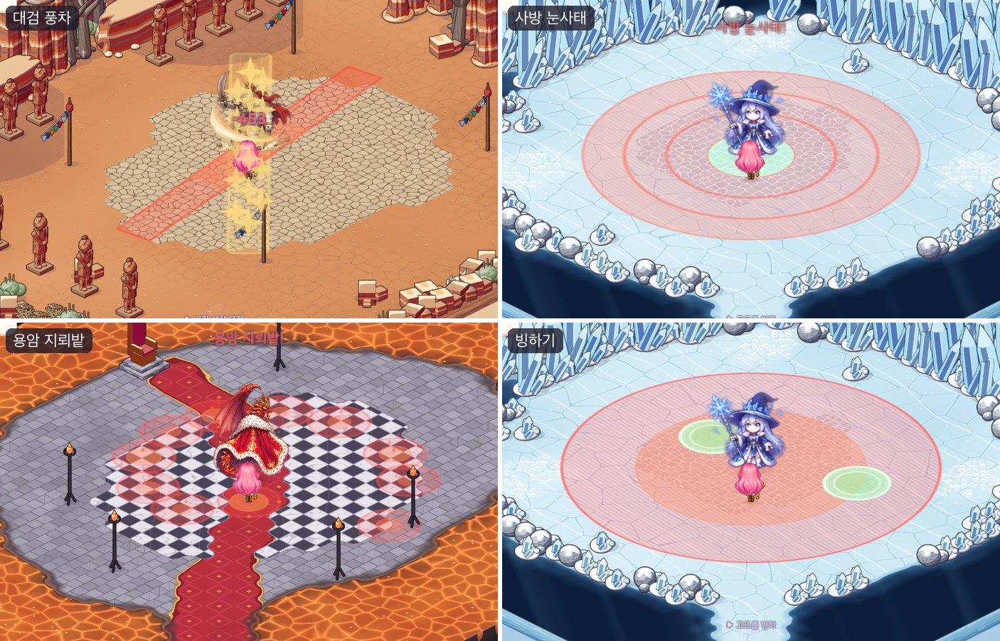

## 작업 내용

### 큰 공격 = 차례로 치는 판정들

- 예전: 패턴 하나 = 예고 → 판정 한 번 → 숨 고르기.
- 지금: 패턴 하나 = **판정 여러 개**. 판정마다 "경고가 뜨는 시각"과 "치는 시각"을 따로 둔다.
  - 한꺼번에 뜨고 차례로 터지는 공격(지뢰 · 조여 오는 장판)과 하나씩 뜨고 하나씩 치는 공격(띠 · 나선 · 풍차)을 같은 틀로 만든다.
  - 하나씩 뜨는 공격은 첫 판정의 경고가 시작하자마자 뜨고, 다음 판정들은 칠 때보다 0.38~1.2초 앞서 뜬다. 앞의 경고를 보고 다음 자리를 미리 읽을 수 있다.
- 시계는 몬스터 AI(게임 규칙 쪽)가 돌리고, 화면 쪽은 "지금 경고가 뜬 판정 · 지금 친 판정" 목록을 받아 경고 · 연출만 그린다. 보스 HP 막대의 경고 알약은 마지막 판정까지 남는다.

### 새 모양 8가지

| 모양 | 생김새 | 쓰는 보스 |
|---|---|---|
| 갈래 | 보스에서 5~6갈래 줄기가 뻗는다. 갈래 사이가 안전 | 로얄 카투스(다섯 갈래 가시 줄기), 크림슨 로드 드래곤(불덩이 연사) |
| 띠 | 플레이어를 덮는 띠 3~4줄이 한쪽 끝부터 차례로 친다 | 산호 골렘(밀물 세 줄기), 황무지 정복자왕 석상(석상 행렬) |
| 조여 오는 장판 | 바깥 띠부터 안쪽으로 세 번 친다. 보스 품은 끝까지 안전 | 아이스 위치(사방 눈사태), 드래곤(화염 결계) |
| 안전 지대 | 보스 둘레 넓은 곳이 모두 맞고 초록 원 두 곳만 안전 | 아이스 위치(빙하기) |
| 지뢰 | 9~11곳이 한꺼번에 뜨고 플레이어 발밑부터 차례로 터진다 | 캡틴 블랙 유령(유령 기뢰), 드래곤(용암 지뢰밭) |
| 풍차 | 2~3갈래가 30~35도씩 돌며 7~8번 친다. 다음 자리가 미리 보인다 | 정복자왕 석상(대검 풍차), 드래곤(회전 화염) |
| 나선 | 원 16개가 두 갈래 나선으로 0.08초 간격으로 퍼져 나간다 | 드래곤(용염 나선) |
| 소환 | 보스 둘레에서 졸개가 솟는다 (솟는 자리에 서 있으면 맞는다) | 정복자왕 석상(백암 파수꾼), 드래곤(해츨링) |

- 안전 지대의 초록 원은 플레이어에게서 2.5~7칸, 걸을 수 있는 칸에 둔다 — 움직여야 닿지만 닿을 수는 있게. 초록 원끼리는 떨어뜨리고, 화면에서 보스 그림 뒤(발밑 바로 위쪽)에 가려지는 자리는 피한다.
- 지뢰는 되도록, 소환 자리는 늘 걸을 수 있는 칸에 둔다 (용암 · 물 위에 지뢰 · 졸개가 뜨지 않게).
- 소환된 졸개는 16~18초 뒤나 보스가 쓰러지면 사라진다. 잡아도 경험치 · 골드 · 전리품 · 퀘스트 진행이 없고 되살아나지 않는다 (보스 필드에서 졸개를 끝없이 불러내 사냥하지 않게).

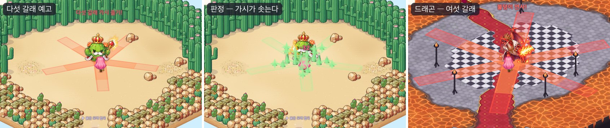

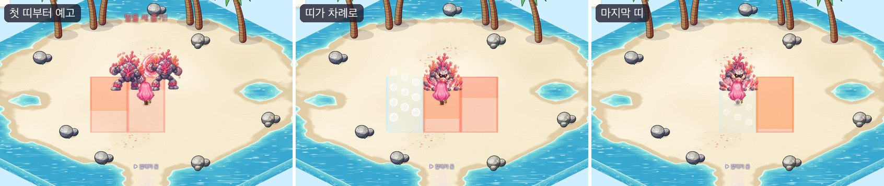

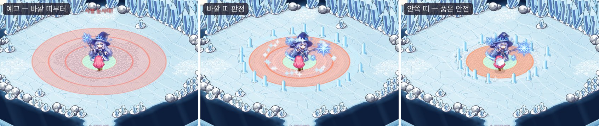

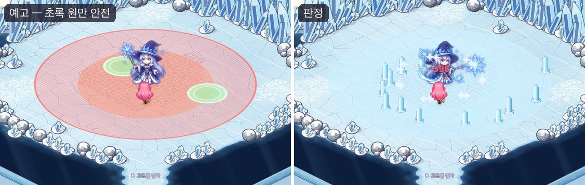

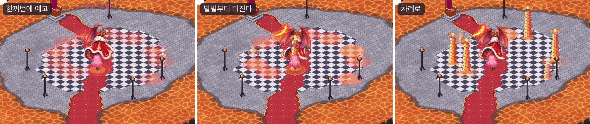

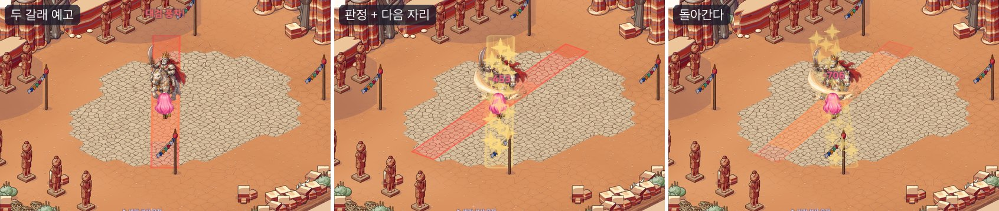

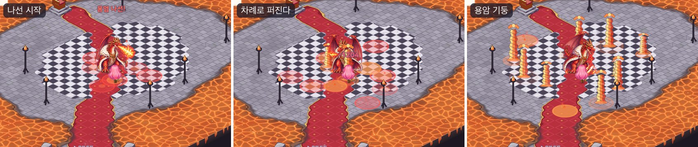

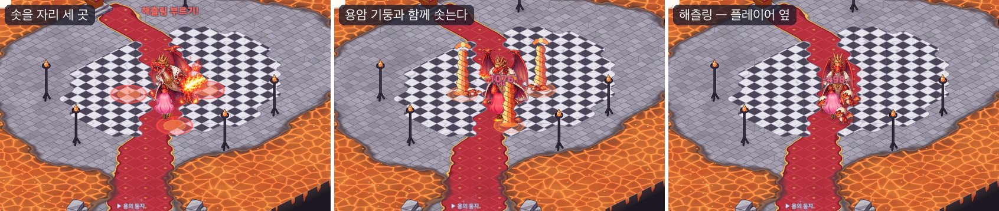

### 연속 공격 · 연계 · 넉백 후 강타

- **연속 공격**: 돌진 · 도약 · 부채꼴을 2~3번 잇는다. 2번째부터는 **그 경고가 뜨는 순간의 보스 · 플레이어 자리로 다시 겨눈다** — 첫 돌진을 피해도 다음 돌진이 따라온다. 돌진하는 시간(0.22초)과 짧은 틈 뒤에 다음 경고가 뜬다.
  산군의 삼연 할퀴기는 한 번 휘두를 때마다 1.6칸씩 앞으로 내디딘다.
- **연계**: 한 공격의 숨 고르기가 끝나자마자 다음 공격이 이어진다 (최대 3단). 보스 HP 막대에 "연계 · 공격 이름". 예: 얼음 감옥(뛰어올라 내려찍기) → 눈보라(부채꼴), 정복의 고리(고리) → 병마용의 창(여러 곳).
- **넉백 후 강타**: 몽둥이 · 꼬리로 둘레를 쳐서 맞은 플레이어를 3.5칸 밀어내고, 밀려난 자리를 바로 노리는 공격이 이어진다. 밀려나는 건 0.22초 동안 미끄러지는 움직임이고 나무 · 바위 · 물 앞에서 멈춘다. 밀려나는 동안은 걷기가 멈췄다가, 걷던 중이면 밀려난 자리에서 길을 다시 찾아 이어 간다.
- 대상 위에 뛰어내린 뒤의 연계처럼 플레이어가 보스 발밑에 겹쳐 있으면, 부채꼴 · 직선 · 갈래는 앞 판정의 방향(뛰어온 쪽)으로 쏜다.

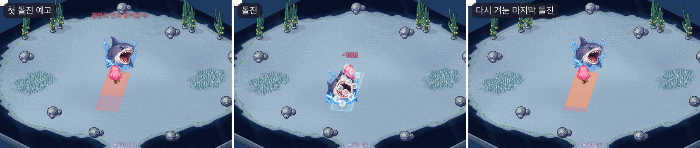

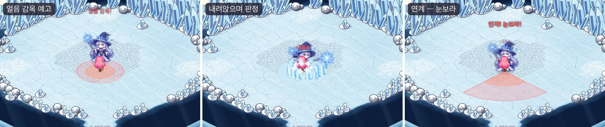

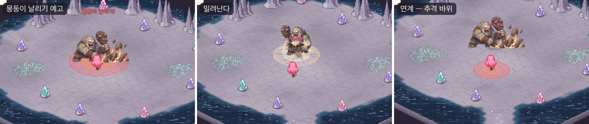

### 보스마다 다른 조합

| 보스 | 큰 공격 | 새로 들고 온 공격 | 연계 |
|---|---|---|---|
| 라이언헤드 Lv20 | 2 → 3 | 깡충깡충 두 번 뛰기 (연속 도약) | 0 |
| 로얄 카투스 Lv35 | 3 → 4 | 다섯 갈래 가시 줄기 (갈래) | 0 |
| 산호 골렘 Lv60 | 4 → 5 | 밀물 세 줄기 (띠) | 0 |
| 메갈로돈 Lv90 | 5 → 6 | 광란의 연속 물어뜯기 (세 번 돌진) | 0 |
| 보스 자이언트 Lv120 | 6 → 7 | 몽둥이 날리기 → 추격 바위 (넉백 후 강타) | 1 |
| 산군 Lv150 | 7 → 8 | 삼연 할퀴기 (내디디며 세 번) | 2 |
| 아이스 위치 Lv180 | 8 → 9 | 빙하기 (안전 지대) · 사방 눈사태 (조여 오는 장판) | 2 |
| 캡틴 블랙 유령 Lv220 | 9 → 10 | 유령 기뢰 (지뢰) | 3 |
| 황무지 정복자왕 석상 Lv250 | 10 → 11 | 대검 풍차 (풍차) · 백암 파수꾼 소환 · 석상 행렬 (네 줄 띠) | 3 |
| 크림슨 로드 드래곤 Lv400 | 11 → 13 | 용염 나선 (나선) · 해츨링 부르기 (소환) · 회전 화염 · 화염 결계 · 용암 지뢰밭 · 불덩이 연사 | 4 |

- 보스마다 공격 종류(모양 + 움직임 + 연속 + 넉백)의 조합이 모두 다르고, 앞 보스들에게 없던 종류를 하나 이상 들고 온다. 테스트가 이것을 확인한다.
- 예전 공격은 이름 · 연출을 그대로 두고 연계로 묶거나(포효 → 도약 할퀴기) 새 모양으로 바꿨다(석상 행렬: 직선 하나 → 네 줄 띠, 불덩이 연사: 긴 직선 → 여섯 갈래).
  몇 개는 새 공격으로 갈아 끼웠다 (아이스 위치의 눈사태: 여러 곳 → 사방 눈사태, 드래곤의 용암 분출 · 화염 고리 · 용의 포효 → 용암 지뢰밭 · 화염 결계 · 회전 화염).

### 뒤 지역일수록 어렵게

| | 앞쪽 다섯 지역 | 뒤쪽 다섯 지역 |
|---|---|---|
| 자기 둘레 반지름 (평균) | 3.3칸 | 4.2칸 |
| 고리 · 장판 바깥 반지름 | 5.1칸 | 7.5칸 |
| 부채꼴 반지름 | 6.1칸 | 6.8칸 |
| 직선 길이 | 8.4칸 | 10.1칸 |
| 여러 곳 공격의 원 수 | 7개 | 9.9개 |

- 보스의 첫 예고: 가장 빠른 것 1.3초(라이언헤드) → 0.7초(드래곤), 평균 1.37초 → 1.01초. 보스마다 가장 빠른 예고가 앞 보스보다 길지 않다.
- 하한: 첫 보스는 1.2초, 나머지는 0.7초. 연속 · 띠 · 나선 · 풍차의 다음 판정 경고는 0.35초 이상 (가장 짧은 건 드래곤 회전 화염의 0.38초).
- 연계 수는 줄지 않는다 (0 · 0 · 0 · 0 · 1 · 2 · 2 · 3 · 3 · 4).

### 경고 · 연출

- 판정마다 경고를 따로 그린다. 갈래 · 풍차는 갈래마다 직선 경고, 띠는 차례로 뜨는 직선, 안전 지대는 넓은 원 경고 위에 초록 원.
- 조여 오는 장판은 **안쪽이 빈 고리 경고**(새 그림)를 띠마다 그린다 — 띠 세 겹을 겹쳐도 안전한 안쪽이 빗금으로 진해지지 않고, 바깥 띠부터 먼저 진해진다.
- 새 연출 셋: 갈래마다 땅에서 줄지어 솟는 선인장 가시, 몽둥이로 땅을 쳐 둘레를 날리는 충격, 대검 풍차가 지나간 갈래의 금빛 칼바람. 산군의 연속 할퀴기는 부채꼴 발톱 자국.
- Play 중 에디터 메뉴 *보스 큰 공격 하나씩 써 보기*: 보스 필드에서 누를 때마다 다음 큰 공격을 거리 · 간격과 상관없이 바로 쓴다 (연출 확인용).

## 문제와 해결

| 문제 | 해결 |
|---|---|
| 띠 · 나선 · 풍차의 첫 판정에도 짧은 경고를 쓰니, 공격을 시작하고 한참 동안 바닥에 아무것도 없었다 | 첫 판정은 시작하자마자 경고, 다음 판정부터 짧은 경고 |
| 대상 위에 뛰어내린 뒤 이어지는 부채꼴이 엉뚱한 쪽(늘 같은 방향)으로 나갔다 — 보스와 대상이 겹쳐 방향을 정할 수 없었다 | 대상이 0.5칸 안에 겹쳐 있으면 앞 판정의 방향(뛰어온 쪽)을 쓴다 |
| 안전 지대의 초록 원이 붉은 경고 위에서 노랗게 보였다 (옅은 민트가 빨강과 섞였다) | 경고 위에 놓이는 안전 원만 진한 초록 + 또렷한 테두리 |
| 안전 원 하나가 마녀 그림 바로 뒤에 놓여 거의 보이지 않았다 (보스 그림은 키가 커서 뒤쪽 여러 칸을 덮는다) | 보스 발밑 바로 위쪽 화면 기둥(가로 ±1.2 유닛)은 안전 원 자리로 고르지 않는다 — 자리가 모자라면 이 조건부터 늦춘다 |
| 캡처 도중 드래곤의 회전 화염에 가만히 서서 여러 번 맞아 쓰러졌고, 마을에서 깨어나 보스가 사라졌다 | 캡처는 기다리는 동안 체력을 채우고, 보스가 사라지거나 멀리 밀려났으면 보스 필드에 다시 들어간다 (게임 쪽은 그대로 — 피해야 하는 공격) |

## 검증

- Unity 6000.6.2f1 컴파일 성공 · EditMode 테스트 236개 통과 — 프로젝트 복제본에서
  - 모양마다: 갈래 사이 틈 · 띠 차례 · 장판 안쪽 안전 · 안전 원 자리 · 지뢰 순서 · 풍차 회전 · 나선 반지름 · 연속 공격 다시 겨누기 · 연계 · 넉백 도착점 · 소환 · 겹친 대상 방향
  - 보스 표: 보스마다 다른 조합 · 새 종류 · 예고 하한 · 뒤 지역일수록 짧은 예고 · 넓은 범위 · 늘어나는 연계
- 실제 Play 화면 캡처 100장: 보스 10마리마다 새 · 연속 · 연계 · 넉백 · 소환 공격을 바로 써서 예고 · 판정 · 이어지는 순간을 찍어 확인 (겹친 대상 방향 · 안전 원 색 · 안전 원 자리를 여기서 찾아 고쳤다)
- 사용자 세이브는 건드리지 않았다

## 남은 일

- 직접 싸워 보며 난이도 다듬기 — 특히 드래곤의 회전 화염(서 있으면 여러 번 맞는다)과 지뢰 · 나선이 겹치는 순간
- 산호 골렘 공격 첫 칸에 골렘이 둘 그려진 몬스터 시트 문제 (몬스터 시트를 자르는 도구에서 따로 고친다)
- 부채꼴 연출의 발톱 · 칼 자국이 판정보다 조금 늦게 보인다 (다른 부채꼴 연출과 같은 타이밍)
