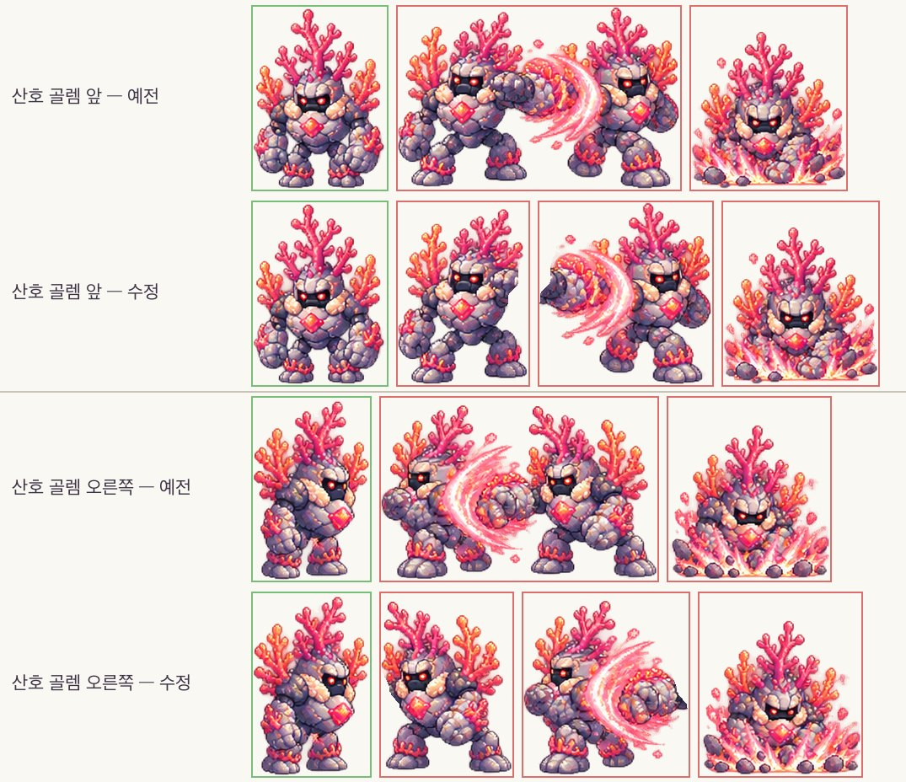
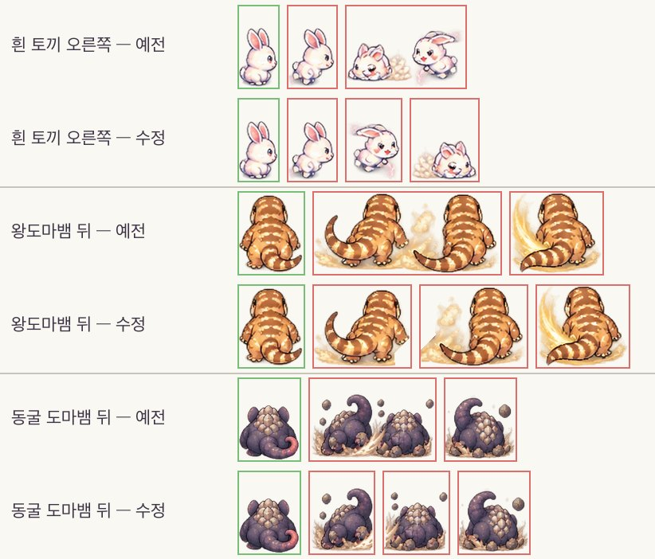
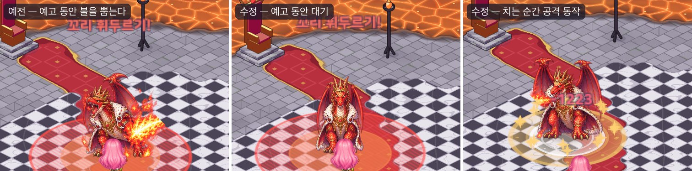
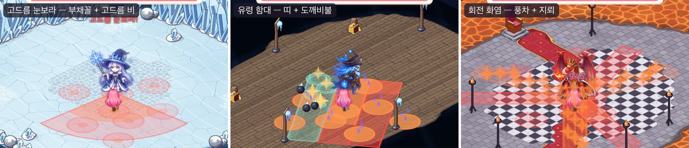

# 39. 보스 다듬기 — 두 마리로 보이던 산호 골렘 · 드래곤이 불 뿜는 순간 · 지역별 난이도 곡선

38번 노트의 보스 큰 공격을 실제로 써 보니 세 가지가 걸렸다.

- 지역 3 보스 **산호 골렘**이 공격 동작을 할 때 골렘이 **두 마리**로 보인다.
- 마지막 보스 **크림슨 로드 드래곤**은 큰 공격을 예고하는 동안(아직 치기 전)부터 **불을 뿜고 있어** 어색하다.
- 지역이 뒤로 갈수록 보스가 **더 자주, 더 다양하게, 더 피하기 어렵게** 큰 공격을 써야 하는데, 패턴 수만 늘었을 뿐 간격 · 예고 · 범위는 보스마다 들쭉날쭉했다.

## 작업 내용

### 공격 칸에 몬스터가 둘 — 시트 칸 나누기

몬스터 시트를 칸으로 자르는 도구(34번 노트)는 이펙트(물살 · 불길 · 흙먼지)로 이웃 칸끼리 붙은 줄을 "같은 몬스터의 다른 줄보다 칸이 적은 줄"로 알아보고, 넓은 덩어리를 나눈다.
산호 골렘은 **네 방향 줄 모두** 주먹 지르기 칸과 지른 뒤 칸이 분홍 소용돌이로 이어져 있었다. 모든 줄이 똑같이 붙어 있으니 칸이 모자란 줄이 없었고, 두 칸이 한 칸이 되어 공격할 때 골렘이 둘로 보였다.

- 몬스터 98종의 공격 칸을 모두 훑었다: 알파가 진한 덩어리가 걷기 칸 몸통만 한 것이 둘 이상이거나, 가장 큰 덩어리가 걷기 칸 몸통의 1.7배 넘는 칸을 후보로 뽑고(32칸), 그림으로 하나씩 봤다.
  대부분은 한 몸 + 큰 이펙트(가지 팔 · 날개 · 물살 · 광선 · 불)였고, 진짜로 몸이 둘인 칸은 **산호 골렘(네 방향) · 흰 토끼(오른쪽) · 왕도마뱀(뒤) · 동굴 도마뱀(뒤)** 이었다.
- 이 줄들은 칸 수를 표에 직접 적어(9칸) 넓은 덩어리를 둘로 나눈다.
- 흰 토끼 오른쪽 줄은 칸 수를 적어도 그대로였다: 두 번째 토끼가 흙먼지에 덮여 진한 몸통이 작게 잡혔고, 작은 몸통은 "날개 끝 · 불꽃 같은 조각"으로 보고 이웃 칸에 다시 붙였기 때문이다.
  이 줄은 조각 붙이기를 하지 않게 했다.
- 칸을 나누니 예전에 "두 마리가 붙은 칸"을 통째로 좌우 뒤집던 설정이 달려든 토끼 한 마리만 뒤집어 왼쪽을 보게 됐다 → 그 설정을 지웠다.
- 다시 구운 그림은 네 장뿐이고 나머지 94장은 그대로다 (같은 도구로 다시 구워도 똑같이 나온다).

### 예고 동안의 자세 — 불은 치는 순간에

보스는 큰 공격을 예고하는 내내 **공격 동작의 첫 칸**에 멈춰 서 있었다. 대부분의 보스는 첫 칸이 주먹을 드는 "힘 모으기" 자세라 괜찮았지만, 드래곤은 첫 칸이 **불 뿜기**(둘째 칸은 발톱 휘두르기)라 바닥 경고가 차오르는 1초 남짓 동안 불을 뿜고 있었다.
꼬리 휘두르기 · 소환 같은 불과 상관없는 공격도 마찬가지였다.

- 몬스터 그림을 구울 때 공격 첫 칸에 **이미 이펙트가 그려져 있는지**를 재서 그림 표에 적는다: 대기 칸보다 그림이 1.3배 넘게 넓거나, 폭이 1.3배 넘게 넓거나, 아주 밝은 빛 픽셀이 눈에 띄게 많으면 이펙트 칸이다.
  (처음에는 그림 상자 넓이만 비교했는데, 드래곤 왼쪽 보기는 대기 칸도 날개를 펴 넓어서 불 뿜는 칸을 걸러 내지 못했다 — 밝은 빛 픽셀로 가른다.)
- **예고 동안**: 첫 칸이 이펙트 없는 자세면 그 칸에 멈춰 힘을 모으고(산호 골렘 · 아이스 위치 · 캡틴 블랙 …), 이펙트 칸이면 대기 동작을 이어 간다(드래곤 · 메갈로돈 · 자이언트 · 산군).
- **판정 순간**: 그때부터 공격 동작을 재생해 마지막 칸으로 숨을 고른다. 드래곤의 화염 브레스 · 불덩이 · 지옥불 · 포효처럼 몸에서 뿜는 공격은 불 뿜는 칸에 머문다 → **불은 실제로 공격이 들어가는 순간에만** 나온다.
- 판정 자세는 0.45초 보여 주고, 그동안 뜬 다음 예고는 그 뒤에 힘 모으기 자세로 바꾼다 — 0.38초마다 치는 풍차 · 0.07초마다 치는 나선은 자세가 깜빡이지 않고, 연계 · 되풀이의 다음 예고 동안에는 다시 대기 자세로 돌아간다.

### 난이도 곡선 — 잦게 · 다양하게 · 피하기 어렵게

보스 10마리의 큰 공격 표를 다시 짰다. 지역이 뒤로 갈수록:

| 지역 · 보스 | 큰 공격 간격 | 큰 공격 수 | 평균 첫 예고 | 피하기 어려움 | 연계 · 동시 공격 |
|---|---|---|---|---|---|
| 1 라이언헤드 | 7초 | 3 | 1.37초 | 21 | — |
| 2 로얄 카투스 | 6 (예전 6) | 4 | 1.35 | 43 | — |
| 3 산호 골렘 | 5.2 (5.5) | 5 | 1.34 | 67 | — |
| 4 메갈로돈 | 4.5 (5) | 6 | 1.27 | 75 | — |
| 5 보스 자이언트 | 3.9 (5) | 8 (7) | 1.20 | 92 | 연계 1 |
| 6 산군 | 3.4 (4.5) | 9 (8) | 1.10 | 115 | 연계 2 |
| 7 아이스 위치 | 3 (4.3) | 11 (9) | 1.10 | 176 | 연계 2 · 동시 1 |
| 8 캡틴 블랙 유령 | 2.6 (4.2) | 12 (10) | 1.04 | 274 | 연계 3(2단) · 동시 1 |
| 9 황무지 정복자왕 석상 | 2.3 (4) | 14 (11) | 1.04 | 493 | 연계 3(2단) · 동시 2 |
| 10 크림슨 로드 드래곤 | 2 (3.8) | 16 (13) | 0.99 | 1079 | 연계 5(3단) · 동시 3 |

- **피하기 어려움** = 큰 공격 하나가 덮는 평균 위험 넓이(칸², 연계 · 동시 공격까지 더하고 안전 지대는 안전 원을 뺀다) × 평균 판정 수 ÷ 평균 첫 예고(초). 예전에는 지역 4 · 5 · 8 에서 앞 보스보다 내려갔다.
- 판정 수를 늘리려고 기존 공격 여럿을 **연속 공격**으로 바꿨다 (가시 소나기 · 물기둥 · 바위 던지기 · 낙석 · 고드름 비를 두 번 — 두 번째는 그때 내 자리로, 돌진 · 칼질 · 포격도 두 번).
- **동시 공격**(새 규칙): 한 큰 공격 안에서 다른 모양이 함께 친다 — 정해진 시간(0~1.4초) 뒤에 시작. 아이스 위치 *고드름 눈보라*(부채꼴 + 고드름 비), 캡틴 블랙 *유령 함대*(띠 + 도깨비불),
  정복자왕 *석상 포위*(조여 오는 장판 + 안전한 품에 떨어지는 화살) · *백암 파수꾼 소환*(소환 + 화살 비), 드래곤 *회전 화염*(풍차 + 늦게 터지는 지뢰) · *용의 영역*(안전 지대 + 늦게 뻗는 여섯 갈래) · *해츨링 부르기*(소환 + 운석).
  동시 공격은 움직이지 않는 모양만 쓰고, 연계는 둘 다 끝난 뒤에 이어진다.
- **깊은 연계**: 캡틴 블랙 *닻 내려찍기 → 커틀러스 → 유령 포격*, 정복자왕 *말발굽 → 모래 폭풍 → 병마용의 창*, 드래곤 *꼬리 휘두르기 → 불꽃 추격 → 화염 브레스 → 운석 낙하*(넉백 후 3단).
- 새 큰 공격: 돌기둥 행렬(자이언트) · 벼락 갈래(산군) · 고드름 눈보라 · 빙하 균열(아이스 위치) · 유령 함대 · 망령의 고리(캡틴 블랙) · 석상 포위 · 모래 회오리 풍차 · 황제의 심판(정복자왕) · 용의 영역 · 쌍둥이 불길 · 용왕의 포효(드래곤).
- 표의 규칙(간격은 늘 짧아지고, 평균 첫 예고는 길어지지 않고, 피하기 어려움은 지역마다 10% 넘게 오르고, 공격 종류 · 동시 공격은 줄지 않고, 7번째 지역부터 동시 공격)은 테스트가 지킨다 — 나중에 보스 공격을 고쳐도 곡선이 무너지지 않게.

## 문제와 해결

| 문제 | 해결 |
|---|---|
| 산호 골렘 공격 칸에 골렘이 둘 (네 방향 모두) | 모든 줄이 똑같이 붙어 있어 "칸이 모자란 줄"로 잡히지 않았다 → 줄의 칸 수를 표에 적는다 |
| 흰 토끼 오른쪽 줄은 칸 수를 적어도 나뉘지 않았다 | 흙먼지에 덮인 두 번째 토끼가 조각으로 잡혀 다시 붙었다 → 그 줄은 조각 붙이기를 하지 않는다 |
| 칸을 나눈 뒤 달려드는 토끼가 왼쪽을 봤다 | 두 마리 칸을 통째로 뒤집던 설정이 남아 있었다 → 지운다 |
| 드래곤이 예고 동안 불을 뿜고 있다 | 공격 첫 칸에 이펙트가 있는 보스는 예고 동안 대기 동작, 공격 동작은 판정 순간부터 |
| 그림 상자 넓이로는 드래곤 왼쪽 보기의 불 뿜는 칸을 못 가렸다 (대기 칸도 날개로 넓다) | 아주 밝은 빛 픽셀의 몫도 본다 |
| 연계 · 되풀이 공격에서 다음 예고 동안 드래곤이 앞 판정의 불 뿜는 칸에 머물렀다 (다음 예고가 뜰 때 앞 판정 동작이 아직 재생 중이라 자세를 바꾸지 않았다) | 판정 자세를 정해진 시간만 보여 주고, 그 뒤 예고 중인 판정이 남았으면 대기 자세로 |
| 지역 4 · 5 · 8 보스가 앞 보스보다 피하기 쉬웠다 | 피하기 어려움 점수를 정하고 지역마다 10% 넘게 오르게 표를 다시 짰다 |

## 검증

- Unity 6000.6.2f1 컴파일 성공 · EditMode 테스트 240개 통과 — 프로젝트 복제본에서 (동시 공격 · 연계 · 연속 돌진과 동시 공격이 함께 있을 때 · 난이도 곡선)
- 몬스터 그림 다시 굽기: 바뀐 그림은 네 장뿐, 그림 표에 공격 첫 칸 이펙트 표시가 더해졌다
- 실제 Play 화면 캡처: 보스 10마리의 새 · 연속 · 연계 · 동시 공격을 예고 · 판정 · 이어짐으로 찍어 자세와 경고를 확인
- 사용자 세이브는 건드리지 않았다

## 남은 일

- 직접 싸워 보며 숫자 다듬기 — 특히 마지막 세 보스(간격 2~2.6초 · 동시 공격)가 너무 몰아치지 않는지
- 드래곤 · 메갈로돈처럼 공격 칸이 두 개뿐인 시트는 판정 순간 동작이 짧다 (시트에 힘 모으기 칸이 없다)
