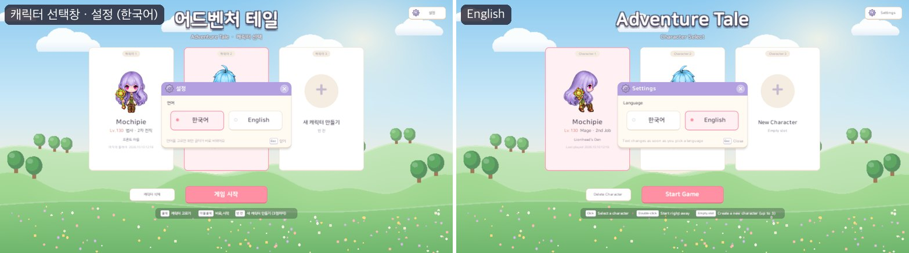
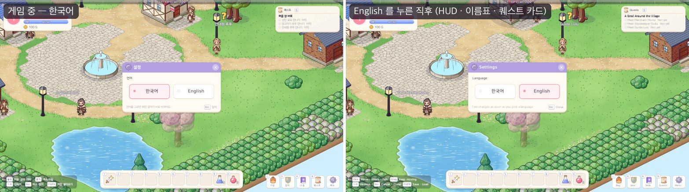
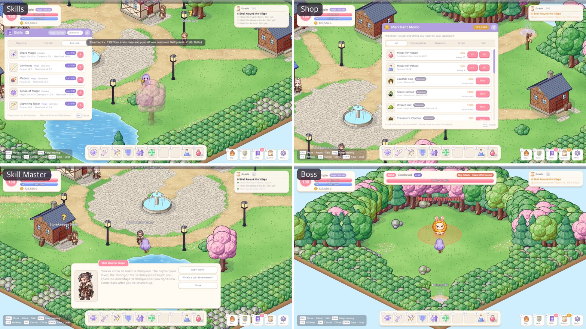
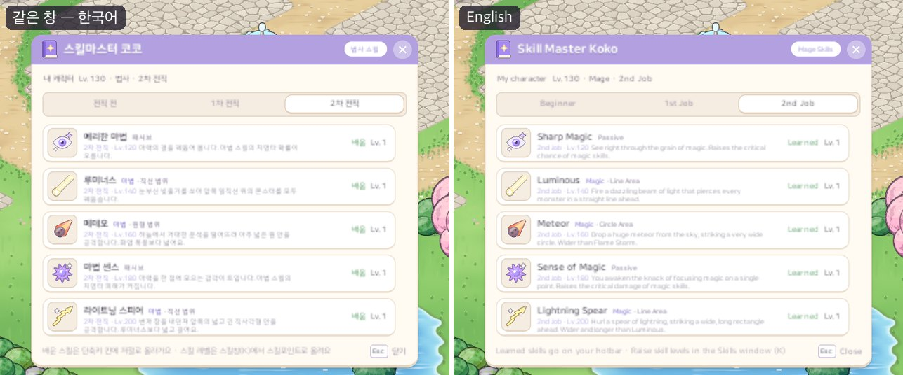

# 40. 다국어 — 한국어 · 영어, 설정에서 바꾸기

지금까지 게임의 모든 글자는 한국어였고, 그 문구가 코드 곳곳에 그대로 적혀 있었다. 버튼 이름 · 알림 · 툴팁 · NPC 대화 같은 화면 문구가 500개 가까이, 아이템 · 몬스터 · NPC · 퀘스트 · 맵 같은 기획 데이터의 문구가 1,000개 남짓이었다.
이번 작업으로 게임의 모든 화면 글자를 **한국어와 영어** 두 언어로 보여 주고, **설정 창에서 언어를 고르면 그 자리에서 바로 바뀌게** 했다. 고른 언어는 설정 파일에 남아서 다음에 켜도 그대로다.

## 작업 내용

### 문구를 키로 — 두 갈래 표

문구를 다루는 방법을 두 갈래로 나눴다.

- **화면 문구**(버튼 · 창 제목 · 알림 · 툴팁 · 대화 흐름 · 규칙이 돌려주는 까닭): 코드에는 키만 적는다 (`shop.bought`, `toast.saved` …). 문구 표에는 키마다 한국어와 영어를 한 줄에 나란히 둔다. 모두 458개다.
  두 언어가 한 줄에 같이 있어서 하나를 고치면 다른 하나도 바로 눈에 들어온다. 표는 영역마다 한 파일로 나눴다: 공통 낱말 · 규칙 알림 · 화면 · NPC 대화.
- **데이터 문구**(아이템 · 스킬 · 몬스터 · 보스 큰 공격 · NPC · 퀘스트 · 맵 · 지역): 한국어는 지금처럼 기획 데이터에 그대로 둔다. 이것이 **기준 문구**다.
  영어만 따로 모아 **데이터 id 를 키로** 지역 파일마다 적었다 (`item.seed` = "Sprout Seed").
  데이터의 이름 · 설명은 읽을 때마다 지금 언어로 돌려준다. 그래서 화면 코드는 예전처럼 "아이템 이름"을 읽기만 하면 된다.
  데이터를 한국어로 읽으며 기획을 다듬던 방식이 그대로 남고, 맵 설계 도구가 만드는 맵 파일도 손대지 않아도 된다.

데이터 id 가 없거나 이름을 조합하는 경우는 따로 처리했다.

- **보스 큰 공격**에는 id 가 없다. "보스 id + 한국어 이름"을 키로 쓴다.
- **포탈 이름표**("초록 들판 (Lv.1~5)", "오아시스 마을 (사막)")는 도착 맵 이름을 옮기고 꼬리를 붙인다. 레벨 꼬리는 그대로 두고, 지역 이름 꼬리는 지역 이름을 옮긴다.
  손으로 지은 이름표 8개("눈 덮인 고개", "얼음 구멍 (블루홀)" …)만 표에 따로 적었다.
- **제작 장비 60개**(유니크 · 레전더리 · 미스틱)는 바탕 장비의 영어 이름으로 자동으로 만든다 ("Legendary Lionheart Sword"). 한국어도 원래 "전설의 사자왕의 검"처럼 바탕 이름으로 만들었다.

### 한국어 조사 · 숫자

한국어 문구는 이름 뒤에 붙는 조사가 이름마다 다르다 ("나무 검**을**" / "리본 구두**를**").
예전에는 코드가 문장을 이어 붙이면서 조사를 골랐다. 영어는 어순이 달라서 그 방식을 쓸 수 없다.
그래서 문구 표의 한국어 문장 안에 조사 자리를 적게 했다: `{0:을} 배웠어요!` 처럼 쓰면 앞 낱말의 받침을 보고 "을/를"을 고른다.
"으로/로"의 ㄹ 받침 규칙도 지키고, 숫자는 읽는 소리로 본다 ("레벨 50**이**", "레벨 2**가**").
숫자 형식(`1,234G`, `3.5초`, `+10`)도 같은 문법으로 적는다.

### 언어를 바꾸면 — 화면을 새로 짓는다

창마다 "언어가 바뀌면 글자를 다시 쓰는" 코드를 두면, 하나만 빠뜨려도 두 언어가 섞인다.
그래서 언어가 바뀌면 **화면 전체를 새 언어로 다시 만든다**. 화면은 원래 만들 때 글자를 정하는 구조라, 새로 만들면 빠짐없이 새 언어가 된다.

- **게임 중**: 다음 프레임에 HUD(상태창 · 창 · 핫바 · 메뉴)를 새로 만들고 옛 것을 치운다.
  NPC · 포탈 이름표는 HUD 안의 층에 붙어 있어서, 그 층만 새 HUD 로 옮기고 이름표 글자를 다시 쓴다. 보스 막대도 다시 붙인다.
  열려 있던 설정 창은 다시 열어 두어서, 설정 창에서 언어를 고르면 그 창이 그대로 새 언어로 바뀐 것처럼 보인다.
  맵 이동 연출 중이면 연출이 끝난 뒤에 바꾼다.
- **캐릭터 선택창**: 선택창을 새 언어로 다시 만든다. 오른쪽 위에 [설정] 버튼을 새로 달았다.
- **설정 파일**은 캐릭터 세이브와 따로 둔 `settings.json` 하나다. 모든 캐릭터가 같이 쓴다.
  처음 켤 때는 컴퓨터 언어를 따른다 (한국어면 한국어, 그 밖은 영어).

### 영어로 옮기기

데이터 문구 1,124줄(아이템 301 · 몬스터 98 · 보스 큰 공격 · NPC 60 · 퀘스트 28 · 맵 65 · 지역 10, 자동으로 만드는 제작 장비 120줄 포함)을 옮겼다.
설명과 퀘스트 대사가 이름을 서로 가리키므로, **이름(용어집)부터 정하고** 그다음 설명 · 대사를 지역 순서대로 옮겼다.

- 귀여운 몬스터 이름은 말맛을 살렸다: 씨앗몬 = Seedmon, 꿀버리 = Honeybuzz, 도술너구리 = Taoist Tanuki, 산군 = Mountain Lord.
- NPC 이름은 반복 이름(모모 · 두두 · 루루)은 그대로 읽고, 뜻이 있는 이름은 뜻을 살렸다: 촌장 고동 = Elder Whelk, 안내원 구름 = Guide Cloud, 심연의 마법사 노을 = Abyss Mage Dusk.
- 말투는 그림 · 성격에 맞췄다.
  - 촌장들은 점잖은 "Ho ho"로 말한다.
  - 자기 이름으로 말하는 창고지기 두두는 영어도 3인칭("Dudu never loses anything!")이다.
  - 반말하던 소년 문지기들은 가볍게 말한다.
- 스킬 이름은 스킬 트리 기획서의 영문 표기를 그대로 썼다.
- 추천 이름은 번역하지 않고 언어마다 재료를 따로 두었다. 영어로 보고 있으면 "Mochipie", "Dewfox"처럼 영어 이름을 추천한다.
- 플레이어가 지은 캐릭터 이름은 언어를 바꿔도 그대로다.

### 영어는 길다

한국어 한 글자에 담기는 소리가 영어 몇 글자라서, 같은 문구가 영어로 1.5~2배 길어진다. 실제 화면을 두 언어로 찍어 비교하며 맞췄다.

- **장비창 능력치 이름**: "Magic Attack"이 숫자와 겹쳤다 → "Magic Atk"로 줄였다.
- **창 아래 안내 줄**(가방 · 장비 · 스킬 · 스킬마스터): 두 줄로 넘쳤다 → 한 줄에 들게 짧게 다시 썼다.
- **상점 버튼**: "1개 / 5개 / 전부"는 "x1 / x5 / All"로 짧게 했다.
- **대화창의 한 글자씩 나오는 효과**: 영어 대사가 한국어보다 두 배 오래 걸렸다 → 영어는 두 배 빠르게 나오게 했다.

### 빠뜨리지 않게 하는 장치

문구가 2천 개 가까이 되니, 나중에 데이터나 화면을 고칠 때 영어를 빠뜨리기 쉽다. 그래서 자동 검사를 여러 겹으로 두었다.

- **문구 표 검사**:
  - 두 언어의 키가 같은지, 자리 번호(`{0}` `{1}`)가 같은지, 영어 문구에 한글이 없는지, 한국어 조사를 바르게 적었는지 본다.
  - 모든 아이템 · 몬스터 · 보스 큰 공격 · NPC · 퀘스트 · 맵 · 지역에 영어가 있는지 확인한다.
  - 한국어 이름을 고쳐서 쓰이지 않게 된 영어 키가 남았는지도 확인한다.
- **소스 검사**:
  - 게임 코드에 한국어 화면 문구를 직접 쓰면 테스트가 실패한다. 개발자만 보는 로그 · 예외 · 에디터 메뉴는 빼고 본다.
  - 코드가 쓰는 키가 표에 모두 있는지, 표의 키가 모두 쓰이는지도 본다.
- **화면 캡처 검사**:
  - 두 언어로 선택창 · 캐릭터 만들기 · HUD · 가방 · 장비 · 스킬 · 퀘스트 · 메뉴 · 설정 · NPC 대화 5종 · 상점 · 제작 · 스킬마스터 · 툴팁 · 몬스터 정보 · 보스 막대를 찍는다. 게임 중에 언어를 바꾸는 장면도 찍는다.
  - 영어 화면에 한글이 하나라도 남으면 오류로 알린다.
  - 한 줄로 만든 칸의 글자가 두 줄로 넘친 곳을 목록으로 뽑는다.

## 문제와 해결

| 문제 | 해결 |
|---|---|
| 게임을 영어로 켜고 데이터를 처음 읽으면 제작 장비의 한국어 이름에 영어 이름이 섞였다 (데이터를 만드는 동안 "지금 언어" 이름을 읽었다) | 데이터를 만드는 동안에는 늘 한국어 기준 이름을 읽는다. 영어 이름은 영어 표가 따로 만든다 |
| HUD 를 다시 지으면 NPC · 포탈 이름표가 사라졌다 (이름표가 HUD 안의 층에 있다) | 이름표 층을 새 HUD 로 옮겨 받고 글자만 다시 쓴다 |
| 포탈 이름표 중 8가지는 도착 맵 이름이 아니라 손으로 지은 이름이었다 | 그 이름표만 한국어 이름표를 키로 표에 적었다 |
| 장비창 능력치 이름이 숫자와 겹치고, 창 안내 줄 네 개가 두 줄로 넘쳤다 | 짧은 영어로 다시 쓰고, 캡처에서 넘친 글자를 자동으로 찾게 했다 |
| 영어 대사가 한 글자씩 나오는 데 두 배 걸렸다 | 영어는 두 배 빠르게 |
| 에디터에서 영어로 해 본 뒤 바로 테스트를 돌리면 한국어 문구를 비교하는 테스트들이 실패할 수 있었다 (이 프로젝트는 Play 때 도메인 리로드를 꺼서 언어 값이 남는다) | 테스트가 시작할 때 한국어로 맞춘다 |

## 검증

- 컴파일 성공, EditMode 테스트 263개 모두 통과 (새 다국어 테스트 23개 포함).
- 실제 Play 화면 캡처는 두 언어 × 26장 + 게임 중 언어 바꾸기 4장이다.
  - 영어 화면에 남은 한글: 0
  - 한 줄 칸에서 넘친 글자: 0
- 설정 파일 왕복을 확인했다: 고른 언어가 파일에 남고, 다시 켜면 그 언어로 시작한다.
- 한국어 화면과 한국어 문구(알림 · 규칙 메시지)는 예전과 똑같다. 예전 한국어 문구를 비교하는 테스트가 그대로 통과한다.
- 사용자 세이브와 설정 파일은 건드리지 않았다. 캡처는 임시 설정 파일을 쓴다.

## 남은 일

- 영어 문구 감수 — 특히 NPC 말투와 퀘스트 대사.
- 언어를 더 늘릴 때(일본어 등)는 표에 열을 하나 더 두거나 언어별 파일로 나눈다. 글꼴(나눔스퀘어라운드)에 없는 글자는 글꼴부터 정해야 한다.
- 설정 창에 소리 · 화면 같은 다른 설정을 더할 자리를 마련해 두었다.
